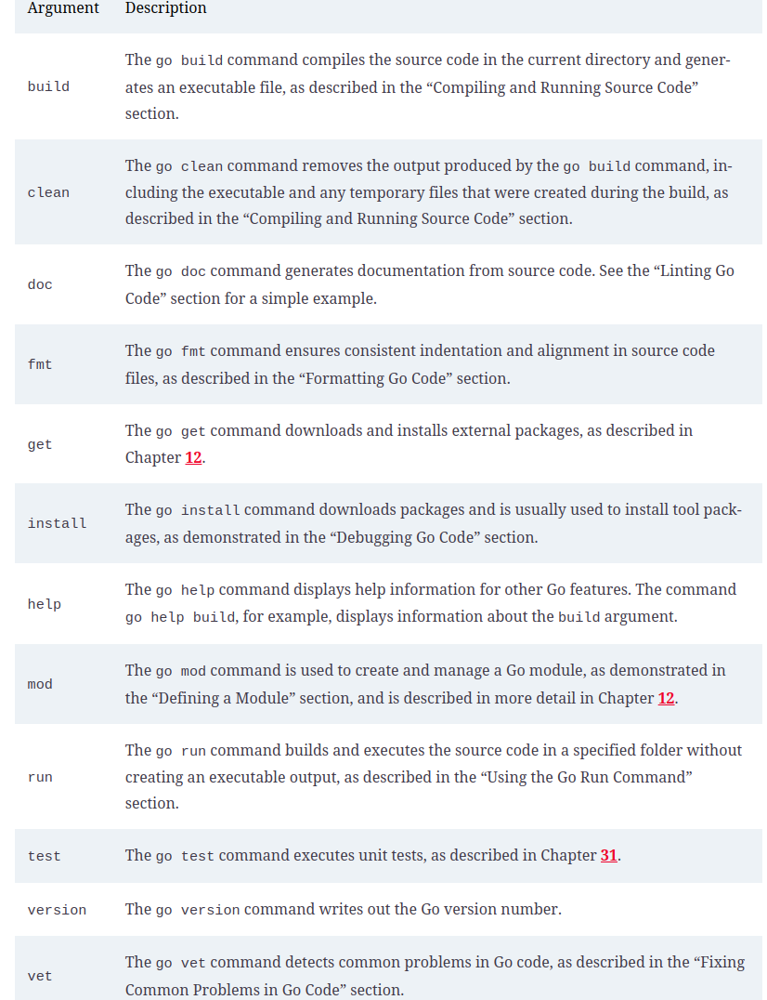
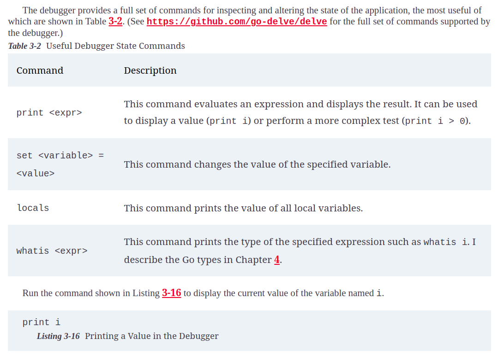
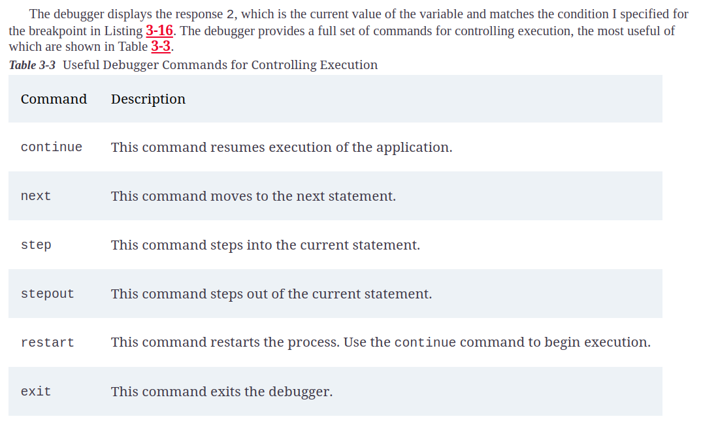

# Using the Go Tools

## Using the Go Command

* The go command provides access to all the features needed to compile and execute Go code and is used throughout this book. The argument used with the go command specifies the operation that will be performed, 

### Useful Arguments for the go Command

### Useful Debugger state command

### Useful debugger commands for controlling execution

