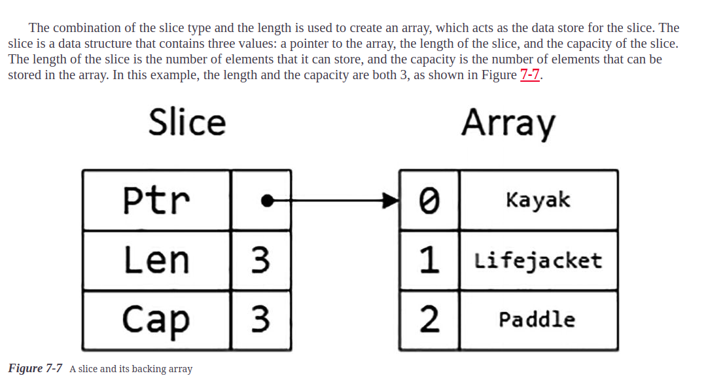
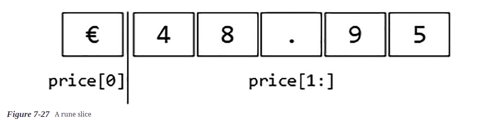

# Using Arrays, Slices, and Maps

## Working with arrays

* Go arrays are a fixed length and contain elements of a single type, which are accessed by index

## Working with Slices

* The best way to think of slices is as a variable-length array because they are useful when you don’t know how many values you need to store or when the number changes over time. One way to define a slice is to use the built-in make function

* slices have a length and a capacity. The length of a slice is how many values it can currently contain, while the number of elements that can be stored in the underlying array before the slice must be resized and a new array created. The capacity will always be at least the length but can be larger if additional capacity has been allocated with the make function. 




#### Caution 

* If you define a slice variable but don’t initialize it, then the result is a slice that has a length of zero and a capacity of zero, and this will cause an error when an element is appended to it.


### Multiple slices backed by a single array


## Workig with Maps

* Maps are a built-in data structure that associates data values with keys. Unlike arrays, where values are associated with sequential integer locations, maps can use other data types as keys


## Understanding the Dual Nature of Strings

* This is true, but there are complications because Go strings have a split personality depending on how you use them.

```go
package main
import (
    "fmt"
    "strconv"
)
func main() {
    var price string = "$48.95"
    var currency byte = price[0]
    var amountString string = price[1:]
    amount, parseErr  := strconv.ParseFloat(amountString, 64)
    fmt.Println("Currency:", currency)
    if (parseErr == nil) {
        fmt.Println("Amount:", amount)
    } else {
        fmt.Println("Parse Error:", parseErr)
    }
}
```

* When the index notation is used, the result is a byte from the specified location in the string:

```go
var currency byte = price[0]
```

* his statement selects the byte at position zero and assigns it to a variable named currency. 
* When a string is sliced, the slice is also described using bytes, but the result is a string:

```go
var amountString string = price[1:]
```

* The range selects all but the byte in location zero and assigns the shortened string to a variable named amountString

```go
package main
import (
    "fmt"
    "strconv"
)
func main() {
    var price string = "$48.95"
    var currency string = string(price[0])
    var amountString string = price[1:]
    amount, parseErr  := strconv.ParseFloat(amountString, 64)
    fmt.Println("Currency:", currency)
    if (parseErr == nil) {
        fmt.Println("Amount:", amount)
    } else {
        fmt.Println("Parse Error:", parseErr)
    }
}
```

* Slicing a string produces another string, but an explicit conversion is required to interpret the byte as the character it represents

* This looks like it works, but it contains a pitfall, which can be seen if the currency symbol is changed

* (If you don’t live in a part of the world where the euro currency symbol is on the keyboard, then hold down the Alt key and press 0128 on your numeric keypad.)

```go
package main
import (
    "fmt"
    "strconv"
)
func main() {
    var price string = "€48.95"
    var currency string = string(price[0])
    var amountString string = price[1:]
    amount, parseErr  := strconv.ParseFloat(amountString, 64)
    fmt.Println("Currency:", currency)
    if (parseErr == nil) {
        fmt.Println("Amount:", amount)
    } else {
        fmt.Println("Parse Error:", parseErr)
    }
}
```

* The problem is that the array and range notations select bytes, but not all characters are expressed as just one byte. The new currency symbol is stored using three bytes


```go
    var price string = "€48.95"
    var currency string = string(price[0])
    var amountString string = price[1:]
    amount, parseErr  := strconv.ParseFloat(amountString, 64)
    fmt.Println("Length:", len(price))
    fmt.Println("Currency:", currency)
    if (parseErr == nil) {
        fmt.Println("Amount:", amount)
    } else {
        fmt.Println("Parse Error:", parseErr)
    }
```

* Obtaining the Length of a String

```sh
Length: 8
Currency: â
Parse Error: strconv.ParseFloat: parsing "\x82\xac48.95": invalid syntax
```

* The output confirms there are eight bytes in the string, and this is the reason that the indexing and slicing produce odd results.

### Converting a String to Runes

* The rune type represents a Unicode code point, which is essentially a single character. To avoid slicing strings in the middle of characters, an explicit conversion to a rune slice can be performed



* I apply the explicit conversion to the literal string and assign the slice to the price variable. When working with a rune slice, individual bytes are grouped into the characters they represent without reference to the number of bytes each character requires.

### UNDERSTANDING WHY BYTES AND RUNES ARE BOTH USEFUL
* The approach Go takes for strings may seem odd, but it has its uses. Bytes are important when you care about storing strings and you need to know how much space to allocate. Characters are important when you are concerned with the contents of strings, such as when inserting a new character into an existing string.

* Both facets of strings are important. It is important, however, to understand whether you need to deal with bytes or characters for any given operation.
 
* You might be tempted to work only with bytes, which will work as long as you use only those characters that are represented by a single byte, which typically means ASCII. This may work at first, but it almost always ends badly, specifically when your code processes characters entered by a user with a non-ASCII character set or processes a file containing non-ASCII data. For the small amount of extra work required, it is simpler and safer to accept that Unicode does really exist and rely on Go to deal with translating bytes into characters.


