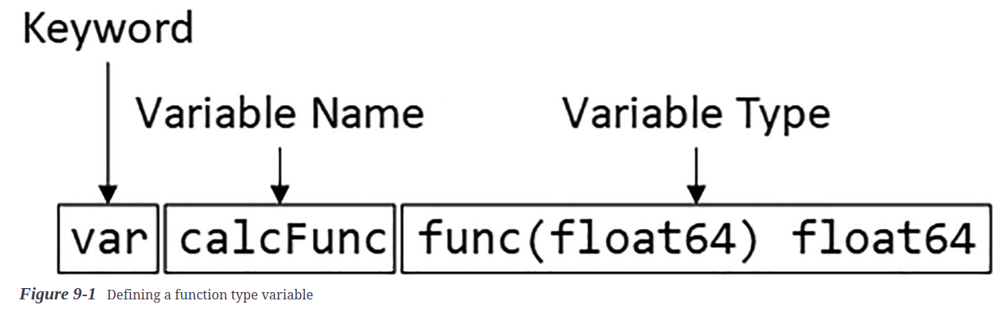
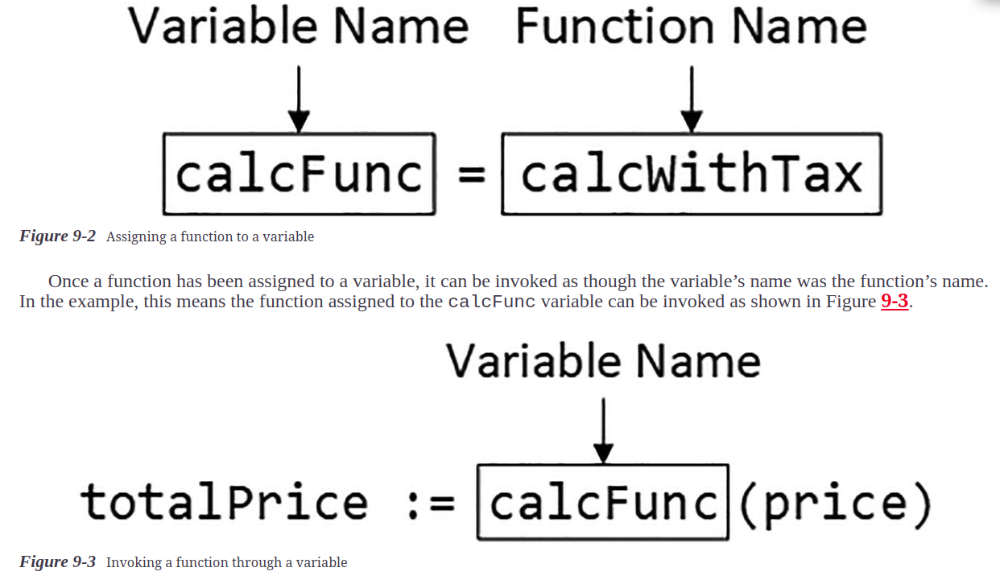

# Using Function type

## Understanding Function Types

* Functions have a data type in Go, which means 
  * they can be assigned to variables
  * used as function parameters
  * used as arguments
  * used as results

```go
package main
import "fmt"
func calcWithTax(price float64) float64 {
    return price + (price * 0.2)
}
func calcWithoutTax(price float64) float64 {
    return price
}
func main() {
    products := map[string]float64 {
        "Kayak" : 275,
        "Lifejacket": 48.95,
    }
    for product, price := range products {
        var calcFunc func(float64) float64
        if (price > 100) {
            calcFunc = calcWithTax
        } else {
            calcFunc = calcWithoutTax
        }
        totalPrice := calcFunc(price)
        fmt.Println("Product:", product, "Price:", totalPrice)
    }
}
```

* This example contains two functions, each of which defines a float64 parameter and produces a float64 result.



* Function types are specified with the func keyword, followed by the parameter types in parentheses and then the result types. This is known as the function signature. If there are multiple results, then the result types are also enclosed in parentheses.



### Understanding Function Comparisons and the Zero Type

* The Go comparison operators cannot be used to compare functions, but they can be used to determine whether a function has been assigned to a variable

### Using Functions as Arguments

* Function types can be used in the same way as any other type, including as arguments for other functions,

```go
func printPrice(product string, price float64, calculator func(float64) float64 ) {
    fmt.Println("Product:", product, "Price:", calculator(price))
}

func main() {
    products := map[string]float64 {
        "Kayak" : 275,
        "Lifejacket": 48.95,
    }
    for product, price := range products {
        if (price > 100) {
            printPrice(product, price, calcWithTax)
        } else {
            printPrice(product, price, calcWithoutTax)
        }
    }
}
```

### Using Functions as Results

* Functions can also be results, meaning that the value returned by a function is another function

```go
func selectCalculator(price float64) func(float64) float64 {
    if (price > 100) {
        return calcWithTax
    }
    return calcWithoutTax
}

func main() {
    products := map[string]float64 {
        "Kayak" : 275,
        "Lifejacket": 48.95,
    }
    for product, price := range products {
        printPrice(product, price, selectCalculator(price))
    }
}
```

* The selectCalculator function receives a float64 value and returns a function

## Creating Function Type Aliases

* using function types can be verbose and repetitive, which produces code that can be hard to read and maintain.

* Go supports type aliases, which can be used to assign a name to a function signature so that the parameter and result types are not specified every time the function type is used.

```go
type calcFunc func(float64) float64
// The alias is created with the type keyword, followed by a name for the alias and then by the type,
func printPrice(product string, price float64, calculator calcFunc) {
    fmt.Println("Product:", product, "Price:", calculator(price))
}
func selectCalculator(price float64) calcFunc {
    if (price > 100) {
        return calcWithTax
    }
    return calcWithoutTax
}
```

#### NoteThe :- type keyword is also used to create custom types

## Using the Literal Function Syntax

* The function literal syntax allows functions to be defined so they are specific to a region of code

* Note :- Go does not support arrow functions, where functions are expressed more concisely using the => operator, without the func keyword and a code block surrounded by braces. In Go, functions must always be defined with the keyword and a body.

### Understanding Function Variable Scope

* Functions are treated like any other value, but the function that adds tax can be accessed only through the withTax variable, which, in turn, is accessible only within the if statement’s code block

### Using Functions Values Directly

*  Go treats literal functions like any other value. But functions don’t have to be assigned to variables and can be used just like any other literal value

```go
func selectCalculator(price float64) calcFunc {
    if (price > 100) {
        return func (price float64) float64 {
            return price + (price * 0.2)
        }
    }
     return func (price float64) float64 {
        return price
    }
}
```

* The return keyword is applied directly to the function, without assigning the function to a variable.

#### Literal functions can also be used as arguments to other functions

```go
func main() {
    products := map[string]float64 {
        "Kayak" : 275,
        "Lifejacket": 48.95,
    }
    for product, price := range products {
        printPrice(product, price, func (price float64) float64 {
            return price + (price * 0.2)
        })
    }
}
```

### Understanding Function Closure

* Functions defined using the literal syntax can reference variables from the surrounding code, a feature known as closure. This feature can be difficult to understand, so I am going to start with an example that doesn’t rely on closure.

```go
    // Code without function closure
    watersportsProducts := map[string]float64 {
        "Kayak" : 275,
        "Lifejacket": 48.95,
    }
    soccerProducts := map[string] float64 {
        "Soccer Ball": 19.50,
        "Stadium": 79500,
    }
    calc := func(price float64) float64 {
        if (price > 100) {
            return price + (price * 0.2)
        }
        return price;
    }
    for product, price := range watersportsProducts {
        printPrice(product, price, calc)
    }
    calc = func(price float64) float64 {
        if (price > 50) {
            return price + (price * 0.1)
        }
        return price
    }
    for product, price := range soccerProducts {
        printPrice(product, price, calc)
    }
```

* What I want is the ability to consolidate the common code required to calculate a price and allow that common code to be configured with the changes for each category. This is easily done using the closure feature

```go
func priceCalcFactory(threshold, rate float64) calcFunc {
    return func(price float64) float64 {
        if (price > threshold) {
            return price + (price * rate)
        }
        return price
    }
}

func main() {
    watersportsProducts := map[string]float64 {
        "Kayak" : 275,
        "Lifejacket": 48.95,
    }
    soccerProducts := map[string] float64 {
        "Soccer Ball": 19.50,
        "Stadium": 79500,
    }
    waterCalc := priceCalcFactory(100, 0.2);
    soccerCalc := priceCalcFactory(50, 0.1)
    for product, price := range watersportsProducts {
        printPrice(product, price, waterCalc)
    }
    for product, price := range soccerProducts {
        printPrice(product, price, soccerCalc)
    }
}
```

### Understanding Closure Evaluation

* The variables on which a function closes are evaluated each time the function is invoked, which means that changes made outside of a function can affect the results it produces

```go
var prizeGiveaway = false
func priceCalcFactory(threshold, rate float64) calcFunc {
    return func(price float64) float64 {
        if (prizeGiveaway) {
            return 0
        } else if (price > threshold) {
            return price + (price * rate)
        }
        return price
    }
}
// prizeGiveaway is a global variable

// The calculator function closes on the prizeGiveaway variable, which causes the prices to drop to zero. The prizeGiveaway variable is set to false before the function for the watersports category is created and set to true before the function for the soccer category is created.

// But, since closures are evaluated when the function is invoked, it is the current value of the prizeGiveaway variable that is used, not the value at the time the function was created


func main() {
    watersportsProducts := map[string]float64 {
        "Kayak" : 275,
        "Lifejacket": 48.95,
    }
    soccerProducts := map[string] float64 {
        "Soccer Ball": 19.50,
        "Stadium": 79500,
    }
    prizeGiveaway = false
    waterCalc := priceCalcFactory(100, 0.2);
    prizeGiveaway = true
    soccerCalc := priceCalcFactory(50, 0.1)
    for product, price := range watersportsProducts {
        printPrice(product, price, waterCalc)
    }
    for product, price := range soccerProducts {
        printPrice(product, price, soccerCalc)
    }
}
```

#### Forcing Early Evaluation

* Evaluating closures when the function is invoked can be useful, but if you want to use the value that was current when the function was created, then copy the value

```go
func priceCalcFactory(threshold, rate float64) calcFunc {
    fixedPrizeGiveway := prizeGiveaway
    return func(price float64) float64 {
        if (fixedPrizeGiveway) {
            return 0
        } else if (price > threshold) {
            return price + (price * rate)
        }
        return price
    }
}
```

#### Adding a Parameter to force Early Evaluation

```go
func priceCalcFactory(threshold, rate float64, zeroPrices bool) calcFunc {
    return func(price float64) float64 {
        if (zeroPrices) {
            return 0
        } else if (price > threshold) {
            return price + (price * rate)
        }
        return price
    }
}
```

#### Closing on a Pointer to Prevent Early Evaluation

* Most problems with closure are caused by changes made to variables after a function has been created, which can be addressed using the techniques in the previous section. On occasion, you may find encounter the contrary issue, which is the need to avoid early evaluation to ensure that the current value is used by a function.

```go
func priceCalcFactory(threshold, rate float64, zeroPrices *bool) calcFunc {
    return func(price float64) float64 {
        if (*zeroPrices) {
            return 0
        } else if (price > threshold) {
            return price + (price * rate)
        }
        return price
    }
}
```

* the factory function defines a parameter that receives a pointer to a bool value, on which the calculator function closes. The pointer is followed when the calculator function is invoked, which ensures that the current value is used.