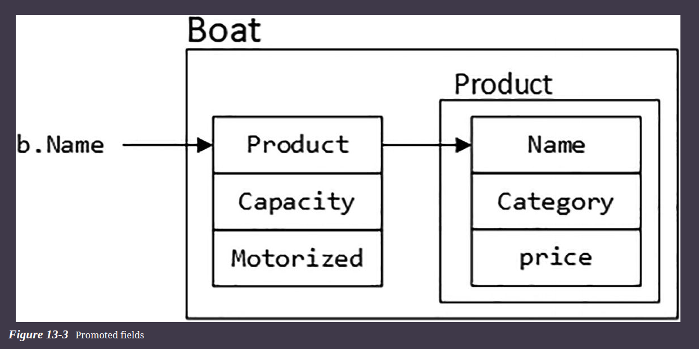
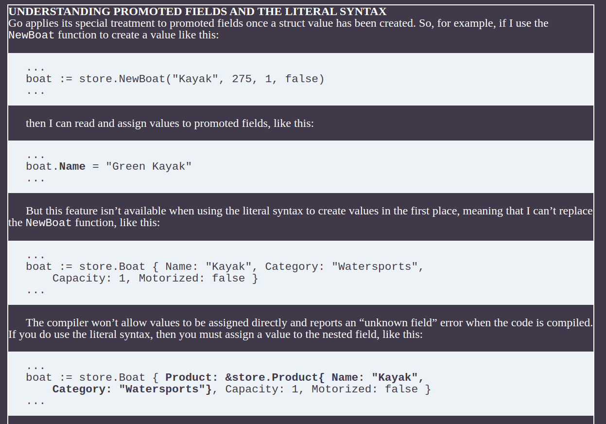

# Types and Interface Composition

## Understanding Type Composition

* Go doesn’t support classes or inheritance and focuses on composition instead. But, despite the differences, composition can be used to create hierarchies of types, just in a different way.

### Defining the Base Type

* The starting point is to define a struct type and a method
* Create the composition/store folder and add to it a file named product.go

```go
package store
type Product struct {
    Name, Category string
    price float64
}
func (p *Product) Price(taxRate float64) float64 {
    return p.price + (p.price * taxRate)
}
// Listing 13-4The Contents of the product.go File in the store Folder
```

### Defining a Constructor

* Because Go doesn’t support classes, it doesn’t support class constructors either.
* A common convention is to define a constructor function whose name is New\<Type>, such as NewProduct and that allows values to be provided for all fields, even those that have not been exported.

```go
...
func NewProduct(name, category string, price float64) *Product {
    return &Product{ name, category, price }
}
...
```

* Constructor functions are only a convention, and their use is not enforced, which means that exported types can be created using the literal syntax, just as long as no values are assigned to the  **unexported fields**.

* Constructors should be used whenever they are defined because they make it easier to manage changes in the way that values are created and because they ensure that fields are properly initialized. Using the literal syntax means that no value is assigned to the price field, which affects the output from the Price method. But, since Go doesn’t support enforcing the use of constructors, their use requires discipline.

## Composing Types

* Go supports composition, rather than inheritance, which is done by combining struct types.

```go
package store
type Boat struct {
    *Product
    Capacity int
    Motorized bool
}
func NewBoat(name string, price float64, capacity int, motorized bool) *Boat {
    return &Boat {
        NewProduct(name, "Watersports", price), capacity, motorized,
    }
}
// Listing 13-7The Contents of the boat.go File in the store Folder
```
* The NewBoat function is a constructor that uses its parameters to create a Boat, with its embedded Product value.
* A struct can mix regular and embedded field types, but the embedded fields are an important part of the composition feature

```go
boats := []*store.Boat{
    store.NewBoat("Kayak", 275, 1, false),
    store.NewBoat("Canoe", 400, 3, false),
    store.NewBoat("Tender", 650.25, 2, true),
}
for _, b := range boats {
    fmt.Println("Conventional:", b.Product.Name, "Direct:", b.Name)
}
```

* Go allows the fields of the nested type to be accessed in two ways. The first is the conventional approach of navigating the hierarchy of types to reach the value that is required. The *Product field is embedded, which means that its name its its type. To reach the Name field, I can navigate through the nested type, like this:
    * b.Product.Name
* Go also allows nested field types to be used directly, like this:
    * b.Name


* The Boat type doesn’t define a Name field, but it can be treated as though it did because of the direct access feature. This is known as field promotion

* Go essentially flattens the types so that the Boat type behaves as though it defines the fields that are provided by the nested Product type



#### Methods are also promoted so that methods defined for the nested type can be invoked from the enclosing type

```go
boats := []*store.Boat {
    store.NewBoat("Kayak", 275, 1, false),
    store.NewBoat("Canoe", 400, 3, false),
    store.NewBoat("Tender", 650.25, 2, true),
}
for _, b := range boats {
    fmt.Println("Boat:", b.Name, "Price:", b.Price(0.2))
}

// There is no Price method defined for the *Boat type, but Go promotes the method defined with a *Product receiver


```

#### IMP

* If the field type is a value, such as Product, then any methods defined with Product or *Product receivers will be promoted. 
* If the field type is a pointer, such as *Product, then only methods with *Product receivers will be prompted.



### Creating a Chain of Nested Types

* The composition feature can be used to create complex chains of nested types, whose fields and methods are promoted to the top-level enclosing type.

* Add a file named rentalboats.go to the store folder

```go
package store
type RentalBoat struct {
    *Boat
    IncludeCrew bool
}
func NewRentalBoat(name string, price float64, capacity int,
        motorized, crewed bool) *RentalBoat {
    return &RentalBoat{NewBoat(name, price, capacity, motorized), crewed}
}
// The Contents of the rentalboats.go File in the store Folder
```

* The RentalBoat type is composed using the *Boat type, which is, in turn, composed using the *Product type, forming a chain. Go performs promotion so that the fields defined by all three types in the chain can be accessed directly


### Using Multiple Nested Types in the Same Struct

* Types can define multiple struct fields, and Go will promote the fields for all of them
* Below defines a new type that describes a boat crew and uses it as the type for a field in another struct.

```go
package store

type Crew struct {
    Captain, FirstOfficer string
}

type RentalBoat struct {
    *Boat
    IncludeCrew bool
    *Crew
}

func NewRentalBoat(name string, price float64, capacity int, motorized, crewed bool, captain, firstOfficer string) *RentalBoat {
    return &RentalBoat{NewBoat(name, price, capacity, motorized), crewed, &Crew{captain, firstOfficer}}
}

```

### Understanding When Promotion Cannot Be Performed

* Go can perform promotion only if there is no field or method defined with the same name on the enclosing type, which can lead to unexpected results
* Add a file named specialdeal.go to the store folder 

```go
package store
type SpecialDeal struct {
    Name string
    *Product
    price float64
}
func NewSpecialDeal(name string, p *Product, discount float64) *SpecialDeal {
    return &SpecialDeal{ name, p, p.price - discount }
}
func (deal *SpecialDeal ) GetDetails() (string, float64, float64) {
    return deal.Name, deal.price, deal.Price(0)
}
// The Contents of the specialdeal.go File in the store Folder
```

### Understanding Promotion Ambiguity

* A related issue arises when two embedded fields use the same field or method names

```go
package main
import (
    "fmt"
    "composition/store"
)
func main() {
    kayak := store.NewProduct("Kayak", "Watersports", 279)
    type OfferBundle struct {
        *store.SpecialDeal
        *store.Product
    }
    bundle := OfferBundle {
        store.NewSpecialDeal("Weekend Special", kayak, 50),
        store.NewProduct("Lifrejacket", "Watersports", 48.95),
 
 }
    fmt.Println("Price:", bundle.Price(0))
}
// An Ambiguous Method in the main.go File in the composition Folder
```

* The OfferBundle type has two embedded fields, both of which have Price methods. Go cannot differentiate between the methods.

#### Error from above code

```sh
.\main.go:22:33: ambiguous selector bundle.Price
```

## Understanding Composition and Interfaces

* Composing types makes it easy to build up specialized functionality without having to duplicate the code required by a more general type so that the Boat type in the project, for example, can build on the functionality provided by the Product type.

```go
package main
import (
    "fmt"
    "composition/store"
)
func main() {
    products := map[string]*store.Product {
        "Kayak": store.NewBoat("Kayak", 279, 1, false),
        "Ball": store.NewProduct("Soccer Ball", "Soccer", 19.50),
    }
    for _, p := range products {
        fmt.Println("Name:", p.Name, "Category:", p.Category, "Price:", p.Price(0.2))
    }
}
// Mixing Types in the main.go File in the composition Folder
```

Error from above code 

```sh
.\main.go:11:9: cannot use store.NewBoat("Kayak", 279, 1, false) (type *store.Boat) as type *store.Product in map value
```

### Using Composition to Implement Interfaces

* Go uses interfaces to describe methods that can be implemented by multiple types.
* Go takes promoted methods into account when determining whether a type conforms to an interface, which avoids the need to duplicate methods that are already present through an embedded field.

* add a file named forsale.go to store folder.

```go
package store
type ItemForSale interface {
    Price(taxRate float64) float64
}
```

### Understanding the Type Switch Limitation

* Interfaces can specify only methods, which is why I used the key used to store values in the map

* switch statements can be used to gain access to underlying types, but this doesn’t work as you might expect

```go
// This code will give error
// This issue is that case statements that specify multiple types will match values of all of those types but will not perform type assertion.
// this means that *Product and *Boat values will be matched by the case statement, but the type of item variable will be ItemForSale, which is why the compiler produces the error.
// Instead, additional type assertions or single-type case statements must be used
package main
import (
    "fmt"
    "composition/store"
)
func main() {
    products := map[string]store.ItemForSale {
        "Kayak": store.NewBoat("Kayak", 279, 1, false),
        "Ball": store.NewProduct("Soccer Ball", "Soccer", 19.50),
    }
    for key, p := range products {
        switch item := p.(type) {
            case *store.Product, *store.Boat:
                fmt.Println("Name:", item.Name, "Category:", item.Category,
                    "Price:", item.Price(0.2))
            default:
                fmt.Println("Key:", key, "Price:", p.Price(0.2))
        }
    }
}
```

#### Using Separate Case Statement

```go
func main() {
     products := map[string]store.ItemForSale {
        "Kayak": store.NewBoat("Kayak", 279, 1, false),
        "Ball": store.NewProduct("Soccer Ball", "Soccer", 19.50),
    }
    for key, p := range products {
        switch item := p.(type) {
            case *store.Product:
                fmt.Println("Name:", item.Name, "Category:", item.Category,
                    "Price:", item.Price(0.2))
            case *store.Boat:
                fmt.Println("Name:", item.Name, "Category:", item.Category,
                    "Price:", item.Price(0.2))
            default:
                fmt.Println("Key:", key, "Price:", p.Price(0.2))
        }
    }
}

// A type assertion is performed by the case statement when a single type is specified, albeit it can lead to duplication as each type is processed.
```


* An alternative solution is to define interface methods that provide access to the property values. This can be done by adding methods to an existing interface or by defining a separate interface


```go
func main() {
    products := map[string]store.ItemForSale {
        "Kayak": store.NewBoat("Kayak", 279, 1, false),
        "Ball": store.NewProduct("Soccer Ball", "Soccer", 19.50),
    }
    for key, p := range products {
        switch item := p.(type) {
            case store.Describable:
                fmt.Println("Name:", item.GetName(), "Category:", item.GetCategory(),
                    "Price:", item.(store.ItemForSale).Price(0.2))
            default:
                fmt.Println("Key:", key, "Price:", p.Price(0.2))
        }
    }
}   
```

* This works, but it relies on a type assertion to the ItemForSale interface to access the Price method.

* This is problematic because a type can implement the Describable interface but not the ItemForSale interface, which would cause a runtime error.

* I could deal with the type assertion by adding a Price method to the Describable interface, but there is an alternative

### Composing Interfaces

* Go allows interfaces to be composed from other interfaces

```go
package store
type Product struct {
    Name, Category string
    price float64
}
func NewProduct(name, category string, price float64) *Product {
    return &Product{ name, category, price }
}
func (p *Product) Price(taxRate float64) float64 {
    return p.price + (p.price * taxRate)
}
type Describable interface  {
    GetName() string
    GetCategory() string
    ItemForSale
}
func (p *Product) GetName() string {
    return p.Name
}
func (p *Product) GetCategory() string {
    return p.Category
}
```

* One interface can enclose another, with the effect that types must implement all the methods defined by the enclosing and enclosed interfaces. 

* Interfaces are simpler than structs, and there are no fields or method to promote.

* The result of composing interfaces is a union of the method defined by the enclosing and enclosed types

* In this example, the union means that implementing the Describable interface requires GetName, GetCategory, and Price methods. The GetName and GetCategory methods defined directly by the Describable interface are formed into a union with the Price method defined by the ItemForSale interface.


#### The change to the Describable interface means that the type assertion I used in the previous section is no longer required

```go
package main
import (
    "fmt"
    "composition/store"
)
func main() {
    products := map[string]store.ItemForSale {
        "Kayak": store.NewBoat("Kayak", 279, 1, false),
        "Ball": store.NewProduct("Soccer Ball", "Soccer", 19.50),
    }
    for key, p := range products {
        switch item := p.(type) {
            case store.Describable:
                fmt.Println("Name:", item.GetName(), "Category:", item.GetCategory(),
                    "Price:", item.Price(0.2))
            default:
                fmt.Println("Key:", key, "Price:", p.Price(0.2))
        }
    }
}
// Removing an Assertion in the main.go File in the composition Folder
```