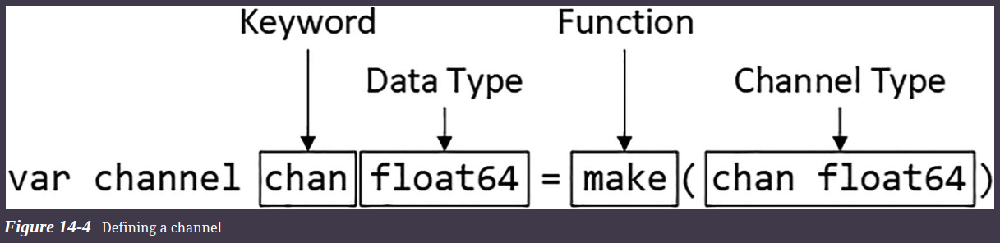
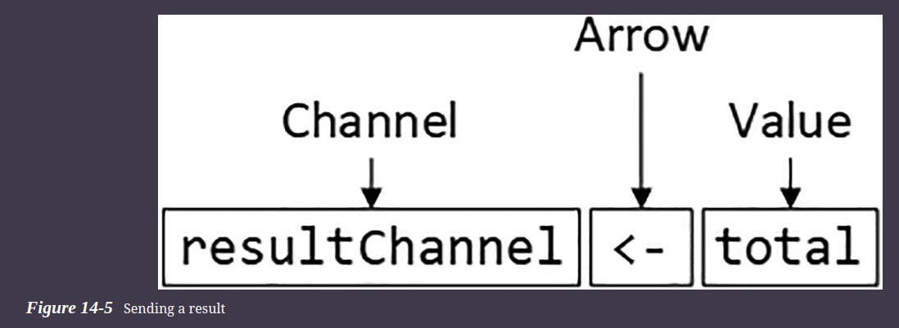
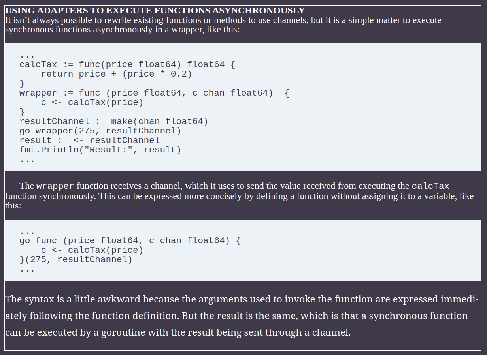

# Using Goroutines and Channels

## Understanding How Go Executes Code

* The key building block for executing a Go program is the goroutine, which is a lightweight thread created by the Go runtime.

* All Go programs use at least one goroutine because this is how Go executes the code in the main function.

* When compiled Go code is executed, the runtime creates a goroutine that starts executing the statements in the entry point, which is the main function in the main package

* Each statement in the main function is executed in the order in which they are defined.

* The goroutine keeps executing statements until it reaches the end of the main function, at which point the application terminates.

* The goroutine executes each statement in the main function synchronously, which means that it waits for the statement to complete before moving on to the next statement. 

### Advantage and disadvantage of goroutine

* The advantages of synchronous execution are simplicity and consistency—the behavior of synchronous code is easy to understand and predictable

* The disadvantage is that it can be inefficient. 

## Creating Additional Goroutines

* Go allows the developer to create additional goroutines, which execute code at the same time as the main goroutine. Go makes it easy to create new goroutines

* A goroutine is created using the go keyword followed by the function or method that should be executed asynchronously

```go
go group.TotalPrice(category)
```

* When the Go runtime encounters the go keyword, it creates a new goroutine and uses it to execute the specified function or method

* This changes the program execution because, at any given moment, there are multiple goroutines, each of which is executing its own set of statements. These statements are executed concurrently, which just means they are being executed at the same time.

* Go routines make it easy to invoke functions and methods, but the change has introduced a common problem. 
  * If we donot wait for the goroutine then the execution moves to the new line and program will terminate soon with unexpected result.
  * To deal with this problem we have to add some time which is not the correct way but we are using it for simplicity.

## Returning Results from Goroutines

* Getting a result from a function that is being executed asynchronously can be complicated because it requires coordination between the goroutine that produces the result and the goroutine that consumes the result.

* To address this issue, Go provides channels, which are conduits through which data can be sent and received

## Channels

* Channels are strongly typed, which means that they will carry values of a specified type or interface. The type for a channel is the chan keyword, followed by the type the channel will carry.
* Channels are created using the built-in make function, specifying the channel type.



**Note :-**  The sync package provides features for managing goroutines that share data.

### Sending a Result Using a Channel

```go
func (group ProductGroup) TotalPrice(category string, resultChannel chan float64)  {
    var total float64
    for _, p := range group {
        fmt.Println(category, "product:", p.Name)
        total += p.Price
        time.Sleep(time.Millisecond * 100)
    }
    fmt.Println(category, "subtotal:", ToCurrency(total))
    resultChannel <- total
}
```



### Receiving a Result Using a Channel

* The arrow syntax is used to receive a value from a channel

* Ex -> totalVal += <-myChannel

#### **IMP** - Receiving from a channel is a blocking operation, meaning that execution will not continue until a value has been received, which means I no longer have to prevent the program from terminating.

* The channel is used to coordinate the goroutines, allowing the main goroutine to wait for the individual results produced by the goroutines created in the CalcStoreTotal function.



## Working with Channels

### Coordinating Channels

* By default, sending and receiving through a channel are blocking operations.
* This means a goroutine that sends a value will not execute any further statements until another goroutine receives the value from the channel. 
* If a second goroutine sends a value, it will be blocked until the channel is cleared, causing a queue of goroutines waiting for values to be received. 
* This happens in the other direction, too, so that goroutines that receive values will block until another goroutine sends one. 

```go

// changes the way that values are sent and received in the example project to highlight this behavior.

func CalcStoreTotal(data ProductData) {
    var storeTotal float64
    var channel chan float64 = make(chan float64)
    for category, group := range data {
        go group.TotalPrice(category, channel)
    }
    time.Sleep(time.Second * 5)
    fmt.Println("-- Starting to receive from channel")
    for i := 0; i < len(data); i++ {
        fmt.Println("-- channel read pending")
        value :=  <- channel
        fmt.Println("-- channel read complete", value)
        storeTotal += value
        time.Sleep(time.Second)
    }
    fmt.Println("Total:", ToCurrency(storeTotal))
}

func (group ProductGroup) TotalPrice(category string, resultChannel chan float64)  {
    var total float64
    for _, p := range group {
        //fmt.Println(category, "product:", p.Name)
        total += p.Price
        time.Sleep(time.Millisecond * 100)
    }
    fmt.Println(category, "channel sending", ToCurrency(total))
    resultChannel <- total
    fmt.Println(category, "channel send complete")
}

// The changes introduce a delay after the CalcStoreTotal creates the goroutines and receives the first value from the channel. There is also a delay before and after each value is received.

```

### Using a Buffered Channel

* The default channel behavior can lead to bursts of activity as goroutines do their work, followed by a long idle period waiting for messages to be received. 

* This doesn’t have an impact on the example application because the goroutines finish once their messages are received, but in a real project goroutines often have repetitive tasks to perform, and waiting for a receiver can cause a performance bottleneck.

* An alternative approach is to create a channel with a buffer, which is used to accept values from a sender and store them until a receiver becomes available. This makes sending a message a nonblocking operation, allowing a sender to pass its value to the channel and continue working without having to wait for a receiver.

```go
var channel chan float64 = make(chan float64, 2)
// The size of the buffer is specified as an argument to the make function
```

### Inspecting a Channel Buffer

* You can determine the size of a channel’s buffer using the built-in **cap** function and determine how many values are in the buffer using the **len** function

* Using the len and cap functions can give insight into the channel buffer, but the results should not be used to try to avoid blocking when sending a message. Goroutines are executed in parallel, which means values may be sent to the channel after you check for buffer capacity but before you send a value. 


### See the “Using Select Statements” section for details of how to reliably send and receive without blocking.

## Sending and Receiving an Unknown Number of Values

```go
type DispatchNotification struct {
    Customer string
    *Product
    Quantity int
}
var Customers = []string{"Alice", "Bob", "Charlie", "Dora"}
func DispatchOrders(channel chan DispatchNotification) {
    rand.Seed(time.Now().UTC().UnixNano())
    orderCount := rand.Intn(3) + 2
    fmt.Println("Order count:", orderCount)
    for i := 0; i < orderCount; i++ {
        channel <- DispatchNotification{
            Customer: Customers[rand.Intn(len(Customers)-1)],
            Quantity: rand.Intn(10),
            Product:  ProductList[rand.Intn(len(ProductList)-1)],
        }
    }
}
```

* The DispatchOrders function creates a random number of DispatchNotification values and sends them through the channel that is received through the channel parameter

* There is no way to know in advance how many DispatchNotification values the DispatchOrders function will create, which presents a challenge when writing the code that receives from the channel

* the simplest approach, which is to use a for loop, meaning that the code will keep trying to receive values forever.

```go
func main() {
    dispatchChannel := make(chan DispatchNotification, 100)
    go DispatchOrders(dispatchChannel)
    for {
        details := <- dispatchChannel
        fmt.Println("Dispatch to", details.Customer, ":", details.Quantity,
            "x", details.Product.Name)
    }
}

// This will give deadlock error
// because if there is no value then also for will be looking for values.
```

* The for loop doesn’t work because the receiving code will try to get values from the channel after the sender has stopped producing them. The Go runtime will terminate the program if all the goroutines are blocked

### Closing a Channel

* The solution for this problem is for the sender to indicate when no further values are coming through the channel, which is done by closing the channel

```go
func DispatchOrders(channel chan DispatchNotification) {
    ...
    close(channel)
}
```

* The built-in close function accepts a channel as its argument and is used to indicate that there will be no further values sent through the channel.
* Receivers can check if a channel is closed when requesting a value

#### **Tip :-** You need to close channels only when it is helpful to do so to coordinate your goroutines. Go doesn’t require channels to be closed to free up resources or perform any kind of housekeeping task.

```go
// Checking for closed channel
for {
    if details, open := <- dispatchChannel; open {
        fmt.Println("Dispatch to", details.Customer, ":", details.Quantity, "x", details.Product.Name)
    } else {
        fmt.Println("Channel has been closed")
        break
    }
}

// The receive operator can be used to obtain two values. 
// The first value is assigned the value received from the channel, and 
// the second value indicates whether the channel is closed,
```

* **else** clause that is executed when the channel is closed, which prevents further attempts to receive from the channel and allows the program to exit cleanly.

#### Caution :- It is illegal to send values to a channel once it has been closed.

### Enumerating Channel Values

* A for loop can be used with the range keyword to enumerate the values sent through a channel, allowing the values to be received more easily and terminating the loop when the channel is closed

```go
dispatchChannel := make(chan DispatchNotification, 100)
go DispatchOrders(dispatchChannel)
for details := range dispatchChannel {
    fmt.Println("Dispatch to", details.Customer, ":", details.Quantity,
        "x", details.Product.Name)
}
fmt.Println("Channel has been closed")
```

* The range expression produces one value per iteration, which is the value received from the channel. The for loop will continue to receive values until the channel is closed.

* **You can use a for...range loop on a channel that isn’t closed, in which case the loop will never exit**

### Restricting Channel Direction

* By default, channels can be used to send and receive data, but this can be restricted when using channels as arguments, such that only send or receive operations can be performed.

```go
func DispatchOrders(channel chan DispatchNotification) {
    rand.Seed(time.Now().UTC().UnixNano())
    orderCount := rand.Intn(3) + 2
    fmt.Println("Order count:", orderCount)
    for i := 0; i < orderCount; i++ {
        channel <- DispatchNotification{
            Customer: Customers[rand.Intn(len(Customers)-1)],
            Quantity: rand.Intn(10),
            Product:  ProductList[rand.Intn(len(ProductList)-1)],
        }
        if (i == 1) {
            notification := <- channel
            fmt.Println("Read:", notification.Customer)
        }
    }
    close(channel)
}

// Here you can see that when i==1
// notification variable will receive value from the channel , which remove value from the channel which was not intended
```
* Sometimes missing messages will cause the intended receiver’s goroutine to block, triggering the deadlock detection described earlier and terminating the program, but often the program will run but produce unexpected results

* The output reports that X values will be sent through the channel, but only (X - 1) are received. 

#### This problem can be resolved by restricting the direction of the channel.

```go

func DispatchOrders( channel chan<- DispatchNotification)

// Position of arrow indicated the direction if channel

// chan<- (This means we can only send value to this channel)
// <-chan (This mean we can only receive value from the channel)

```

* I use the full variable syntax to define send-only and receive-only channel variables, which are then used as function arguments. 
* This ensures that the recipient of the send-only channel can only send values or close the channel and that the recipient of the receive-only channel can only receive values. 
* These restrictions are applied to the same underlying channel so that the messages sent through sendOnlyChannel will be received through receiveOnlyChannel.

### Using Explicit Conversions for Channels

```go
func main() {
    dispatchChannel := make(chan DispatchNotification, 100)
    // var sendOnlyChannel chan<- DispatchNotification = dispatchChannel
    // var receiveOnlyChannel <-chan DispatchNotification = dispatchChannel
    go DispatchOrders(chan<- DispatchNotification(dispatchChannel))
    receiveDispatches((<-chan DispatchNotification)(dispatchChannel))
}

// The explicit conversion for the receive-only channel requires parentheses around the channel type to prevent the compiler from interpreting a conversion to the DispatchNotification type.
```

## Using Select Statements

* The select keyword is used to group operations that will send or receive from channels, which allows for complex arrangements of goroutines and channels to be created. There are several uses for select statements, so I will start with the basics and work through the more advanced options. To prepare for the examples in this section, Increases the number of DispatchNotification values sent by the DispatchOrders function and introduces a delay so they are sent over a longer period.

```go
func DispatchOrders(channel chan<- DispatchNotification) {
    rand.Seed(time.Now().UTC().UnixNano())
    orderCount := rand.Intn(5) + 5
    fmt.Println("Order count:", orderCount)
    for i := 0; i < orderCount; i++ {
        channel <- DispatchNotification{
            Customer: Customers[rand.Intn(len(Customers)-1)],
            Quantity: rand.Intn(10),
            Product:  ProductList[rand.Intn(len(ProductList)-1)],
        }
        // if (i == 1) {
        //     notification := <- channel
        //     fmt.Println("Read:", notification.Customer)
        // }
        time.Sleep(time.Millisecond * 750)
    }
    close(channel)
}
```

### Receiving Without Blocking

* The simplest use for select statements is to receive from a channel without blocking, ensuring that a goroutine won’t have to wait when the channel is empty.

```go
func main() {
    dispatchChannel := make(chan DispatchNotification, 100)
    go DispatchOrders(chan<- DispatchNotification(dispatchChannel))
    // receiveDispatches((<-chan DispatchNotification)(dispatchChannel))
    for {
        select {
            case details, ok := <- dispatchChannel:
                if ok {
                    fmt.Println("Dispatch to", details.Customer, ":",
                        details.Quantity, "x", details.Product.Name)
                } else {
                    fmt.Println("Channel has been closed")
                    goto alldone
                }
            default:
                fmt.Println("-- No message ready to be received")
                time.Sleep(time.Millisecond * 500)
        }
    }
    alldone: fmt.Println("All values received")
}
```

* A select statement has a similar structure to a switch statement, **except that the case statements are channel operations**.
* When the select statement is executed, each channel operation is evaluated until one that can be performed without blocking is reached
* The channel operation is performed, and the statements enclosed in the case statement are executed. If none of the channel operations can be performed, the statements in the default clause are executed.

* The select statement evaluates its case statements once, which is why we have also used a for loop
* The loop continues to execute the select statement, which will receive values from the channel when they become available.
* If no value is available, then the default clause is executed, which introduces a sleep period.

* The case statement channel operation checks to see whether the channel has been closed and, if it has, uses the goto keyword to jump to a labeled statement, which is outside of the for loop.

* The delays introduced by the time.Sleep method create a small mismatch between the rate at which values are sent through the channel and the rate at which they are received. The result is that the select statement is sometimes executed when the channel is empty. 

* Instead of blocking, which is what would happen with a regular channel operation, the select statement executes the statements in the default clause. Once the channel has been closed, the loop is terminated.

### Receiving from Multiple Channels

* A select statement can be used to receive without blocking, as the previous example demonstrated, but that feature becomes more useful when there are multiple channels, through which values are sent at different rates. 
* A select statement will allow the receiver to obtain values from whichever channel has them, without blocking on any single channel.

```go
func enumerateProducts(channel chan<- *Product) {
    for _, p := range ProductList[:3] {
        channel <- p
        time.Sleep(time.Millisecond * 800)
    }
    close(channel)
}

func ReceivingFromMultipleChannel() {
	dispatchChannel := make(chan DispatchNotification, 100)
	go DispatchOrdersSelect(chan<- DispatchNotification(dispatchChannel))
	productChannel := make(chan *Product)
	go enumerateProducts(productChannel)
	openChannels := 2
	for {
		select {
		case details, ok := <-dispatchChannel:
			if ok {
				fmt.Println("Dispatch to", details.Customer, ":",
					details.Quantity, "x", details.Product.Name)
			} else {
				fmt.Println("Dispatch channel has been closed")
				dispatchChannel = nil
				openChannels--
			}
		case product, ok := <-productChannel:
			if ok {
				fmt.Println("Product:", product.Name)
			} else {
				fmt.Println("Product channel has been closed")
				productChannel = nil
				openChannels--
			}
		default:
			if openChannels == 0 {
				goto alldone
			}
			fmt.Println("-- No message ready to be received")
			time.Sleep(time.Millisecond * 500)
		}
	}

alldone:
	fmt.Println("All values received")
}

// In this example, the select statement is used to receive values from two channels, one that carries DispatchNofitication values and one that carries Product values. Each time the select statement is executed, it works its way through the case statements, building up a list of the ones from which a value can be read without blocking. One of the case statements is selected from the list at random and executed. If none of the case statements can be performed, the default clause is executed.
```

* **Care must be taken to manage closed channels because they will provide a nil value** for every receive operation that occurs after the channel has closed, relying on the closed indicator to show that the channel is closed.

* **Unfortunately, this means that case statements for closed channels will always be chosen by select statements because they are always ready to provide a value without blocking**, even though that value isn’t useful.

#### Tip :- If the default clause is omitted, then the select statement will block until one of the channels has a value to be received. This can be useful, but it does not deal with channels that can be closed.

* Managing closed channels requires two measures. 
    * The first is to prevent the select statement from choosing a channel once it is closed. This can be done by assigning nil to the channel variable
        * A nil channel is never ready and will not be chosen, allowing the select statement to move onto other case statements, whose channels may still be open.

    * The second measure is to break out of the for loop when all the channels are closed, without which the select statement would endlessly execute the default clause. 
        * uses an int variable, which is decremented when a channel closes. When the number of open channels reaches zero, a goto statement breaks out of the loop

### Sending Without Blocking

* A select statement can also be used to send to a channel without blocking

```go
func enumerateProducts(channel chan<- *Product) {
    for _, p := range ProductList {
        select {
            case channel <- p:
                // fmt.Println("Sent product:", p.Name)
            default:
                fmt.Println("Discarding product:", p.Name)
                time.Sleep(time.Second)
        }
    }
    close(channel)
}

// the case statement contains a statement that writes out a message, but this is not required, 
// and the case statement can specify send operations without additional statements

func main() {
    productChannel := make(chan *Product, 5)
    go enumerateProducts(productChannel)
    time.Sleep(time.Second)
    for p := range productChannel {
        fmt.Println("Received product:", p.Name)
    }
}
```

### Sending to Multiple Channels

* If there are multiple channels available, a select statement can be used to find a channel for which sending will not block

#### Tip :- You can combine case statements with send and receive operations in the same select statement. When the select statement is executed, the Go runtime builds a combined list of case statements that can be executed without blocking and picks one at random, which can be either a send or a receive statement.

```go
func enumerateProducts(channel1, channel2 chan<- *Product) {
    for _, p := range ProductList {
        select {
            case channel1 <- p:
                fmt.Println("Send via channel 1")
            case channel2 <- p:
                fmt.Println("Send via channel 2")
        }
    }
    close(channel1)
    close(channel2)
}

func main() {
    c1 := make(chan *Product, 2)
    c2 := make(chan *Product, 2)
    go enumerateProducts(c1, c2)
    time.Sleep(time.Second)
    for p := range c1 {
        fmt.Println("Channel 1 received product:", p.Name)
    }
    for p := range c2 {
        fmt.Println("Channel 2 received product:", p.Name)
    }
}
```

* A common mistake is to assume that a select statement will distribute values evenly across multiple channels. 
* As noted, the select statement selects a case statement that can be used without blocking at random, which means that the distribution of values is unpredictable and can be uneven. 
* You can see this effect by running the example repeatedly, which will show values being sent to channels in a different order.

