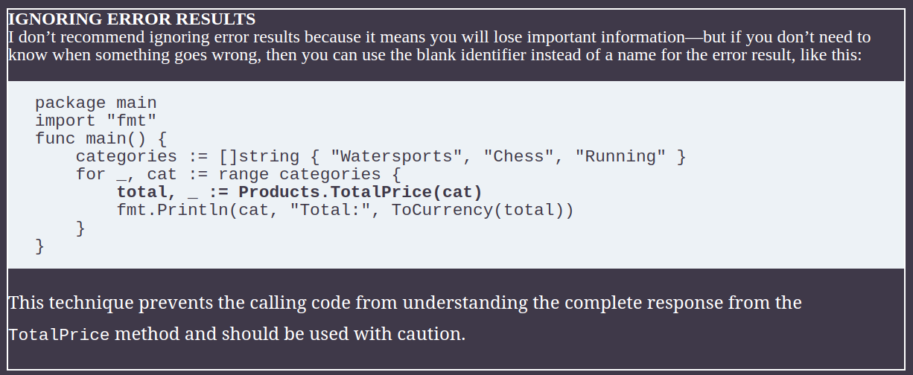
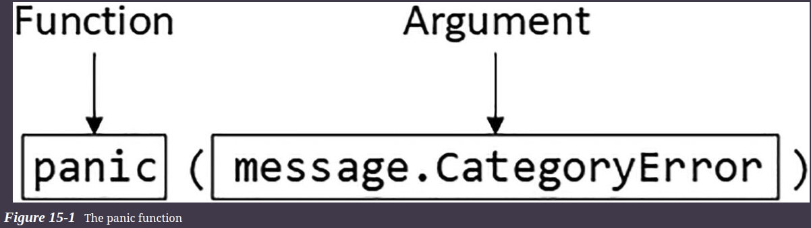

# Error Handling

## Dealing with Recoverable Errors

* Go makes it easy to express exceptional conditions, which allows a function or method to indicate to the calling code that something has gone wrong.

```go
package main
import "fmt"
func main() {
    categories := []string { "Watersports", "Chess", "Running" }
    for _, cat := range categories {
        total := Products.TotalPrice(cat)
        fmt.Println(cat, "Total:", ToCurrency(total))
    }
}
```

```sh
# Output
Watersports Total: $328.95
Chess Total: $1291.00
Running Total: $0.00
```

* The response from the TotalPrice method for the Running category is ambiguous. 
* A zero result could mean that there are no products in the specified category, or it could mean that there are products but they have a sum value of zero. 
* The code that calls the TotalPrice method has no way of knowing what the zero value represents.

#### Go provides a predefined interface named error that provides one way to resolve this issue. Here is the definition of the interface:

```go
type error interface {
    Error() string
}
```

## Generating Errors

* Functions and methods can express exceptional or unexpected outcomes by producing error responses.

```go
// Defining an Error in the operations.go File
package main
type CategoryError struct {
    requestedCategory string
}
func (e *CategoryError) Error() string {
    return "Category " + e.requestedCategory + " does not exist"
}
func (slice ProductSlice) TotalPrice(category string) (total float64,
        err *CategoryError) {
    productCount := 0
    for _, p := range slice {
        if (p.Category == category) {
            total += p.Price
            productCount++
        }
    }
    if (productCount == 0) {
        err = &CategoryError{ requestedCategory: category}
    }
    return
}
```

```go
// main.go
package main
import "fmt"
func main() {
    categories := []string { "Watersports", "Chess", "Running" }
    for _, cat := range categories {
        total, err := Products.TotalPrice(cat)
        if (err == nil) {
            fmt.Println(cat, "Total:", ToCurrency(total))
        } else {
            fmt.Println(cat, "(no such category)")
        }
    }
}
```

* If the error result is nil, then the requested category exists, and the float64 result represents the total of their prices, even if that total is zero. If the error result is not nil, then the requested category does not exist, and the float64 value should be disregarded.



## Reporting Errors via Channels

* If a function is being executed using a goroutine, then the only communication is through the channel, which means that details of any problems must be communicated alongside successful operations. 
* It is important to keep the error handling as simple as possible, and I recommend avoiding trying to use additional channels or creating complex mechanisms for trying to signal error conditions outside of the channel. 
* My preferred approach is to create a custom type that consolidates both outcomes.

```go
// operation.go file
type ChannelMessage struct {
    Category string
    Total float64
    *CategoryError
}

func (slice ProductSlice) TotalPriceAsync(categories []string, channel chan ChannelMessage) {
	for _, c := range categories {
		total, err := slice.TotalPrice(c)

		channel <- ChannelMessage{
			Category:      c,
			Total:         total,
			CategoryError: err,
		}
	}

	close(channel)
}
```
* The ChannelMessage type allows me to communicate the pair of results required to accurately reflect the outcome from the TotalPrice method, which is executed asynchronously by the new TotalPriceAsync method. The result is similar to the way that synchronous method results can express errors.

* If there is only one sender for a channel, you can close the channel after an error has occurred. But care must be taken to avoid closing the channel if there are multiple senders because they may still be able to generate valid results and will attempt to send them on a closed channel, which will terminate the program with a panic.

```go
package main
import "fmt"
func main() {
    categories := []string { "Watersports", "Chess", "Running" }
    channel := make(chan ChannelMessage, 10)
    go Products.TotalPriceAsync(categories, channel)
    for message := range channel {
        if message.CategoryError == nil {
            fmt.Println(message.Category, "Total:", ToCurrency(message.Total))
        } else {
            fmt.Println(message.Category, "(no such category)")
        }
    }
}
// Using a New Method in the main.go File
```

## Using the Error Convenience Functions

* It can be awkward to have to define data types for every type of error that an application can encounter. 
* The errors package, which is part of the standard library, provides a New function that returns an error whose content is a string. 
* The drawback of this approach is that it creates simple errors, but it has the advantage of simplicity.

```go
// operation.go

import "errors"

type ChannelMessage struct {
    Category string
    Total float64
    CategoryError error
}

func (slice ProductSlice) TotalPrice(category string) (total float64,
        err error) {
    productCount := 0
    for _, p := range slice {
        if (p.Category == category) {
            total += p.Price
            productCount++
        }
    }
    if (productCount == 0) {
        err = errors.New("Cannot find category")
    }
    return
}
```

* The fmt package is responsible for formatting strings, which it does with formatting verbs and one of the functions provided by the fmt package is Errorf, which creates error values using a formatted string.

```go
func (slice ProductSlice) TotalPrice(category string) (total float64,
        err error) {
    productCount := 0
    for _, p := range slice {
        if (p.Category == category) {
            total += p.Price
            productCount++
        }
    }
    if (productCount == 0) {
        err = fmt.Errorf("Cannot find category: %v", category)
    }
    return
}
```

## Dealing with Unrecoverable Errors

* Some errors are so serious they should lead to the immediate termination of the application, a process known as panicking

```go
func main() {
    categories := []string { "Watersports", "Chess", "Running" }
    channel := make(chan ChannelMessage, 10)
    go Products.TotalPriceAsync(categories, channel)
    for message := range channel {
        if message.CategoryError == nil {
            fmt.Println(message.Category, "Total:", ToCurrency(message.Total))
        } else {
            panic(message.CategoryError)
            //fmt.Println(message.Category, "(no such category)")
        }
    }
}

// Instead of printing out a message when a category cannot be found, the main function panics, which is done using the built-in panic function.
```



* The panic function is invoked with an argument, which can be any value that will help explain the panic. 
* Panic function is invoked with an error, which is a useful way of combining the Go error handling features.

* When the panic function is called, the execution of the enclosing function is halted, and any defer functions are performed (**IMP**)
* The panic bubbles up through the call stack, terminating execution of the calling functions and invoking their defer functions.

**DEFINING PANICKING AND NON-PANICKING FUNCTIONS**

* There are no definitive rules that dictate when an error is appropriate and when panicking would be more useful. 
* The problem is that the severity of the problem is often best determined by the calling function, which is not where the decision to panic usually occurs. 
* Ex -> Using a nonexistent product category could be a serious and nonrecoverable issue in some situations and an expected outcome in others, and these two conditions may well exist in the same project.

### Recovering from Panics

* Go provides the built-in function ***recover***, which can be called to stop a panic from working its way up the call stack and terminating the program. 
* The recover function must be called in code that is executed using the ***defer*** keyword.

```go
func main() {
    recoveryFunc := func() {
        if arg := recover(); arg != nil {
            if err, ok := arg.(error); ok {
                fmt.Println("Error:", err.Error())
            } else if str, ok := arg.(string); ok {
                fmt.Println("Message:", str)
            } else {
                fmt.Println("Panic recovered")
            }
        }
    }
    defer recoveryFunc()
    categories := []string { "Watersports", "Chess", "Running" }
    channel := make(chan ChannelMessage, 10)
    go Products.TotalPriceAsync(categories, channel)
    for message := range channel {
        if message.CategoryError == nil {
            fmt.Println(message.Category, "Total:", ToCurrency(message.Total))
        } else {
            panic(message.CategoryError)
            //fmt.Println(message.Category, "(no such category)")
        }
    }
}

// Recovering from panic in main.go
```

* This example uses the defer keyword to register a function, which will be executed when the main function has completed, even if there has been no panic.
* Calling the recover function returns a value if there has been a panic, halting the progression of the panic and providing access to the argument used to invoke the panic function.

* Since any value can be passed to the panic function, the type of the value returned by the recover function is the empty interface (interface{}), which requires a type assertion before it can be used.

* The recovery function here deals with error and string types, which are the two most common types of panic argument.

* It can be awkward to define a function and immediately use it with the defer keyword, so panic recovery is usually done using an anonymous function.

```go
defer func() {
    if arg := recover(); arg != nil {
        if err, ok := arg.(error); ok {
            fmt.Println("Error:", err.Error())
        } else if str, ok := arg.(string); ok {
            fmt.Println("Message:", str)
        } else {
            fmt.Println("Panic recovered")
        }
    }
}()
```

## Panicking After a Recovery

* You may recover from a panic only to realize that the situation is not recoverable after all. 
* When this happens, you can start a new panic, either providing a new argument or reusing the value received when the recover function was called.

```go
defer func() {
    if arg := recover(); arg != nil {
        if err, ok := arg.(error); ok {
            fmt.Println("Error:", err.Error())
            panic(err)
        } else if str, ok := arg.(string); ok {
            fmt.Println("Message:", str)
        } else {
            fmt.Println("Panic recovered")
        }
    }
}()

// Here we start new panic when type is error
```

* The deferred function recovers the panic, inspects the details of the error, and then panics again.

## Recovering from Panics in Go Routines

* A panic works its way up the stack only to the top of the current goroutine, at which point it causes termination of the application.

* This restriction means that panics must be recovered within the code that a goroutine executes.

```go
package main
import "fmt"
type CategoryCountMessage struct {
    Category string
    Count int
}
func processCategories(categories [] string, outChan chan <- CategoryCountMessage) {
    defer func() {
        if arg := recover(); arg != nil {
            fmt.Println(arg)
        }
    }()
    channel := make(chan ChannelMessage, 10)
    go Products.TotalPriceAsync(categories, channel)
    for message := range channel {
        if message.CategoryError == nil {
            outChan <- CategoryCountMessage {
                Category: message.Category,
                Count: int(message.Total),
            }
        } else {
            panic(message.CategoryError)
        }
    }
    close(outChan)
}

func main() {
    categories := []string { "Watersports", "Chess", "Running" }
    channel := make(chan CategoryCountMessage)
    go processCategories(categories, channel)
    for message := range channel {
        fmt.Println(message.Category, "Total:", message.Count)
    }
}
```
* The main function uses a goroutine to invoke the processCategories function, which panics if the TotalPriceAsync function sends an error. The processCategories recovers from the panic, but this has an unexpected consequence, which you can see in the output produced by compiling and executing the project:

```sh
Watersports Total: 328
Chess Total: 1291
Cannot find category: Running
fatal error: all goroutines are asleep - deadlock!
goroutine 1 [chan receive]:
main.main()
        C:/errorHandling/main.go:39 +0x1c5
exit status 2
```

* The problem is that recovering from a panic doesn’t resume execution of the processCategories function, which means that the close function is never called on the channel from which the main function is receiving messages.

* The main function tries to receive a message that will never be sent and blocks on the channel, triggering the Go runtime’s deadlock detection.

* The simplest approach is to call the close function on the channel during recovery

```go
...
defer func() {
    if arg := recover(); arg != nil {
        fmt.Println(arg)
        close(outChan)
    }
}()
...
```

* Above prevents deadlock, but it does so without indicating to the main function that the processCategories function was unable to complete its work, which may have consequences. A better approach is to indicate this outcome through the channel before closing it,


```go
type CategoryCountMessage struct {
    Category string
    Count int
    TerminalError interface{}
}

func processCategories(categories [] string, outChan chan <- CategoryCountMessage) {
    defer func() {
        if arg := recover(); arg != nil {
            fmt.Println(arg)
            outChan <- CategoryCountMessage{
                TerminalError: arg,
            }
            close(outChan)
        }
    }()
    channel := make(chan ChannelMessage, 10)
    go Products.TotalPriceAsync(categories, channel)
    for message := range channel {
        if message.CategoryError == nil {
            outChan <- CategoryCountMessage {
                Category: message.Category,
                Count: int(message.Total),
            }
        } else {
            panic(message.CategoryError)
        }
    }
    close(outChan)
}

func main() {
    categories := []string { "Watersports", "Chess", "Running" }
    channel := make(chan CategoryCountMessage)
    go processCategories(categories, channel)
    for message := range channel {
        if (message.TerminalError == nil) {
            fmt.Println(message.Category, "Total:", message.Count)
        } else {
            fmt.Println("A terminal error occured")
        }
    }
}

// The result is that the decision about how to handle the panic is passed from the goroutine to the calling code, which can elect to continue execution or trigger a new panic depending on the problem
```
