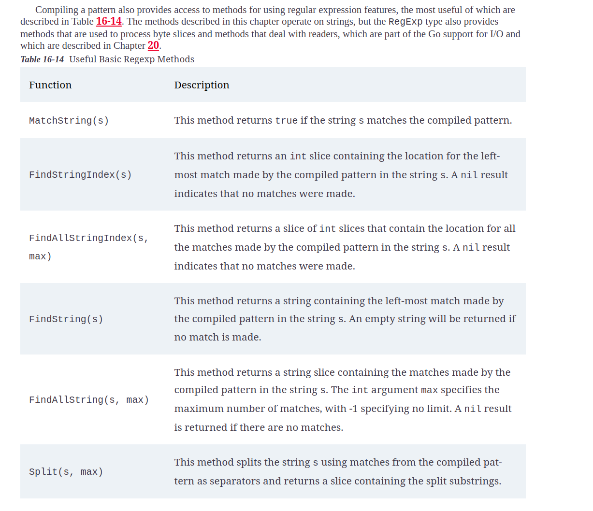

# strings and regexp

## Processing Strings 

* **strings** package provides a set of functions for processing strings.

### Manipulating strings

#### Splitting Strings

#### Trimming Strings

#### Altering Strings

#### Replacer Methods

## Building Strings

## Using Regular Expression

### Compiled Pattern method 

### Using SubstringExpression

### Replacing Substring using Regexp

