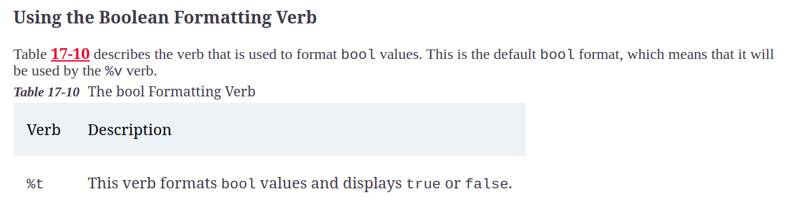

# Formatting and scanning strings

## Writing Strings

## Formatting strings

### Understanding the formatting verb

### Formatting Arrays, slices and maps

### Using the integer formatting verbs

### Using the floating point formatting verbs

#### Formatting verb modifier

### Using the string and character formatting verbs

### Using Boolean Formatting verbs

### Using Pointer Formatting verbs

## Scanning Strings

* The fmt package provides functions for scanning strings, which is the process of parsing strings that contain values separated by spaces. 

### Scanning in a slice

### Dealing with newline characters

By default, scanning treats newlines in the same way as spaces, acting as separators between values.

The Scan function doesn’t stop looking for values until after it has received the number it expects and the first press of the Enter key is treated as a separator and not the termination of the input.

### Using a Different String Source

