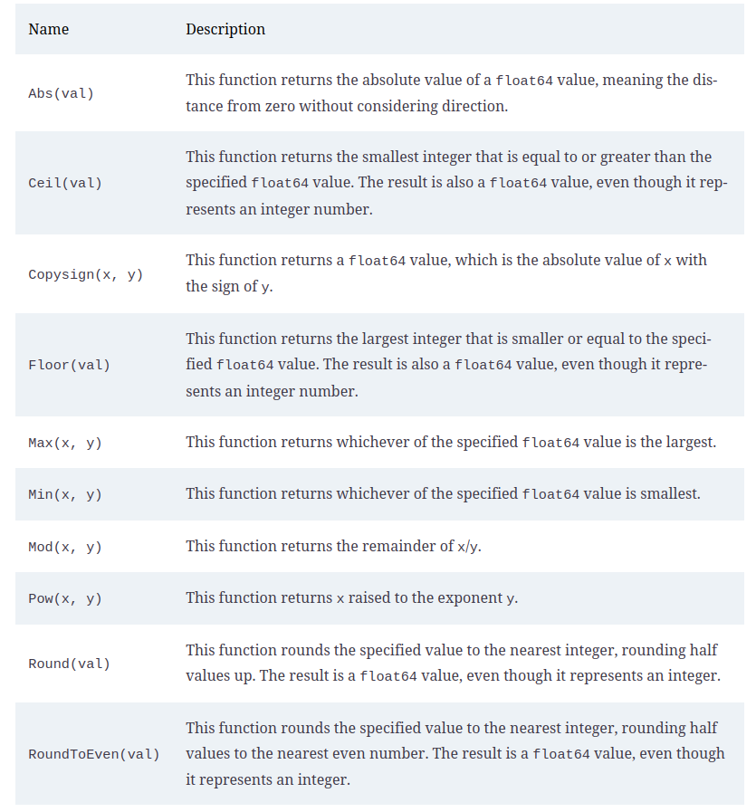
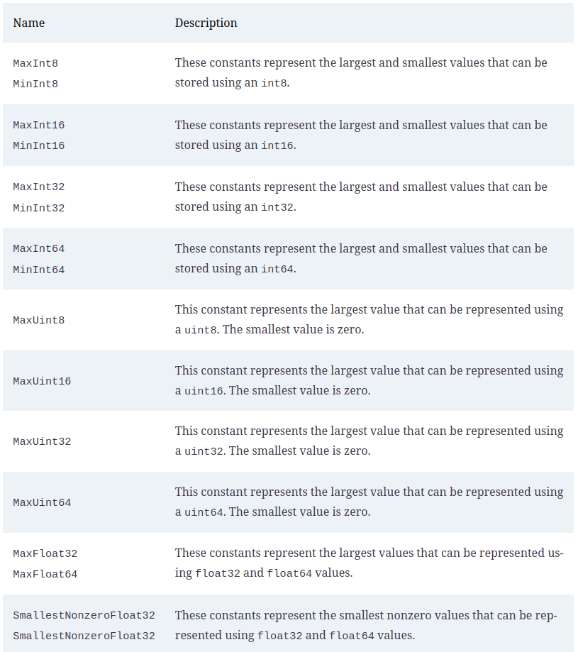
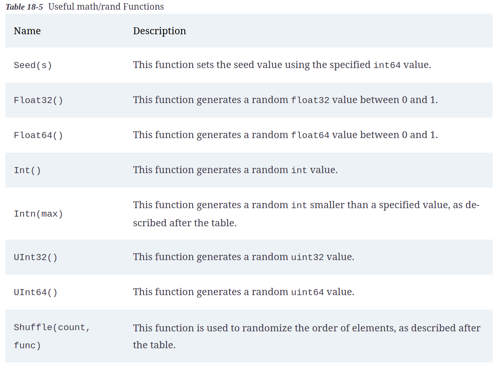
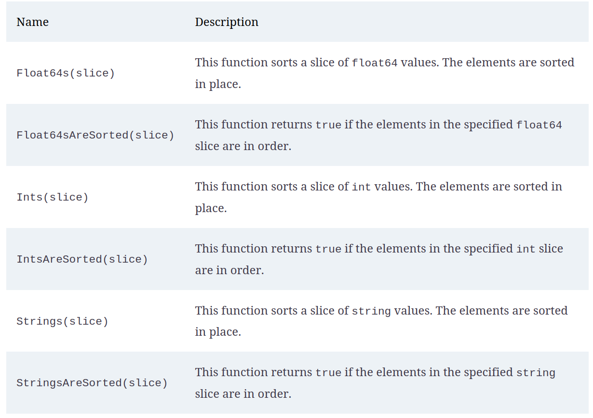
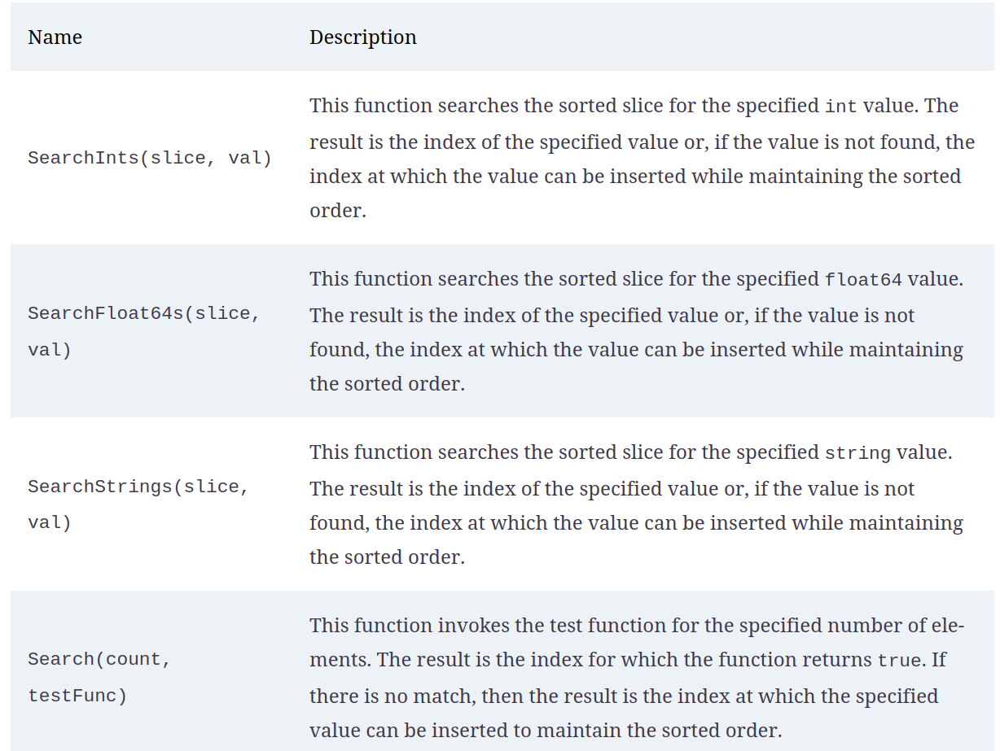
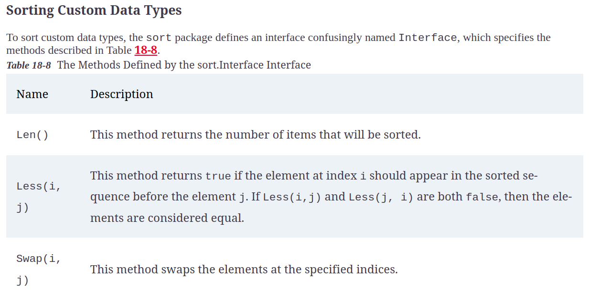
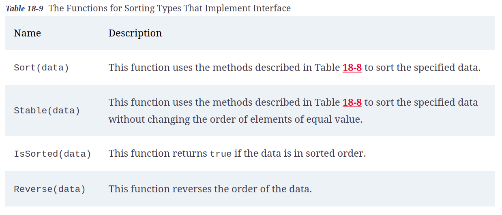

# Math Functions and Data Sorting

## Working with numbers

### Useful function from math package

### Limit Constants

* The math package also provides a set of constants for the limits of the numeric data types

### Generating Random Numbers

* The math/rand package provides support for generating random numbers.

## Sorting Data

### Sorting Numbers and string slices

#### Basic Function for sorting

### Searching Sorted Data

### Sorting Custom Data Type

#### sort.Interface

#### Function for sorting types that implement interface

