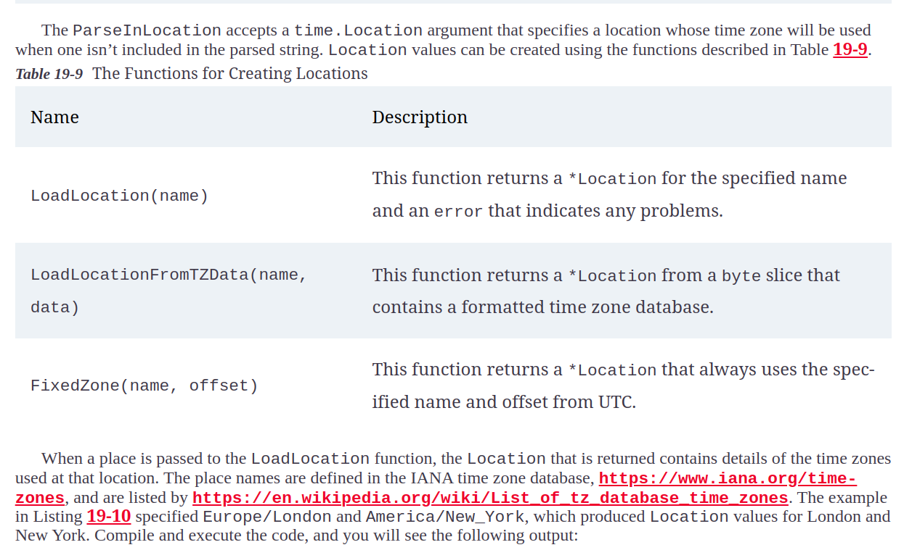

# Dates, Times, and Durations

## Working with Dates and times

### Method for accessing time components

### Types used to describe time components

### Formatting Times as Strings

### The Layout Constants Defined by the time Package

### Parsing time values from strings

### Specifying a Parsing Location

* The Parse function assumes that dates and times expressed without a time zone are defined in Coordinated Universal Time (UTC). The ParseInLocation method can be used to specify a location that is used when no time zone is specified

### Function for creating Locations

### Embedding the time zone database

### Manipulating time values

### Time duration representation

#### Duration methods

#### Creating Duration relative to time

#### Creating Duration from string

## Using the Time Features for Goroutine and channels

### Stopping and resetting timer

* Caution :- Be careful when stopping a timer. The timer’s channel is not closed, which means that reads from the channel will continue to block even after the timer has stopped

### Time Function for creating tick

