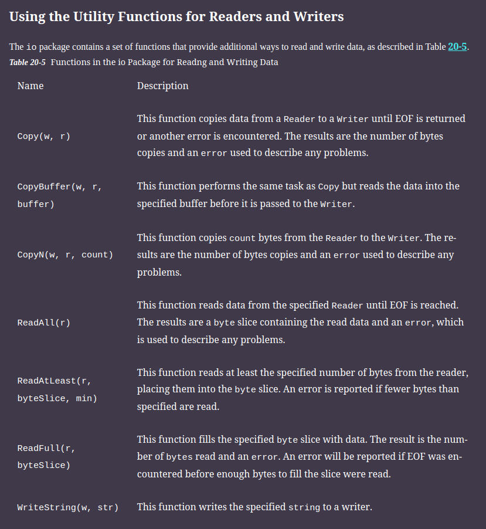
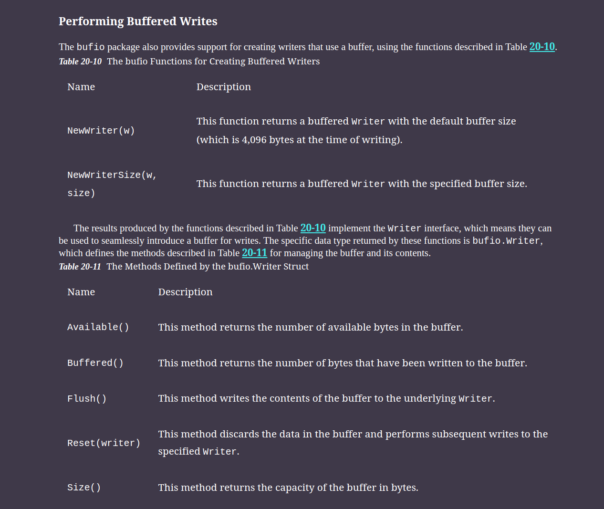

# Reading and Writing Data

## Utility Function for Reader and Writer

## Using the specialized Readers and Writers

## Buffering data

### Buffered Read

#### Addition Buffered Reader method

### Buffered Write

## Formatting and Scanning with reader and writer

