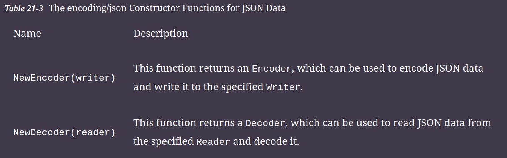
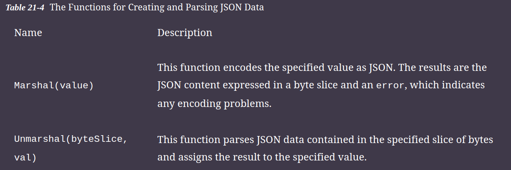
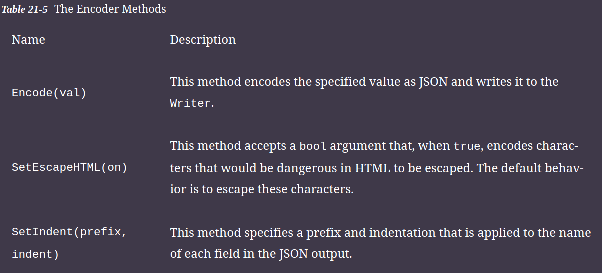
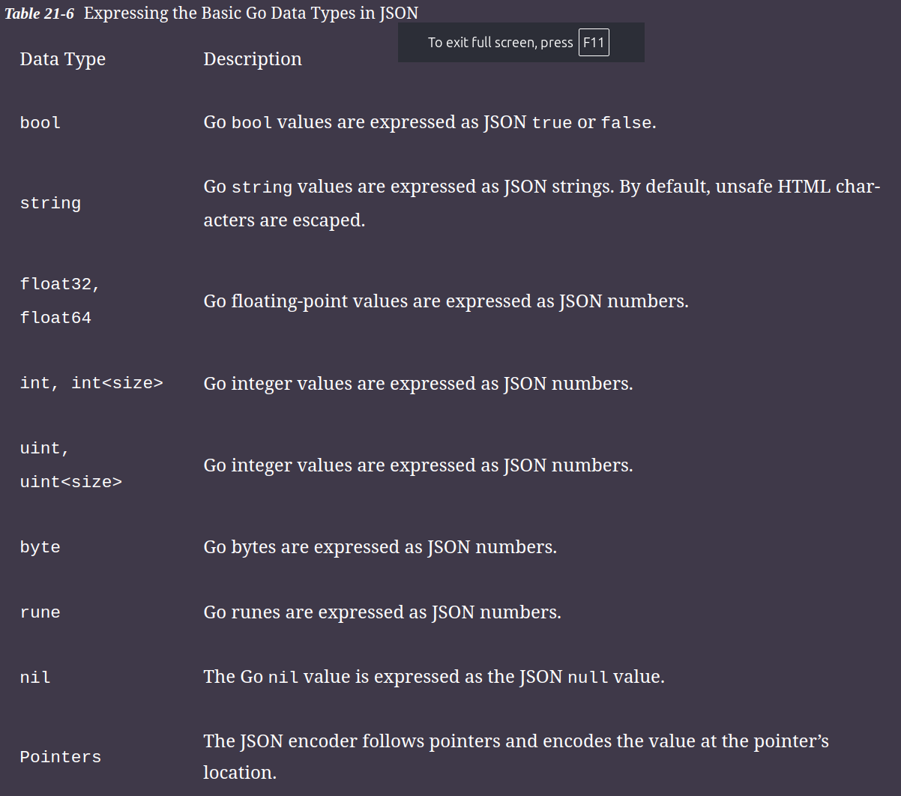
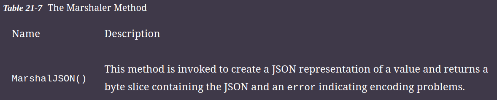
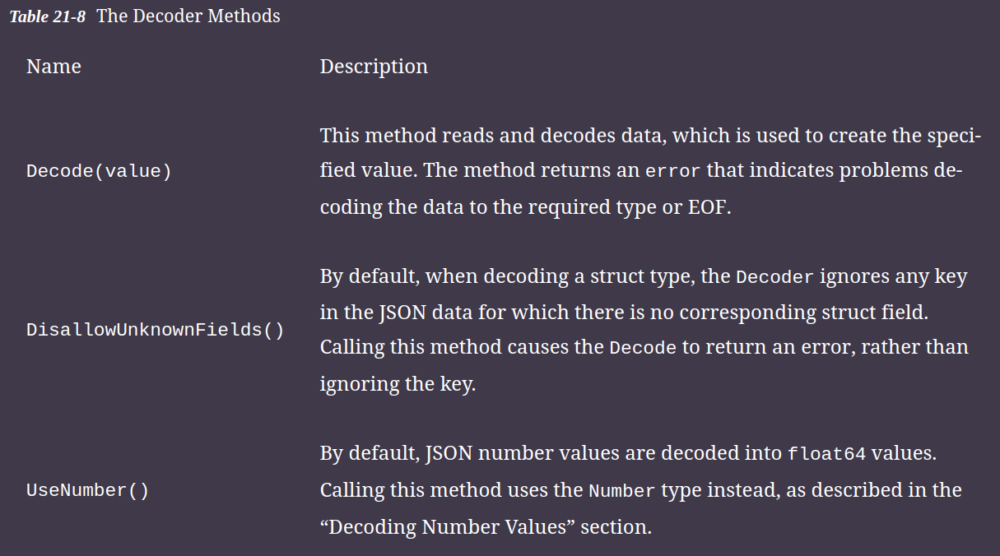
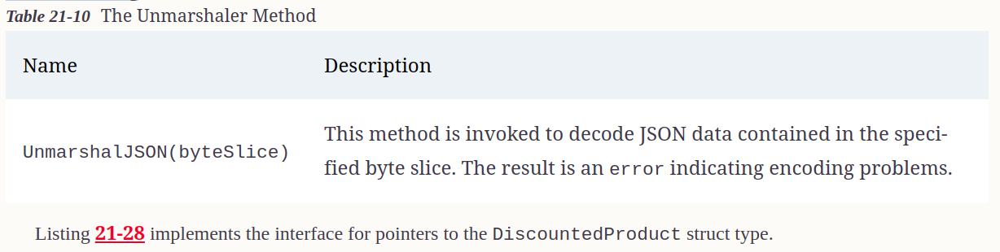

# Working with JSON data

## Reading and Writing JSON Data

* The encoding/json package provides support for encoding and decoding JSON data



**Note -> The Go standard library includes packages for other data formats, including XML and CSV.**



### Encoding JSON Data

* The NewEncoder constructor function is used to create an Encoder, which can be used to write JSON data to a Writer, using the methods



* In any language except JavaScript, the data types expressed by JSON don’t line up exactly to the native data types.

**Below Table summarizes how the basic Go data types are represented in JSON.**



#### Demonstrates the process of creating a JSON encoder and encoding some of the basic Go types.

```go
func main() {
    var b bool = true
    var str string = "Hello"
    var fval float64 = 99.99
    var ival int = 200
    var pointer *int = &ival
    var writer strings.Builder
    encoder := json.NewEncoder(&writer)
    for _, val := range []interface{} {b, str, fval, ival, pointer} {
        encoder.Encode(val)
    }
    fmt.Print(writer.String())
}
```

Output

```sh
true
"Hello"
99.99
200
200
```

#### Encoding Arrays and Slices

* Go slices and arrays are encoded as JSON arrays, with the **exception that byte slices are expressed as base64-encoded strings**

* **Byte arrays, however, are encoded as an array of JSON numbers.**

```go
func main() {
    names := []string {"Kayak", "Lifejacket", "Soccer Ball"}
    numbers := [3]int { 10, 20, 30}
    var byteArray [5]byte
    copy(byteArray[0:], []byte(names[0]))
    byteSlice := []byte(names[0])
    var writer strings.Builder
    encoder := json.NewEncoder(&writer)
    encoder.Encode(names)
    encoder.Encode(numbers)
    encoder.Encode(byteArray)
    encoder.Encode(byteSlice)
    fmt.Print(writer.String())
}
```

Output
```sh
["Kayak","Lifejacket","Soccer Ball"]
[10,20,30]
[75,97,121,97,107]
"S2F5YWs="
```

* The Encoder expresses each array in the JSON syntax, except the byte slice.

**Notice that byte arrays and byte slices are processed differently, even when their contents are the same.**

#### Encoding Maps

* Go maps are encoded as JSON objects, with the map keys used as the object keys. The values contained in the map are encoded based on their type.

**Tip :- Maps can also be useful for creating custom JSON representations of Go data, as described in the “Creating Completely Custom JSON Encodings ” section.**

```go
func main() {
    m := map[string]float64 {
        "Kayak": 279,
        "Lifejacket": 49.95,
    }
    var writer strings.Builder
    encoder := json.NewEncoder(&writer)
    encoder.Encode(m)
    fmt.Print(writer.String())
}
```

#### Encoding Structs

* The Encoder expresses struct values as JSON objects, using the exported struct field names as the object’s keys and the field values as the object’s values

```go
func EncodingStruct() {
	p1 := &Person{"Nikhil", 21}

	var writer strings.Builder

	encoder := json.NewEncoder(&writer)

	encoder.Encode(p1)

	fmt.Print(writer.String())
}
```

### Understanding the Effect of Promotion in JSON in Encoding

```go
func EffectOfPromotion() {
	Laptop := &Product{
		Name:     "Mac",
		Category: "Electronics",
		Price:    89000,
	}

	dp := DiscountedProduct{
		Laptop,
		10000,
	}

	var writer strings.Builder

	encoder := json.NewEncoder(&writer)

	encoder.Encode(&dp)

	fmt.Print(writer.String())
}
```

* Notice that encodes a pointer to the struct value. The Encode function follows the pointer and encodes the value at its location, which means that the code encodes the DiscountedProduct value without creating a copy.

### Customizing the JSON Encoding of Structs

* How a struct is encoded can be customized using struct tags, which are string literals that follow fields.

* Struct tags are part of the Go support for reflection but for this chapter it is enough to know that tags follow fields and can be used to alter two aspects of how a field is encoded in JSON.

```go
package main
type DiscountedProduct struct {
    *Product `json:"product"`
    Discount float64
}
```

### Omitting a Field

* The Encoder skips fields decorated with a tag that specifies a hyphen (the - character) for the name.

```go
package main
type DiscountedProduct struct {
    *Product `json:"product"`
    Discount float64 `json:"-"`
}

// The new tag tells the Encoder to skip the Discount field when creating the JSON representation of a DIscountedProduct value.
```

### Omitting Unassigned Fields

* By default, the JSON Encoder includes struct fields, even when they have not been assigned a value.

```go
func main() {
    var writer strings.Builder
    encoder := json.NewEncoder(&writer)
    dp := DiscountedProduct {
        Product: &Kayak,
        Discount: 10.50,
    }
    encoder.Encode(&dp)
    dp2 := DiscountedProduct { Discount: 10.50 }
    encoder.Encode(&dp2)
    fmt.Print(writer.String())
}
```

* To omit a nil field, the omitempty keyword is added to the tag for the field

```go
type DiscountedProduct struct {
    *Product `json:"product,omitempty"`
    Discount float64 `json:"-"`
}

// The omitempty keyword is separated from the field name with a comma but without any spaces.
```
* To skip a nil field without changing the name or field promotion, specify the omitempty keyword without a name

```go
type DiscountedProduct struct {
    *Product `json:",omitempty"`
    Discount float64 `json:"-"`
}
```

* The Encoder will promote the Product fields if a value has been assigned to the embedded field and omit the field if no value has been assigned.

### Forcing Fields to be Encoded as Strings

* Struct tags can be used to force a field value to be encoded as a string, overriding the normal encoding for the field type

```go
type DiscountedProduct struct {
    *Product `json:",omitempty"`
    Discount float64 `json:",string"`
}
```
* The addition of the string keyword overrides the default encoding and produces a string for the Discount field

### Encoding Interfaces

* The JSON encoder can be used on values assigned to interface variables, but it is the dynamic type that is encoded.

```go
func EncodingInterface() {
	var writer strings.Builder
	Laptop := &Product{
		Name:     "Mac",
		Category: "Electronics",
		Price:    89000,
	}
	encoder := json.NewEncoder(&writer)
	dp := DiscountedProduct{
		Product:  Laptop,
		Discount: 10.50,
	}
	namedItems := []Named{&dp, &Person{PersonName: "Alice"}}
	encoder.Encode(namedItems)
	fmt.Print(writer.String())
}
```

* No aspect of the interface is used to adapt the JSON, and all the exported fields of each value in the slice are included in the JSON.

* This can be a useful feature, but care must be taken when decoding this kind of JSON, because each value can have a different set of fields

### Creating Completely Custom JSON Encodings

* The Encoder checks to see whether a struct implements the Marshaler interface, which denotes a type that has a custom encoding and which defines the method MarshalJSON()



```go
func (dp *DiscountedProductOmitUnassigned) MarshalJSON() (jsn []byte, err error) {
	if dp.Product != nil {
		m := map[string]interface{}{
			"product": dp.Name,
			"cost":    dp.Price - dp.Discount,
		}

		jsn, err = json.Marshal(m)
	}

	return
}
```


* The MarshalJSON method can generate JSON in any way that suits the project, but I find the most reliable approach is to use the support for encoding maps. I define a map with string keys and use the empty interface for the values. This allows me to build the JSON by adding key-value pairs to the map and then pass the map to the Marshal function.

## Decoding JSON Data

* The NewDecoder constructor function creates a Decoder, which can be used to decode JSON data obtained from a Reader.



```go

func DecodingJSONData() {
	reader := strings.NewReader(`true "hello" 99.20 200`)
	vals := []interface{}{}

	decoder := json.NewDecoder(reader)

	for {
		var decoderVal interface{}

		err := decoder.Decode(&decoderVal)

		if err != nil {
			if err != io.EOF {
				Printfln("Error %v", err.Error())
			}
			break
		}

		vals = append(vals, decoderVal)
	}

	for _, val := range vals {
		Printfln("Decoded (%T): %v", val, val)
	}
}
```

* The first step in decoding the data is to create the Decoder, which accepts a Reader.
* I want to decode multiple values, so I call the Decode method inside a for loop. 
* The Decoder is able to select the appropriate Go data type for JSON values, and this is achieved by providing a pointer to an empty interface as the argument to the Decode method

### Decoding Number Values

* JSON uses a single data type to represent both floating-point and integer values. 
* The Decoder decodes these numeric values as float64 values.

* This behavior can be changed by calling the UseNumber method on the Decoder, which causes JSON number values to be decoded into the Number type, defined in the encoding/json package.

```go
func main() {
  reader := strings.NewReader(`true "Hello" 99.99 200`)
  vals := []interface{} { }
  decoder := json.NewDecoder(reader)
  decoder.UseNumber()
  for {
      var decodedVal interface{}
      err := decoder.Decode(&decodedVal)
      if (err != nil) {
          if (err != io.EOF) {
              Printfln("Error: %v", err.Error())
          }
          break
      }
      vals = append(vals, decodedVal)
  }
  for _, val := range vals {
      if num, ok := val.(json.Number); ok {
          if ival, err := num.Int64(); err == nil {
              Printfln("Decoded Integer: %v", ival)
          } else if fpval, err := num.Float64(); err == nil {
              Printfln("Decoded Floating Point: %v", fpval)
          } else {
              Printfln("Decoded String: %v", num.String())
          }
      } else {
          Printfln("Decoded (%T): %v", val, val)
      }
  }
}
```

### Specifying Types for Decoding

* The previous examples passed an empty interface variable to the Decode method.

* This lets the Decoder select the Go data type for the JSON value that is decoded. If you know the structure of the JSON data you are decoding, you can direct the Decoder to use specific Go types by using variables of that type to receive a decoded value.

```go
func main() {
  reader := strings.NewReader(`true "Hello" 99.99 200`)
  var bval bool
  var sval string
  var fpval float64
  var ival int
  vals := []interface{} { &bval, &sval, &fpval, &ival }
  decoder := json.NewDecoder(reader)
  for i := 0; i < len(vals); i++ {
      err := decoder.Decode(vals[i])
      if err != nil {
          Printfln("Error: %v", err.Error())
          break
      }
  }
  Printfln("Decoded (%T): %v", bval, bval)
  Printfln("Decoded (%T): %v", sval, sval)
  Printfln("Decoded (%T): %v", fpval, fpval)
  Printfln("Decoded (%T): %v", ival, ival)
}
```

**The Decoder will return an error if it can’t decode a JSON value into a specified type. This technique should be used only when you are confident that you understand the JSON data that will be decoded.**

### Decoding Arrays

* The Decoder processes arrays automatically, but care must be taken because JSON allows arrays to contain values of different types, which conflicts with the strict type rules enforced by Go.

```go
func main() {
  reader := strings.NewReader(`[10,20,30]["Kayak","Lifejacket",279]`)
    ints := []int {}
    mixed := []interface{} {}
    vals := []interface{} { &ints, &mixed}
    decoder := json.NewDecoder(reader)
    for i := 0; i < len(vals); i++ {
        err := decoder.Decode(vals[i])
        if err != nil {
            Printfln("Error: %v", err.Error())
            break
        }
    }
    Printfln("Decoded (%T): %v", ints, ints)
    Printfln("Decoded (%T): %v", mixed, mixed)
}
```
* I can specify an int slice to decode the first array in the JSON data because all the values can be represented as Go int values. The second array contains a mix of values, which means that I have to specify the empty interface as the target type. The literal slice syntax is awkward when using the empty interface because two sets of braces are required:
```go
...
mixed := []interface{} {}
...
```

* The empty interface type includes empty braces (interface{}) and so does specifying an empty slice ({}).

### Decoding Maps

* JavaScript objects are expressed as key-value pairs, which makes it easy to decode them into Go maps

```go
func DecodingMaps() {
	reader := strings.NewReader(`{"Kayak" : 279 , "Lifejacket" : 49.95}`)

	m := map[string]interface{}{}

	decoder := json.NewDecoder(reader)

	err := decoder.Decode(&m)

	if err != nil {
		Printfln("Error %v", err.Error())
	} else {
		Printfln("Map: %T, %v", m, m)
		for k, v := range m {
			Printfln("Key: %v , Value: %v", k, v)
		}
	}
}
```

* A single JSON object can be used for multiple data types as values, but if you know in advance that you will be decoding a JSON object that has a single value type, then you can be more specific when defining the map into which the data will be decoded

```go
func DecodingMapWithSpecificValueType() {
	reader := strings.NewReader(`{"Kayak" : 279, "Lifejacket" : 49.95}`)
	m := map[string]float64{}
	decoder := json.NewDecoder(reader)
	err := decoder.Decode(&m)
	if err != nil {
		Printfln("Error: %v", err.Error())
	} else {
		Printfln("Map: %T, %v", m, m)
		for k, v := range m {
			Printfln("Key: %v, Value: %v", k, v)
		}
	}
}
```

### Decoding Structs

* The key-value structure of JSON objects can be decoded into Go struct values
* this requires more knowledge of the JSON data than decoding the data into a map

```
Decoding to Interface Types

As I explained earlier in the chapter, the JSON encoder deals with interfaces by encoding the value using the exported fields of the dynamic type. This is because JSON deals with key-value pairs and has no way to express methods. As a consequence, you cannot decode directly to an interface variable from JSON. Instead, you must decode to a struct or map and then assign the value that is created to an interface variable.
```

```go
func DecodingStruct() {
	reader := strings.NewReader(`
        {"Name":"Kayak","Category":"Watersports","Price":279}
        {"Name":"Lifejacket","Category":"Watersports" }
        {"name":"Canoe","category":"Watersports", "price": 100, "inStock": true }
    `)
	decoder := json.NewDecoder(reader)
	for {
		var val Product
		err := decoder.Decode(&val)
		if err != nil {
			if err != io.EOF {
				Printfln("Error: %v", err.Error())
			}
			break
		} else {
			Printfln("Name: %v, Category: %v, Price: %v",
				val.Name, val.Category, val.Price)
		}
	}
}
```

* The Decoder decodes the JSON object and uses the keys to set the values of the exported struct fields. 
* The capitalization of the fields and JSON keys don’t have to match, and the Decoder will ignore any JSON key for which there isn’t a struct field and ignore any struct field for which there is no JSON key.

* The JSON objects contain different capitalization and have more or fewer keys than the Product struct fields. The Decoder processes the data as best as it can

### Disallowing Unused Keys

* By default, the Decoder will ignore JSON keys for which there is no corresponding struct field. This behavior can be changed by calling the DisallowUnknownFields method which triggers an error when such a key is encountered.

```go
...
decoder := json.NewDecoder(reader)
decoder.DisallowUnknownFields()
...

// One of the JSON objects defined in Listing 21-25 contains an inStock key, for which there is no corresponding Product field. Normally, this key would be ignored, but since the DisallowUnknownFields method has been called, decoding this object produces an error
```

```sh
Name: Kayak, Category: Watersports, Price: 279
Name: Lifejacket, Category: Watersports, Price: 0
Error: json: unknown field "inStock"
```

### Using Struct Tags to Control Decoding

* The keys used in a JSON object don’t always align with the fields defined by the structs in a Go project. When this happens, struct tags can be used to map between the JSON data and the struct.

```go
package main
import "encoding/json"
type DiscountedProduct struct {
    *Product `json:",omitempty"`
    Discount float64 `json:"offer,string"`
}
func (dp *DiscountedProduct) MarshalJSON() (jsn []byte, err error) {
    if (dp.Product != nil) {
        m := map[string]interface{} {
            "product": dp.Name,
            "cost": dp.Price - dp.Discount,
        }
        jsn, err = json.Marshal(m)
    }
    return
}

// The tag applied to the Discount field tells the Decoder that the value for this field should be obtained from the JSON key named offer and that the value will be parsed from a string, instead of the JSON number that would usually be expected for a Go float64 value.
```

```go
func main() {
    reader := strings.NewReader(`
        {"Name":"Kayak","Category":"Watersports","Price":279, "Offer": "10"}`)
    decoder := json.NewDecoder(reader)
    for {
        var val DiscountedProduct
        err := decoder.Decode(&val)
        if err != nil {
            if err != io.EOF {
                Printfln("Error: %v", err.Error())
            }
            break
        } else {
            Printfln("Name: %v, Category: %v, Price: %v, Discount: %v",
                val.Name, val.Category, val.Price, val.Discount)
        }
    }
}
```

## Creating Completely Custom JSON Decoders

* The Decoder checks to see whether a struct implements the Unmarshaler interface, which denotes a type that has a custom encoding



```go
package main
import (
    "encoding/json"
    "strconv"
)
type DiscountedProduct struct {
    *Product `json:",omitempty"`
    Discount float64 `json:"offer,string"`
}
func (dp *DiscountedProduct) MarshalJSON() (jsn []byte, err error) {
    if (dp.Product != nil) {
        m := map[string]interface{} {
            "product": dp.Name,
            "cost": dp.Price - dp.Discount,
        }
        jsn, err = json.Marshal(m)
    }
    return
}
func (dp *DiscountedProduct) UnmarshalJSON(data []byte) (err error) {
    mdata := map[string]interface{} {}
    err = json.Unmarshal(data, &mdata)
    if (dp.Product == nil) {
        dp.Product = &Product{}
    }
    if (err == nil) {
        if name, ok := mdata["Name"].(string); ok {
            dp.Name = name
        }
        if category, ok := mdata["Category"].(string); ok {
            dp.Category = category
        }
        if price, ok := mdata["Price"].(float64); ok {
            dp.Price = price
        }
        if discount, ok := mdata["Offer"].(string); ok {
            fpval, fperr := strconv.ParseFloat(discount, 64)
            if (fperr == nil) {
                dp.Discount = fpval
            }
        }
    }
    return
}
```

* This implementation of the UnmarshalJSON method uses the Unmarshal method to decode the JSON data into a map and then checks the type of each value required for the DiscountedProduct struct. Compile and execute the project, and you will see the custom decoding:

```sh
Name: Kayak, Category: Watersports, Price: 279, Discount: 10
```