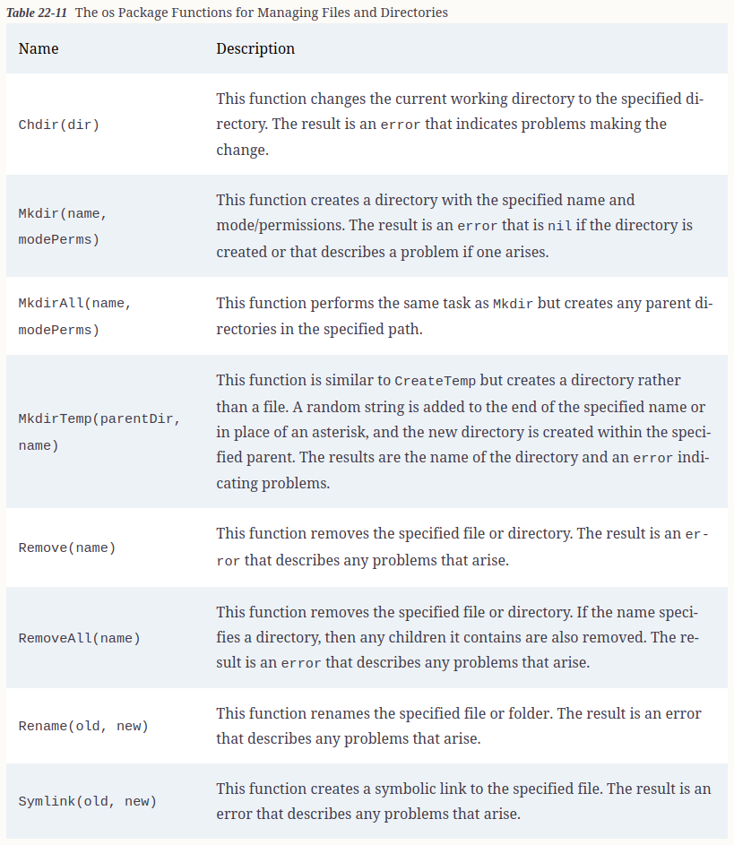
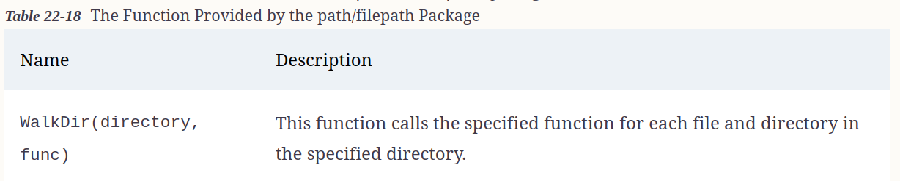

# Working with files

## Reading Files

* The key package when dealing with files is the os package. 
* This package provides access to operating system features—including the file system—in a way that hides most of the implementation details, meaning that the same functions can be used to achieve the same results regardless of the operating system being used.


* One of the most common reasons to read a file is to load configuration data.

### Using the Read Convenience Function

* The ReadFile function provides a convenient way to read the complete contents of a file into a byte slice in a single step.

```go
func LoadConfig() (err error) {
    data, err := os.ReadFile("config.json")
    if (err == nil) {
        Printfln(string(data))
    }
    return
}

// The LoadConfig function uses the ReadFile function to read the contents of the config.json file. The file will be read from the current working directory when the application is executed, which means that I can open the file just with its name.
```

### Decoding the JSON Data

* For the example configuration file, receiving the contents of the file as a string is not ideal, and a more useful approach would be to parse the contents as JSON, which can be easily done by wrapping up the byte data so that it can be accessed through a Reader.

```go
type ConfigData struct {
	UserName           string
	AdditionalProducts []Product
}

var Config ConfigData

func LoadConfig() (err error) {
	data, err := os.ReadFile("config.json")

	if err == nil {
		// Printfln(string(data))
		decoder := json.NewDecoder(strings.NewReader(string(data)))
		decoder.Decode(&Config)
	}

	return
}

func init() {
	err := LoadConfig()

	if err != nil {
		Printfln("Error Loading Config: %v", err.Error())
	} else {
		Printfln("Username: %v", Config.UserName)
		Products = append(Products, Config.AdditionalProducts...)
	}
}

// I could have decoded the JSON data in the config.json file into a map, but I took a more structured approach and defined a struct type whose fields match the structure of the configuration data, which I find makes it easier to use configuration data in real projects.
```

### Using the File Struct to Read a File

* The Open function opens a file for reading and returns a File value, which represents the open file, and an error, which is used to indicate problems opening the file. 

* The File struct implements the Reader interface, which makes it simple to read and process the example JSON data, without reading the entire file into a byte slice

#### Using the Standard Input, Output, and Error.

  The os package defines three *File variables, named Stdin, Stdout, and Stderr, that provide access to the standard input, standard output, and standard error.

```go
func LoadConfigUsingFileStruct() (err error) {
	file, err := os.Open("config.json")

	if err == nil {
		defer file.Close()
		decoder := json.NewDecoder(file)
		err = decoder.Decode(&Config)
	}

	return
}

func init() {
	// err := LoadConfig()
	err := LoadConfigUsingFileStruct()

	if err != nil {
		Printfln("Error Loading Config: %v", err.Error())
	} else {
		Printfln("Username: %v", Config.UserName)
		Products = append(Products, Config.AdditionalProducts...)
	}
}
```

#### Reading from a Specific Location

* The File struct defines methods beyond those required by the Reader interface that allows reads to be performed at a specific location in the file


```go
func LoadConfigUsingSpecificLocation() (err error) {
	file, err := os.Open("config.json")

	if err == nil {
		defer file.Close()

		nameSlice := make([]byte, 5)
		file.ReadAt(nameSlice, 17)
		// Printfln("NameSlice: %v", string(nameSlice))
		Config.UserName = string(nameSlice)

		file.Seek(48, 0)

		decoder := json.NewDecoder(file)

		err = decoder.Decode(&Config.AdditionalProducts)
	}

	return
}
```

## Writing to Files

* The os package also includes functions for writing files
* These functions are more complex to use than their read-related counterparts because more configuration options are required.


### Using the write convenience function

* The WriteFile function provides a convenient way to write an entire file in a single step and will create the file if it does not exist.

```go
func UsingWriteConvenienceFunction() {
	total := 0.0
	for _, p := range Products {
		total += p.Price
	}
	dataStr := fmt.Sprintf("Time: %v, Total: $%.2f\n",
		time.Now().Format("Mon 15:04:05"), total)
	err := os.WriteFile("output.txt", []byte(dataStr), 0666)
	if err == nil {
		fmt.Println("Output file created")
	} else {
		Printfln("Error: %v", err.Error())
	}
}
```


### Using the File Struct to Write to a File

* The OpenFile function opens a file and returns a File value

* Unlike the ***Open*** function, the ***OpenFile*** function accepts one or more flags that specify how the file should be opened. 

* The flags are defined as constants in the os package

* **Care must be taken with these flags, not all of which are supported by every operating system.**


```go
func UsingOpenFileForWriting() {
	total := 0.0
	for _, p := range Products {
		total += p.Price
	}
	dataStr := fmt.Sprintf("Time: %v, Total: $%.2f\n", time.Now().Format("Mon 15:04:05"), total)

	file, err := os.OpenFile("output.txt", os.O_CREATE|os.O_APPEND|os.O_WRONLY, 0666)

	if err == nil {
		defer file.Close()

		file.WriteString(dataStr)
	} else {
		Printfln("Error: %v", err.Error())
	}

}
```

#### File methods for writing data


### Writing JSON Data to a file

* The File struct implements the Writer interface, which allows a file to be used with the functions for formatting and processing strings described in earlier chapters. It also means that the JSON features can be used to write JSON data to a file.


## Using the Convenience Functions to Create New Files

* Although it is possible to use the OpenFile function to create new files, as demonstrated in the previous section, the os package also provides some useful convenience functions


```go
func CreatingTemporaryFile() {
	cheapProducts := []Product{}
	for _, p := range Products {
		if p.Price < 100 {
			cheapProducts = append(cheapProducts, p)
		}
	}
	file, err := os.CreateTemp(".", "tempfile-*.json")
	if err == nil {
		defer file.Close()
		encoder := json.NewEncoder(file)
		encoder.Encode(cheapProducts)
	} else {
		Printfln("Error: %v", err.Error())
	}
}
```

## Working with File Paths


* Once you have obtained a path, you can treat it like a string and simply append additional segments to it or, to avoid mistakes, use the functions provided by the path/filepath package for manipulating paths,

### path/filepath functions for paths


```go
func WorkingWithPath() {
	path, err := os.UserHomeDir()
	if err == nil {
		path = filepath.Join(path, "MyApp", "MyTempFile.json")
	}
	Printfln("Full path: %v", path)
	Printfln("Volume name: %v", filepath.VolumeName(path))
	Printfln("Dir component: %v", filepath.Dir(path))
	Printfln("File component: %v", filepath.Base(path))
	Printfln("File extension: %v", filepath.Ext(path))
}

```

## Managing Files and Directories



```go
func CreatingDirectories() {
	path, err := os.UserHomeDir()
	if err == nil {
		path = filepath.Join(path, "MyApp", "MyTempFile.json")
	}
	Printfln("Full path: %v", path)
	err = os.MkdirAll(filepath.Dir(path), 0766)
	if err == nil {
		file, err := os.OpenFile(path, os.O_CREATE|os.O_WRONLY, 0666)
		if err == nil {
			defer file.Close()
			encoder := json.NewEncoder(file)
			encoder.Encode(Products)
		}
	}
	if err != nil {
		Printfln("Error %v", err.Error())
	}
}
```

## Exploring the File System

* If you know the location of the files you require, you can simply create paths using the functions described in the previous section and use them to open files. If your project relies on processing the files created by another process, then you will need to explore the file system. 


* The result of the ReadDir function is a slice of values that implement the DirEntry interface, which defines the methods


* The FileInfo interface, which is the result of the Info method, is used to get details about a file or directory. The most useful methods defined by the FileInfo interface are


* You can also get a FileInfo value about a single file using the function

```go
func EnumeratingFiles() {
	path, err := os.Getwd()
	if err == nil {
		dirEntries, err := os.ReadDir(path)
		if err == nil {
			for _, dentry := range dirEntries {
				Printfln("Entry name: %v, IsDir: %v", dentry.Name(), dentry.IsDir())
			}
		}
	}
	if err != nil {
		Printfln("Error %v", err.Error())
	}
}
```

## Determining Whether a File Exists

* The os package defines a function named IsNotExist, accepts an error, and returns true if it denotes that the error indicates that a file does not exist,

```go
func CheckingWhetherFileExist() {
	targetFiles := []string{"no_such_file.txt", "config.json"}
	for _, name := range targetFiles {
		info, err := os.Stat(name)
		if os.IsNotExist(err) {
			Printfln("File does not exist: %v", name)
		} else if err != nil {
			Printfln("Other error: %v", err.Error())
		} else {
			Printfln("File %v, Size: %v", info.Name(), info.Size())
		}
	}
}

// The error returned by the Stat function is passed to the IsNotExist function, allowing nonexistent files to be identified
```

### Locating Files Using a Pattern

* The path/filepath package defines the Glob function, which returns all the names in a directory that match a specified pattern.


* Search pattern syntax


## Processing All Files in a Directory

* An alternative to using patterns is to enumerate all the files in a specific location, which can be done using the function which is defined in the path/filepath package.



* The callback function invoked by WalkDir receives a string that contains the path, a DirEntry value that provides details about the file or directory, and an error that indicates problems accessing that file or directory. The result of the callback function is an error that prevents the WalkDir function from entering the current directory by returning the special SkipDir value.