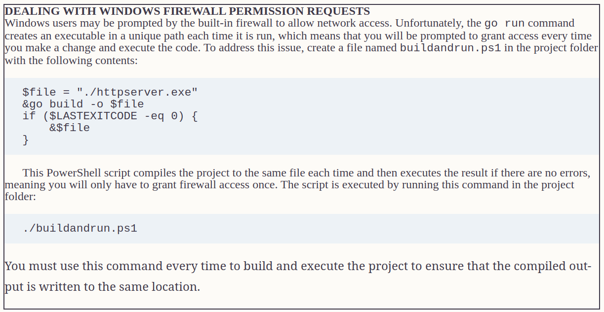

# Creating HTTP servers

## Creating a Simple HTTP Server

* The net/http package makes it easy to create a simple HTTP server, which can then be extended to add more complex and useful features.

```go
type StringHandler struct {
	message string
}

func (sh StringHandler) ServeHTTP(writer http.ResponseWriter, request *http.Request) {
	io.WriteString(writer, sh.message)
}

func CreatingSimpleHttpServer() {
	err := http.ListenAndServe(":5000", StringHandler{message: "Hello, World"})

	if err != nil {
		Printfln("Error: %v", err.Error())
	}
}
```



### Creating the HTTP Listener and Handler

* The net/http package provides a set of convenience functions that make it easy to create an HTTP server without needing to specify too many details.


* The ListenAndServe function starts listening for HTTP requests on a specified network address. 
* The ListenAndServeTLS function does the same for HTTPS requests,


**When a request arrives, it is passed onto a handler, which is responsible for producing a response. Handlers must implement the Handler interface, which defines the method**


* Put these features together and the result is an HTTP server that listens to requests on port 5000, on all interfaces, and which creates responses by writing a string. The details, such as opening the network connection and parsing the HTTP requests, are taken care of behind the scenes.

### Inspecting the Request

* HTTP requests are represented by the Request struct, defined in the net/http package.


```go
func (sh StringHandler) ServeHTTP(writer http.ResponseWriter,
	request *http.Request) {
	Printfln("Method: %v", request.Method)
	Printfln("URL: %v", request.URL)
	Printfln("HTTP Version: %v", request.Proto)
	Printfln("Host: %v", request.Host)
	for name, val := range request.Header {
		Printfln("Header: %v, Value: %v", name, val)
	}
	Printfln("---")
	io.WriteString(writer, sh.message)
}

```

* The browser makes two HTTP requests. The first is for /, which is the path component of the URL that was requested. The second request is for /favicon.ico, which the browser sends to get an icon to display at the top of the window or tab.

#### USING REQUEST CONTEXTS
* The net/http package defines a Context method for the Request struct, which returns an implementation of the context.Context interface. The Context interface is used to manage the flow of a request through an application. In Part 3, I use the Context feature in a custom web platform and online store.

## Filtering Requests and Generating Responses

* The HTTP server responds to all requests in the same way, which isn’t ideal. To produce different responses, I need to inspect the URL to figure out what is being requested and use the functions provided by the net/http package to send an appropriate response.

* The most useful fields and methods defined by the URL struct are 


* The ResponseWriter interface defines the methods that are available when creating a response. As noted earlier, this interface includes the Write method so that it can be used as a Writer, but ResponseWriter also defines the methods.

* Note that you must finish setting headers before using the Write method.


```go
func (sh StringHandler) ServeHTTP(writer http.ResponseWriter,
        request *http.Request) {
    if (request.URL.Path == "/favicon.ico") {
        Printfln("Request for icon detected - returning 404")
        writer.WriteHeader(http.StatusNotFound)
        return
    }
    Printfln("Request for %v", request.URL.Path)
    io.WriteString(writer, sh.message)
}
```

* The request handler checks the URL.Path field to detect icon requests and responds by using the WriteHeader to set a response using the StatusNotFound constant (although I could have simply specified the int literal value 404). 

* You may find that subsequent requests from the browser for http://localhost:5000 do not trigger a second request for the icon file. That’s because the browser notes the 404 response and knows that there is no icon file for this URL. Clear the browser’s cache and request http://localhost:5000 to return to the original behavior


## Using the Response Convenience Functions

* The net/http package provides a set of convenience functions that can be used to create common responses to HTTP requests


## Using the Convenience Routing Handler

* The process of inspecting the URL and selecting a response can produce complex code that is difficult to read and maintain. 
* To simplify the process, the net/http package provides a Handler implementation that allows matching the URL to be separated from producing a request.

```go
func (sh StringHandler) ServeHTTP(writer http.ResponseWriter, request *http.Request) {
	Printfln("Request for %v", request.URL.Path)
	io.WriteString(writer, sh.message)
}

func UsingRoutingHandler() {
	http.Handle("/message", StringHandler{"Hello, World"})
	http.Handle("/favicon.ico", http.NotFoundHandler())
	http.Handle("/", http.RedirectHandler("/message", http.StatusTemporaryRedirect))
	err := http.ListenAndServe(":5000", nil)
	if err != nil {
		Printfln("Error: %v", err.Error())
	}
}
```

* The key to this feature is using nil for the argument to the ListenAndServe function, like this:

```go
...
err := http.ListenAndServe(":5000", nil)
...
```

* This enables the default handler, which routes requests to handlers based on the rules set up with the functions described below


* To help set up the routing rules, the net/http package provides the functions described below which create Handler implementations, some of which wrap around the response functions described  


* The patterns used to match requests are expressed as paths, such a /favicon.ico, or as trees, which have a trailing slash, such as /files/. The longest patterns are matched first, and the root path ("/") matches any request and acts as a fallback route.

## Supporting HTTPS Requests

* The net/http package provides integrated support for HTTPS. To prepare for HTTPS, you will need to add two files to the httpserver folder: a certificate file and a private key file.


* The ListenAndServeTLS function is used to enable HTTPS, where the additional arguments specify the certificate and private key files, which are named certificate.cer and certificate.key in my project

```go
func main() {
    http.Handle("/message", StringHandler{ "Hello, World"})
    http.Handle("/favicon.ico", http.NotFoundHandler())
    http.Handle("/", http.RedirectHandler("/message", http.StatusTemporaryRedirect))
    go func () {
        err := http.ListenAndServeTLS(":5500", "certificate.cer",
            "certificate.key", nil)
        if (err != nil) {
            Printfln("HTTPS Error: %v", err.Error())
        }
    }()
    err := http.ListenAndServe(":5000", nil)
    if (err != nil) {
        Printfln("Error: %v", err.Error())
    }
}
// The ListenAndServeTLS and ListenAndServe functions block, so I have used a goroutine to support both HTTP and HTTPS requests, with HTTP handled on port 5000 and HTTPS on port 5500.
```

* The ListenAndServeTLS and ListenAndServe functions have been invoked with nil as the handler, which means that both HTTP and HTTPS requests will be handled using the same set of routes.

### Redirecting HTTP Requests to HTTPS

* A common requirement when creating web servers is to redirect HTTP requests to the HTTPS port. This can be done by creating a custom handler,

```go
func HTTPSRedirect(writer http.ResponseWriter,
        request *http.Request) {
    host := strings.Split(request.Host, ":")[0]
    target := "https://" + host + ":5500" + request.URL.Path
    if len(request.URL.RawQuery) > 0 {
        target += "?" + request.URL.RawQuery
    }
    http.Redirect(writer, request, target, http.StatusTemporaryRedirect)
}
func main() {
    http.Handle("/message", StringHandler{ "Hello, World"})
    http.Handle("/favicon.ico", http.NotFoundHandler())
    http.Handle("/", http.RedirectHandler("/message", http.StatusTemporaryRedirect))
    go func () {
        err := http.ListenAndServeTLS(":5500", "certificate.cer",
            "certificate.key", nil)
        if (err != nil) {
            Printfln("HTTPS Error: %v", err.Error())
        }
    }()
    err := http.ListenAndServe(":5000", http.HandlerFunc(HTTPSRedirect))
    if (err != nil) {
        Printfln("Error: %v", err.Error())
    }
}
```

## Creating a Static HTTP Server

* The net/http package includes built-in support for responding to requests with the contents of files. To prepare for the static HTTP server, create the httpserver/static folder and add to it a file named index.html.

### Creating the Static File Route

* Now that there are HTML and CSS files to work with, it is time to define the route that will make them available to request using HTTP.

```go
func CreatingStaticFileRoute() {
	http.Handle("/message", StringHandler{"Hello, World"})
	http.Handle("/favicon.ico", http.NotFoundHandler())
	http.Handle("/", http.RedirectHandler("/message", http.StatusTemporaryRedirect))
	fsHandler := http.FileServer(http.Dir("./static"))
	http.Handle("/files/", http.StripPrefix("/files", fsHandler))
	// go func() {
	// 	err := http.ListenAndServeTLS(":5500", "certificate.cer",
	// 		"certificate.key", nil)
	// 	if err != nil {
	// 		Printfln("HTTPS Error: %v", err.Error())
	// 	}
	// }()
	err := http.ListenAndServe(":5000", http.HandlerFunc(HTTPSRedirect))
	if err != nil {
		Printfln("Error: %v", err.Error())
	}
}
```

* The FileServer function creates a handler that will serve files, and the directory is specified using the Dir function. **(It is possible to serve files directly, but caution is required because it is easy to allow requests to select files outside of the target folder. The safest option is to use the Dir function as shown in this example.)**


* I am going to serve the content in the static folder with URL paths that start with files so that a request for /files/store.html, for example, will be handled using the static/store.html file. To do this, I have used the StripPrefix function, which creates a handler that removes a path prefix and passes the request onto another handler to service. Combining these handlers, as I have done in Listing 24-17, means that I can safely expose the contents of the static folder using the files prefix.


## Responding with JSON Data

```go
// json.go file

func HandleJsonRequest(writer http.ResponseWriter, request *http.Request) {
	writer.Header().Set("Content-Type", "application/json")
	json.NewEncoder(writer).Encode(Products)
}
func init() {
	http.HandleFunc("/json", HandleJsonRequest)
}

// The initialization function creates a route, which means that requests for /json will be processed by the HandleJsonRequest function. 
```

## Handling Form Data

### Reading Form Data from Requests

* The Request struct defines the fields and methods


```go
package main
import (
    "net/http"
    "strconv"
)
func ProcessFormData(writer http.ResponseWriter, request *http.Request) {
    if (request.Method == http.MethodPost) {
        index, _ := strconv.Atoi(request.PostFormValue("index"))
        p := Product {}
        p.Name = request.PostFormValue("name")
        p.Category = request.PostFormValue("category")
        p.Price, _ = strconv.ParseFloat(request.PostFormValue("price"), 64)
        Products[index] = p
    }
    http.Redirect(writer, request, "/templates", http.StatusTemporaryRedirect)
}
func init() {
    http.HandleFunc("/forms/edit", ProcessFormData)
}

// forms.go
```

### Reading Multipart Forms

* Forms encoded as multipart/form-data to allow binary data, such as files, to be safely sent to the server. To create a form that allows the server to receive a file, create a file named upload.html in the static folder with the content 

```go
package main
import (
    "net/http"
    "io"
    "fmt"
)
func HandleMultipartForm(writer http.ResponseWriter, request *http.Request) {
    fmt.Fprintf(writer, "Name: %v, City: %v\n", request.FormValue("name"),
        request.FormValue("city"))
    fmt.Fprintln(writer, "------")
    file, header, err := request.FormFile("files")
    if (err == nil) {
        defer file.Close()
        fmt.Fprintf(writer, "Name: %v, Size: %v\n", header.Filename, header.Size)
        for k, v := range header.Header {
            fmt.Fprintf(writer, "Key: %v, Value: %v\n", k, v)
        }
        fmt.Fprintln(writer, "------")
        io.Copy(writer, file)
    } else {
        http.Error(writer, err.Error(), http.StatusInternalServerError)
    }
}
func init() {
    http.HandleFunc("/forms/upload", HandleMultipartForm)
}

// upload.go
```


### Receiving Multiple Files in the Form

* The FormFile method returns only the first file with the specified name, which means that it can’t be used when the user is allowed to select multiple files for a single form element, which is the case with the example form.

```go
Search 50,000+ courses, events, titles, and more
Search 50,000+ courses, events, titles, and more
© The Author(s), under exclusive license to APress Media, LLC, part of Springer Nature 2022
A. FreemanPro Go
https://doi.org/10.1007/978-1-4842-7355-5_24
24. Creating HTTP Servers
Adam Freeman1  
(1)
London, UK
 
In this chapter, I describe the standard library support for creating HTTP servers and processing HTTP and HTTPS requests. I show you how to create a server and explain the different ways in which requests can be handled, including form requests. Table 24-1 puts HTTP servers in context.
Table 24-1Putting HTTP Servers in Context
Question

Answer

What are they?

The features described in this chapter make it easy for Go applications to create HTTP servers.

Why are they useful?

HTTP is one of the most widely used protocols and is useful for both user-facing applications and web services.

How is it used?

The features of the net/http package are used to create a server and handle requests.

Are there any pitfalls or limitations?

These features are well-designed and easy to use.

Are there any alternatives?

The standard library includes support for other network protocols and also for opening and using lower-level network connections. See https://pkg.go.dev/net@go1.17.1 for details of the net package and its subpackages, such as net/smtp, for example, which implements the SMTP protocol.

Table 24-2 summarizes the chapter.
Table 24-2Chapter Summary
Problem

Solution

Listing

Create an HTTP or HTTPS server

Use the ListenAndServe or ListenAndServeTLS functions

6, 7, 11

Inspect an HTTP request

Use the features of the Request struct

8

Produce a response

Use the ResponseWriter interface or the convenience functions

9

Handle requests to specific URLs

Use the integrated router

10, 12

Serve static content

Use the FileServer and StripPrefix function

13–17

Use a template to produce a response or produce a JSON response

Write the content to the ResponseWriter

18–20

Handle form data

Use the Request methods

21–25

Set or read cookies

Use the Cookie, Cookies, and SetCookie methods

26

Preparing for This Chapter
To prepare for this chapter, open a new command prompt, navigate to a convenient location, and create a directory named httpserver. Run the command shown in Listing 24-1 to create a module file.

TipYou can download the example project for this chapter—and for all the other chapters in this book—from https://github.com/apress/pro-go. See Chapter 2 for how to get help if you have problems running the examples.
go mod init httpserver
Listing 24-1Initializing the Module
Add a file named printer.go to the httpserver folder with the content shown in Listing 24-2.
package main
import "fmt"
func Printfln(template string, values ...interface{}) {
    fmt.Printf(template + "\n", values...)
}
Listing 24-2The Contents of the printer.go File in the httpserver Folder
Add a file named product.go to the httpserver folder with the content shown in Listing 24-3.
package main
type Product struct {
    Name, Category string
    Price float64
}
var Products = []Product {
    { "Kayak", "Watersports", 279 },
    { "Lifejacket", "Watersports", 49.95 },
    { "Soccer Ball", "Soccer", 19.50 },
    { "Corner Flags", "Soccer", 34.95 },
    { "Stadium", "Soccer", 79500 },
    { "Thinking Cap", "Chess", 16 },
    { "Unsteady Chair", "Chess", 75 },
    { "Bling-Bling King", "Chess", 1200 },
}
Listing 24-3The Contents of the product.go File in the httpserver Folder
Add a file named main.go to the httpserver folder with the content shown in Listing 24-4.
package main
func main() {
    for _, p := range Products {
        Printfln("Product: %v, Category: %v, Price: $%.2f",
            p.Name, p.Category, p.Price)
    }
}
Listing 24-4The Contents of the main.go File in the httpserver Folder
Use the command prompt to run the command shown in Listing 24-5 in the httpserver folder.
go run .
Listing 24-5Running the Example Project
The project will be compiled and executed, producing the following output:
Product: Kayak, Category: Watersports, Price: $279.00
Product: Lifejacket, Category: Watersports, Price: $49.95
Product: Soccer Ball, Category: Soccer, Price: $19.50
Product: Corner Flags, Category: Soccer, Price: $34.95
Product: Stadium, Category: Soccer, Price: $79500.00
Product: Thinking Cap, Category: Chess, Price: $16.00
Product: Unsteady Chair, Category: Chess, Price: $75.00
Product: Bling-Bling King, Category: Chess, Price: $1200.00
Creating a Simple HTTP Server
The net/http package makes it easy to create a simple HTTP server, which can then be extended to add more complex and useful features. Listing 24-6 demonstrates a server that responds to requests with a simple string response.
package main
import (
    "net/http"
    "io"
)
type StringHandler struct {
    message string
}
func (sh StringHandler) ServeHTTP(writer http.ResponseWriter,
        request *http.Request) {
    io.WriteString(writer, sh.message)
}
func main() {
    err := http.ListenAndServe(":5000", StringHandler{ message: "Hello, World"})
    if (err != nil) {
        Printfln("Error: %v", err.Error())
    }
}
Listing 24-6Creating a Simple HTTP Server in the main.go File in the httpserver Folder
There are only a few lines of code, but they are enough to create an HTTP server that responds to requests with Hello, World. Compile and execute the project and then use a web browser to request http://localhost:5000, which will produce the result shown in Figure 24-1.

Figure 24-1A response to an HTTP request
DEALING WITH WINDOWS FIREWALL PERMISSION REQUESTS
Windows users may be prompted by the built-in firewall to allow network access. Unfortunately, the go run command creates an executable in a unique path each time it is run, which means that you will be prompted to grant access every time you make a change and execute the code. To address this issue, create a file named buildandrun.ps1 in the project folder with the following contents:
$file = "./httpserver.exe"
&go build -o $file
if ($LASTEXITCODE -eq 0) {
    &$file
}
This PowerShell script compiles the project to the same file each time and then executes the result if there are no errors, meaning you will only have to grant firewall access once. The script is executed by running this command in the project folder:
./buildandrun.ps1
You must use this command every time to build and execute the project to ensure that the compiled output is written to the same location.

Although there are few lines of code in Listing 24-6, they take some time to unpack. But it is worth taking the time to understand how the HTTP server was created because it reveals a great deal about the features provided by the net/http package.

Creating the HTTP Listener and Handler
The net/http package provides a set of convenience functions that make it easy to create an HTTP server without needing to specify too many details. Table 24-3 describes the convenience functions for setting up a server.
Table 24-3The net/http Convenience Functions
Name

Description

ListenAndServe(addr, handler)

This function starts listening for HTTP requests on a specified address and passes requests onto the specified handler.

ListenAndServeTLS(addr, cert, key, handler)

This function starts listening for HTTPS requests. The arguments are the address

The ListenAndServe function starts listening for HTTP requests on a specified network address. The ListenAndServeTLS function does the same for HTTP requests, which I demonstrate in the “Supporting HTTPS Requests” section.

The addresses accepted by the functions in Table 24-3 can be used to restrict the HTTP server so that it only accepts requests on a specific interface or to listen for requests on any interface. Listing 24-6 uses the latter approach, which is to specify just the port number:
...
err := http.ListenAndServe(":5000", StringHandler{ message: "Hello, World"})
...
No name or address is specified, and the port number follows a colon, meaning that this statement creates an HTTP server that listens for requests on port 5000 on all interfaces.

When a request arrives, it is passed onto a handler, which is responsible for producing a response. Handlers must implement the Handler interface, which defines the method described in Table 24-4.
Table 24-4The Method Defined by the Handler Interface
Name

Description

ServeHTTP(writer, request)

This method is invoked to process a HTTP request. The request is described by a Request value, and the response is written using a ResponseWriter, both of which are received as parameters.

I describe the Request and ResponseWriter types in more detail in later sections, but the ResponseWriter interface defines the Write method required by the Writer interface, described in Chapter 20, which means that I can produce a string response by using the WriteString function defined in the io package:
...
io.WriteString(writer, sh.message)
...
Put these features together and the result is an HTTP server that listens to requests on port 5000, on all interfaces, and which creates responses by writing a string. The details, such as opening the network connection and parsing the HTTP requests, are taken care of behind the scenes.

Inspecting the Request
HTTP requests are represented by the Request struct, defined in the net/http package. Table 24-5 describes the basic fields defined by the Request struct.
Table 24-5The Basic Fields Defined by the Request Struct
Name

Description

Method

This field provides the HTTP method (GET, POST, etc.) as a string. The net/http package defines constants for the HTTP methods, such as MethodGet and MethodPost.

URL

This field returns the requested URL, expressed as a URL value.

Proto

This field returns a string that indicates the version of HTTP used for the request.

Host

This field returns a string containing the requested hos.

Header

This field returns a Header value, which is an alias to map[string][]string and contains the request headers. The map keys are the names of the headers, and the values are string slices containing the header values.

Trailer

This field returns a map[string]string that contains any additional headers that are included in the request after the body.

Body

This filed returns a ReadCloser, which is an interface that combines the Read method of the Reader interface with the Close method of the Closer interface, both of which are described in Chapter 22.

Listing 24-7 adds statements to the request handler function that write out values from the basic Request fields to the standard out.
package main
import (
    "net/http"
    "io"
)
type StringHandler struct {
    message string
}
func (sh StringHandler) ServeHTTP(writer http.ResponseWriter,
        request *http.Request) {
    Printfln("Method: %v", request.Method)
    Printfln("URL: %v", request.URL)
    Printfln("HTTP Version: %v", request.Proto)
    Printfln("Host: %v", request.Host)
    for name, val := range  request.Header {
        Printfln("Header: %v, Value: %v", name, val)
    }
    Printfln("---")
    io.WriteString(writer, sh.message)
}
func main() {
    err := http.ListenAndServe(":5000", StringHandler{ message: "Hello, World"})
    if (err != nil) {
        Printfln("Error: %v", err.Error())
    }
}
Listing 24-7Writing Request Fields in the main.go File in the httpserver Folder
Compile and execute the project and request http://localhost:5000. You will see the same response in the browser window as in the previous example, but this time there will also be output at the command prompt. The exact output will depend on your browser, but here is the output that I received using Google Chrome:
Method: GET
URL: /
HTTP Version: HTTP/1.1
Host: localhost:5000
Header: Upgrade-Insecure-Requests, Value: [1]
Header: Sec-Fetch-Site, Value: [none]
Header: Sec-Fetch-Mode, Value: [navigate]
Header: Sec-Fetch-User, Value: [?1]
Header: Accept-Encoding, Value: [gzip, deflate, br]
Header: Connection, Value: [keep-alive]
Header: Cache-Control, Value: [max-age=0]
Header: User-Agent, Value: [Mozilla/5.0 (Windows NT 10.0; Win64; x64)
    AppleWebKit/537.36 (KHTML, like Gecko) Chrome/91.0.4472.124 Safari/537.36]
Header: Accept, Value: [text/html,application/xhtml+xml,application/xml;q=0.9,
    image/avif,image/webp,image/apng,*/*;q=0.8,application/signedexchange;
    v=b3;q=0.9]
Header: Sec-Fetch-Dest, Value: [document]
Header: Sec-Ch-Ua, Value: [" Not;A Brand";v="99", "Google Chrome";v="91",
    "Chromium";v="91"]
Header: Accept-Language, Value: [en-GB,en-US;q=0.9,en;q=0.8]
Header: Sec-Ch-Ua-Mobile, Value: [?0]
---
Method: GET
URL: /favicon.ico
HTTP Version: HTTP/1.1
Host: localhost:5000
Header: Sec-Fetch-Site, Value: [same-origin]
Header: Sec-Fetch-Dest, Value: [image]
Header: Referer, Value: [http://localhost:5000/]
Header: Pragma, Value: [no-cache]
Header: Cache-Control, Value: [no-cache]
Header: User-Agent, Value: [Mozilla/5.0 (Windows NT 10.0; Win64; x64)
   AppleWebKit/537.36 (KHTML, like Gecko) Chrome/91.0.4472.124 Safari/537.36]
Header: Accept-Language, Value: [en-GB,en-US;q=0.9,en;q=0.8]
Header: Sec-Ch-Ua, Value: [" Not;A Brand";v="99", "Google Chrome";v="91",
    "Chromium";v="91"]
Header: Sec-Ch-Ua-Mobile, Value: [?0]
Header: Sec-Fetch-Mode, Value: [no-cors]
Header: Accept-Encoding, Value: [gzip, deflate, br]
Header: Connection, Value: [keep-alive]
Header: Accept, Value:[image/avif,image/webp,image/apng,image/svg+xml,
    image/*,*/*;q=0.8]
---
The browser makes two HTTP requests. The first is for /, which is the path component of the URL that was requested. The second request is for /favicon.ico, which the browser sends to get an icon to display at the top of the window or tab.

USING REQUEST CONTEXTS
The net/http package defines a Context method for the Request struct, which returns an implementation of the context.Context interface. The Context interface is used to manage the flow of a request through an application and is described in Chapter 30. In Part 3, I use the Context feature in a custom web platform and online store.

Filtering Requests and Generating Responses
The HTTP server responds to all requests in the same way, which isn’t ideal. To produce different responses, I need to inspect the URL to figure out what is being requested and use the functions provided by the net/http package to send an appropriate response. The most useful fields and methods defined by the URL struct are described in Table 24-6.
Table 24-6Useful Fields and Methods Defined by the URL Struct
Name

Description

Scheme

This field returns the scheme component of the URL.

Host

This field returns the host component of the URL, which may include the port.

RawQuery

This field returns the query string from the URL. Use the Query method to process the query string into a map.

Path

This field returns the path component of the URL.

Fragment

This field returns the fragment component of the URL, without the # character.

Hostname()

This method returns the hostname component of the URL as a string.

Port()

This method returns the port component of the URL as a string.

Query()

This method returns a map[string][]string (a map with string keys and string slice values), containing the query string fields.

User()

This method returns the user information associated with the request, as described in Chapter 30.

String()

This method returns a string representation of the URL.

The ResponseWriter interface defines the methods that are available when creating a response. As noted earlier, this interface includes the Write method so that it can be used as a Writer, but ResponseWriter also defines the methods described in Table 24-7. Note that you must finish setting headers before using the Write method.
Table 24-7The ResponseWriter Methods
Name

Description

Header()

This method returns a Header, which is an alias to map[string][]string, that can be used to set the response headers.

WriteHeader(code)

This method sets the status code for the response, specified as an int. The net/http package defines constants for most status codes.

Write(data)

This method writes data to the response body and implements the Writer interface.

In Listing 24-8, I have updated my request handler function to produce a 404 Not Found response to requests for icon files.
package main
import (
    "net/http"
    "io"
)
type StringHandler struct {
    message string
}
func (sh StringHandler) ServeHTTP(writer http.ResponseWriter,
        request *http.Request) {
    if (request.URL.Path == "/favicon.ico") {
        Printfln("Request for icon detected - returning 404")
        writer.WriteHeader(http.StatusNotFound)
        return
    }
    Printfln("Request for %v", request.URL.Path)
    io.WriteString(writer, sh.message)
}
func main() {
    err := http.ListenAndServe(":5000", StringHandler{ message: "Hello, World"})
    if (err != nil) {
        Printfln("Error: %v", err.Error())
    }
}
Listing 24-8Producing Difference Responses in the main.go File in the httpserver Folder
The request handler checks the URL.Path field to detect icon requests and responds by using the WriteHeader to set a response using the StatusNotFound constant (although I could have simply specified the int literal value 404). Compile and execute the project and use a browser to request http://localhost:5000. The browser will receive the response shown in Figure 24-1, and you will see the following output from the Go application at the command prompt:
Request for /
Request for icon detected - returning 404
You may find that subsequent requests from the browser for http://localhost:5000 do not trigger a second request for the icon file. That’s because the browser notes the 404 response and knows that there is no icon file for this URL. Clear the browser’s cache and request http://localhost:5000 to return to the original behavior.

Using the Response Convenience Functions
The net/http package provides a set of convenience functions that can be used to create common responses to HTTP requests, as described in Table 24-8.
Table 24-8The Response Convenience Functions
Name

Description

Error(writer, message, code)

This function sets the header to the specified code, sets the Content-Type header to text/plain, and writes the error message to the response. The X-Content-Type-Options header is also set to stop browsers from interpreting the response as anything other than text.

NotFound(writer, request)

This function calls Error and specifies a 404 error code.

Redirect(writer, request, url, code)

This function sends a redirection response to the specified URL and with the specified status code.

ServeFile(writer, request, fileName)

This function sends a response containing the contents of the specified file. The Content-Type header is set based on the file name but can be overridden by explicitly setting the header before calling the function. See the “Creating a Static HTTP Server” section for an example that serves files.

In Listing 24-9, I have used the NotFound function to implement a simple URL handling scheme.
package main
import (
    "net/http"
    "io"
)
type StringHandler struct {
    message string
}
func (sh StringHandler) ServeHTTP(writer http.ResponseWriter,
        request *http.Request) {
    Printfln("Request for %v", request.URL.Path)
    switch request.URL.Path {
        case "/favicon.ico":
            http.NotFound(writer, request)
        case "/message":
            io.WriteString(writer, sh.message)
        default:
            http.Redirect(writer, request, "/message", http.StatusTemporaryRedirect)
    }
}
func main() {
    err := http.ListenAndServe(":5000", StringHandler{ message: "Hello, World"})
    if (err != nil) {
        Printfln("Error: %v", err.Error())
    }
}
Listing 24-9Using the Convenience Functions in the main.go File in the httpserver Folder
Listing 24-9 uses a switch statement to decide how to respond to a request. Compile and execute the project and use a browser to request http://localhost:5000/message, which will produce the response previously shown in Figure 24-1. If the browser requests the icon file, then the server will return a 404 response. For all other requests, the browser is sent a redirection to /message.

Using the Convenience Routing Handler
The process of inspecting the URL and selecting a response can produce complex code that is difficult to read and maintain. To simplify the process, the net/http package provides a Handler implementation that allows matching the URL to be separated from producing a request, as shown in Listing 24-10.
package main
import (
    "net/http"
    "io"
)
type StringHandler struct {
    message string
}
func (sh StringHandler) ServeHTTP(writer http.ResponseWriter,
        request *http.Request) {
    Printfln("Request for %v", request.URL.Path)
    io.WriteString(writer, sh.message)
}
func main() {
    http.Handle("/message", StringHandler{ "Hello, World"})
    http.Handle("/favicon.ico", http.NotFoundHandler())
    http.Handle("/", http.RedirectHandler("/message", http.StatusTemporaryRedirect))
    err := http.ListenAndServe(":5000", nil)
    if (err != nil) {
        Printfln("Error: %v", err.Error())
    }
}
Listing 24-10Using the Convenience Routing Handler in the main.go File in the httpserver Folder
The key to this feature is using nil for the argument to the ListenAndServe function, like this:
...
err := http.ListenAndServe(":5000", nil)
...
This enables the default handler, which routes requests to handlers based on the rules set up with the functions described in Table 24-9.
Table 24-9The net/http Functions for Creating Routing Rules
Name

Description

Handle(pattern, handler)

This function creates a rule that invokes the specified ServeHTTP method of the specified Hander for requests that match the pattern.

HandleFunc(pattern, handlerFunc)

This function creates a rule that invokes the specified function for requests that match the pattern. The function is invoked with ResponseWriter and Request arguments.

To help set up the routing rules, the net/http package provides the functions described in Table 24-10, which create Handler implementations, some of which wrap around the response functions described in Table 24-7.
Table 24-10The net/http Functions for Creating Request Handlers
Name

Description

FileServer(root)

This function creates a Handler that produces responses using the ServeFile function. See the “Creating a Static HTTP Server” section for an example that serves files.

NotFoundHandler()

This function creates a Handler that produces responses using the NotFound function.

RedirectHandler(url, code)

This function creates a Handler that produces responses using the Redirect function.

StripPrefix(prefix, handler)

This function creates a Handler that removes the specified prefix from the request URL and passes on the request to the specified Handler. See the “Creating a Static HTTP Server” section for details.

TimeoutHandler(handler, duration, message)

This function passes on the request to the specified Handler but generates an error response if the response hasn’t been produced within the specified duration.

The patterns used to match requests are expressed as paths, such a /favicon.ico, or as trees, which have a trailing slash, such as /files/. The longest patterns are matched first, and the root path ("/") matches any request and acts as a fallback route.

In Listing 24-10, I used the Handle function to set up three routes:
...
http.Handle("/message", StringHandler{ "Hello, World"})
http.Handle("/favicon.ico", http.NotFoundHandler())
http.Handle("/", http.RedirectHandler("/message", http.StatusTemporaryRedirect))
...
The effect is that requests for /message are routed to the StringHandler, requests for /favicon.ico are handled with a 404 Not Found response, and all other requests produce a redirect to /message. This is the same configuration as in the previous section, but the mapping between the URLs and the request handlers is separate from the code that produces the responses.

Supporting HTTPS Requests
The net/http package provides integrated support for HTTPS. To prepare for HTTPS, you will need to add two files to the httpserver folder: a certificate file and a private key file.

GETTING CERTIFICATES FOR HTTPS
A good way to get started with HTTPS is with a self-signed certificate, which can be used for development and testing. If you don’t already have a self-signed certificate, then you can create one online using sites such as https://getacert.com or https://www.selfsignedcertificate.com, both of which will let you create a self-signed certificate easily and without charge.

Two files are required to use HTTPS, regardless of whether your certificate is self-signed or not. The first is the certificate file, which usually has a cer or cert file extension. The second is the private key file, which usually has a key file extension.

When you are ready to deploy your application, then you can use a real certificate. I recommend https://letsencrypt.org, which offers free certificates and which is (relatively) easy to use. I am unable to help readers obtain and use certificates because doing so requires control of the domain for which the certificate is issued and access to the private key, which should remain secret. If you are having problems following the example, then I recommend using a self-signed certificate.

The ListenAndServeTLS function is used to enable HTTPS, where the additional arguments specify the certificate and private key files, which are named certificate.cer and certificate.key in my project, as shown in Listing 24-11.
package main
import (
    "net/http"
    "io"
)
type StringHandler struct {
    message string
}
func (sh StringHandler) ServeHTTP(writer http.ResponseWriter,
        request *http.Request) {
    Printfln("Request for %v", request.URL.Path)
    io.WriteString(writer, sh.message)
}
func main() {
    http.Handle("/message", StringHandler{ "Hello, World"})
    http.Handle("/favicon.ico", http.NotFoundHandler())
    http.Handle("/", http.RedirectHandler("/message", http.StatusTemporaryRedirect))
    go func () {
        err := http.ListenAndServeTLS(":5500", "certificate.cer",
            "certificate.key", nil)
        if (err != nil) {
            Printfln("HTTPS Error: %v", err.Error())
        }
    }()
    err := http.ListenAndServe(":5000", nil)
    if (err != nil) {
        Printfln("Error: %v", err.Error())
    }
}
Listing 24-11Enabling HTTPS in the main.go File in the httpserver Folder
The ListenAndServeTLS and ListenAndServe functions block, so I have used a goroutine to support both HTTP and HTTPS requests, with HTTP handled on port 5000 and HTTPS on port 5500.

The ListenAndServeTLS and ListenAndServe functions have been invoked with nil as the handler, which means that both HTTP and HTTPS requests will be handled using the same set of routes. Compile and execute the project and use a browser to request http://localhost:5000 and https://localhost:5500. The requests will be processed in the same way, as shown in Figure 24-2. If you are using a self-signed certificate, then your browser will warn you that the certificate is invalid, and you will have to accept the security risk before the browser will display the content.

Figure 24-2Supporting HTTPS requests
Redirecting HTTP Requests to HTTPS
A common requirement when creating web servers is to redirect HTTP requests to the HTTPS port. This can be done by creating a custom handler, as shown in Listing 24-12.
package main
import (
    "net/http"
    "io"
    "strings"
)
type StringHandler struct {
    message string
}
func (sh StringHandler) ServeHTTP(writer http.ResponseWriter,
        request *http.Request) {
    Printfln("Request for %v", request.URL.Path)
    io.WriteString(writer, sh.message)
}
func HTTPSRedirect(writer http.ResponseWriter,
        request *http.Request) {
    host := strings.Split(request.Host, ":")[0]
    target := "https://" + host + ":5500" + request.URL.Path
    if len(request.URL.RawQuery) > 0 {
        target += "?" + request.URL.RawQuery
    }
    http.Redirect(writer, request, target, http.StatusTemporaryRedirect)
}
func main() {
    http.Handle("/message", StringHandler{ "Hello, World"})
    http.Handle("/favicon.ico", http.NotFoundHandler())
    http.Handle("/", http.RedirectHandler("/message", http.StatusTemporaryRedirect))
    go func () {
        err := http.ListenAndServeTLS(":5500", "certificate.cer",
            "certificate.key", nil)
        if (err != nil) {
            Printfln("HTTPS Error: %v", err.Error())
        }
    }()
    err := http.ListenAndServe(":5000", http.HandlerFunc(HTTPSRedirect))
    if (err != nil) {
        Printfln("Error: %v", err.Error())
    }
}
Listing 24-12Redirecting to HTTPS in the main.go File in the httpserver Folder
The handler for HTTP in Listing 24-12 redirects the client to the HTTPS URL. Compile and execute the project and request http://localhost:5000. The response will redirect the browser to the HTTPS service, producing the output shown in Figure 24-3.

Figure 24-3Using HTTPS
Creating a Static HTTP Server
The net/http package includes built-in support for responding to requests with the contents of files. To prepare for the static HTTP server, create the httpserver/static folder and add to it a file named index.html with the content shown in Listing 24-13.

NoteThe class attributes in the HTML files and templates in this chapter all apply styled defined by the Bootstrap CSS package, which is added to the project in Listing 24-15. See https://getbootstrap.com for details of what each class does and the other features provided by the Bootstrap package.
<!DOCTYPE html>
<html>
<head>
    <title>Pro Go</title>
    <meta name="viewport" content="width=device-width" />
    <link href="bootstrap.min.css" rel="stylesheet" />
</head>
<body>
    <div class="m-1 p-2 bg-primary text-white h2">
        Hello, World
    </div>
</body>
</html>
Listing 24-13The Contents of the index.html File in the static Folder
Next, add a file named store.html to the httpserver/static folder, with the content shown in Listing 24-14.
<!DOCTYPE html>
<html>
<head>
    <title>Pro Go</title>
    <meta name="viewport" content="width=device-width" />
    <link href="bootstrap.min.css" rel="stylesheet" />
</head>
<body>
    <div class="m-1 p-2 bg-primary text-white h2 text-center">
        Products
    </div>
    <table class="table table-sm table-bordered table-striped">
        <thead>
            <tr><th>Name</th><th>Category</th><th>Price</th></tr>
        </thead>
        <tbody>
            <tr><td>Kayak</td><td>Watersports</td><td>$279.00</td></tr>
            <tr><td>Lifejacket</td><td>Watersports</td><td>$49.95</td></tr>
        </tbody>
    </table>
</body>
</html>
Listing 24-14The Contents of the store.html File in the static Folder
The HTML files depend on the Bootstrap CSS package to style the HTML content. Run the command shown in Listing 24-15 in the httpserver folder to download the Bootstrap CSS file into the static folder. (You may have to install the curl command.)
curl https://cdn.jsdelivr.net/npm/bootstrap@5.0.2/dist/css/bootstrap.min.css --output static/bootstrap.min.css
Listing 24-15Downloading the CSS File
If you are using Windows, you can download the CSS file using the PowerShell command shown in Listing 24-16.
Invoke-WebRequest -OutFile static/bootstrap.min.css -Uri https://cdn.jsdelivr.net/npm/bootstrap@5.0.2/dist/css/bootstrap.min.css
Listing 24-16Downloading the CSS File (Windows)
Creating the Static File Route
Now that there are HTML and CSS files to work with, it is time to define the route that will make them available to request using HTTP, as shown in Listing 24-17.
...
func main() {
    http.Handle("/message", StringHandler{ "Hello, World"})
    http.Handle("/favicon.ico", http.NotFoundHandler())
    http.Handle("/", http.RedirectHandler("/message", http.StatusTemporaryRedirect))
    fsHandler := http.FileServer(http.Dir("./static"))
    http.Handle("/files/", http.StripPrefix("/files", fsHandler))
    go func () {
        err := http.ListenAndServeTLS(":5500", "certificate.cer",
            "certificate.key", nil)
        if (err != nil) {
            Printfln("HTTPS Error: %v", err.Error())
        }
    }()
    err := http.ListenAndServe(":5000", http.HandlerFunc(HTTPSRedirect))
    if (err != nil) {
        Printfln("Error: %v", err.Error())
    }
}
...
Listing 24-17Defining a Route in the main.go File in the httpserver Folder
The FileServer function creates a handler that will serve files, and the directory is specified using the Dir function. (It is possible to serve files directly, but caution is required because it is easy to allow requests to select files outside of the target folder. The safest option is to use the Dir function as shown in this example.)

I am going to serve the content in the static folder with URL paths that start with files so that a request for /files/store.html, for example, will be handled using the static/store.html file. To do this, I have used the StripPrefix function, which creates a handler that removes a path prefix and passes the request onto another handler to service. Combining these handlers, as I have done in Listing 24-17, means that I can safely expose the contents of the static folder using the files prefix.

Note that I have specified the route with a trailing slash, like this:
...
http.Handle("/files/", http.StripPrefix("/files", fsHandler))
...
As noted earlier, the built-in router supports paths and trees, and routing for a directory requires a tree, which is specified with the trailing slash. Compile and execute the project and use the browser to request https://localhost:5500/files/store.html, and you will receive the response shown in Figure 24-4.

Figure 24-4Serving static content
The support for serving files has some useful features. First, the Content-Type header of the response is set automatically based on the file extension. Second, requests that don’t specify a file are handled using index.html, which you can see by requesting https://localhost:5500/files, which produces the response shown in Figure 24-5. Finally, if a request does specify a file but the file doesn’t exist, then a 404 response is sent automatically, also shown in Figure 24-5.

Figure 24-5Fallback responses
Using Templates to Generate Responses
There is no built-in support for using templates as responses for HTTP requests, but it is a simple process to set up a handler that uses the features provided by the html/template package, which I described in Chapter 23. To get started, create the httpserver/templates folder, and add to it a file named products.html with the content shown in Listing 24-18.
<!DOCTYPE html>
<html>
<head>
    <meta name="viewport" content="width=device-width" />
    <title>Pro Go</title>
    <link rel="stylesheet" href="/files/bootstrap.min.css" >
</head>
<body>
    <h3 class="bg-primary text-white text-center p-2 m-2">Products</h3>
    <div class="p-2">
        <table class="table table-sm table-striped table-bordered">
            <thead>
                <tr>
                    <th>Index</th><th>Name</th><th>Category</th>
                    <th class="text-end">Price</th>
                </tr>
            </thead>
            <tbody>
                {{ range $index, $product := .Data }}
                    <tr>
                        <td>{{ $index }}</td>
                        <td>{{ $product.Name }}</td>
                        <td>{{ $product.Category }}</td>
                        <td class="text-end">
                            {{ printf "$%.2f" $product.Price }}
                        </td>
                    </tr>
                {{ end }}
            </tbody>
        </table>
    </div>
</body>
</html>
Listing 24-18The Contents of the products.html File in the templates Folder
Next, add a file named dynamic.go to the httpserver folder with the content shown in Listing 24-19.
package main
import (
    "html/template"
    "net/http"
    "strconv"
)
type Context struct {
    Request *http.Request
    Data []Product
}
var htmlTemplates *template.Template
func HandleTemplateRequest(writer http.ResponseWriter, request *http.Request) {
    path := request.URL.Path
    if (path == "") {
        path = "products.html"
    }
    t := htmlTemplates.Lookup(path)
    if (t == nil) {
        http.NotFound(writer, request)
    } else {
        err := t.Execute(writer, Context{  request, Products})
        if (err != nil) {
            http.Error(writer, err.Error(), http.StatusInternalServerError)
        }
    }
}
func init() {
    var err error
    htmlTemplates = template.New("all")
    htmlTemplates.Funcs(map[string]interface{} {
        "intVal": strconv.Atoi,
    })
    htmlTemplates, err = htmlTemplates.ParseGlob("templates/*.html")
    if (err == nil) {
        http.Handle("/templates/", http.StripPrefix("/templates/",
            http.HandlerFunc(HandleTemplateRequest)))
    } else {
        panic(err)
    }
}
Listing 24-19The Contents of the dynamic.go File in the httpserver Folder
The initialization function loads all the templates with the html extension in the templates folder and sets up a route so that requests that start with /templates/ are processed by the HandleTemplateRequest function. This function looks up the template, falling back to the products.html file if no file path is specified, executes the template, and writes the response. Compile and execute the project and use a browser to request https://localhost:5500/templates, which will produce the response shown in Figure 24-6.

Figure 24-6Using an HTML template to generate a response
NoteOne limitation of the approach I have shown here is the data passed to the template is hard-wired into the HandleTemplateRequest function. I demonstrate a more flexible approach in Part 3.
UNDERSTANDING CONTENT TYPE SNIFFING
Notice that I didn’t have to set the Content-Type header when using a template to generate a response. When serving files, the Content-Type header is set based on the file extension, but that’s not possible in this situation because I am writing content directly to the ResponseWriter.

When a response doesn’t have a Content-Type header, the first 512 bytes of content written to the ResponseWriter are passed to the DetectContentType function, which implements the MIME Sniffing algorithm defined by https://mimesniff.spec.whatwg.org. The sniffing process can’t detect every content type, but it does well with standard web types, such as HTML, CSS, and JavaScript. The DetectContentType function returns a MIME type, which is used as the value for the Content-Type header. In the example, the sniffing algorithm detects that the content is HTML and sets the header to text/html. The content sniffing process can be disabled by explicitly setting the Content-Type header.

Responding with JSON Data
JSON responses are widely used in web services, which provide access to an application’s data for clients that don’t want to receive HTML, such as Angular or React JavaScript clients. I create a more complex web service in Part 3, but for this chapter, it is enough to understand that the same features that allowed me to serve static and dynamic HTML content can be used to generate JSON responses as well. Add a file named json.go to the httpserver folder with the content shown in Listing 24-20.
package main
import (
    "net/http"
    "encoding/json"
)
func HandleJsonRequest(writer http.ResponseWriter, request *http.Request) {
    writer.Header().Set("Content-Type", "application/json")
    json.NewEncoder(writer).Encode(Products)
}
func init() {
    http.HandleFunc("/json", HandleJsonRequest)
}
Listing 24-20The Contents of the json.go File in the httpserver Folder
The initialization function creates a route, which means that requests for /json will be processed by the HandleJsonRequest function. This function uses the JSON features described in Chapter 21 to encode the slice of Product values created in Listing 24-3. Notice that I have explicitly set the Content-Type header in Listing 24-20:
...
writer.Header().Set("Content-Type", "application/json")
...
The sniffing feature described earlier in the chapter can’t be relied on to identify JSON content and will result in responses with the text/plain content type. Many web service clients will treat responses as JSON regardless of the Content-Type header, but it isn’t a good idea to rely on this behavior. Compile and execute the project and use a browser to request https://localhost:5500/json. The browser will display the following JSON content:
[{"Name":"Kayak","Category":"Watersports","Price":279},
 {"Name":"Lifejacket","Category":"Watersports","Price":49.95},
 {"Name":"Soccer Ball","Category":"Soccer","Price":19.5},
 {"Name":"Corner Flags","Category":"Soccer","Price":34.95},
 {"Name":"Stadium","Category":"Soccer","Price":79500},
 {"Name":"Thinking Cap","Category":"Chess","Price":16},
 {"Name":"Unsteady Chair","Category":"Chess","Price":75},
 {"Name":"Bling-Bling King","Category":"Chess","Price":1200}]
Handling Form Data
The net/http package provides support for easily receiving and processing form data. Add a file named edit.html to the templates folder, with the content shown in Listing 24-21.
<!DOCTYPE html>
<html>
<head>
    <meta name="viewport" content="width=device-width" />
    <title>Pro Go</title>
    <link rel="stylesheet" href="/files/bootstrap.min.css" >
</head>
<body>
    {{ $index := intVal (index (index .Request.URL.Query "index") 0) }}
    {{ if lt $index (len .Data)}}
        {{ with index .Data $index}}
            <h3 class="bg-primary text-white text-center p-2 m-2">Product</h3>
            <form method="POST" action="/forms/edit" class="m-2">
                <div class="form-group">
                    <label>Index</label>
                    <input name="index" value="{{$index}}"
                        class="form-control" disabled />
                    <input name="index" value="{{$index}}" type="hidden" />
                </div>
                <div class="form-group">
                    <label>Name</label>
                    <input name="name" value="{{.Name}}" class="form-control"/>
                </div>
                <div class="form-group">
                    <label>Category</label>
                    <input name="category" value="{{.Category}}"
                        class="form-control"/>
                </div>
                <div class="form-group">
                    <label>Price</label>
                    <input name="price" value="{{.Price}}" class="form-control"/>
                </div>
                <div class="mt-2">
                    <button type="submit" class="btn btn-primary">Save</button>
                    <a href="/templates/" class="btn btn-secondary">Cancel</a>
                </div>
            </form>
        {{ end }}
    {{ else }}
        <h3 class="bg-danger text-white text-center p-2">
            No Product At Specified Index
        </h3>
    {{end }}
</body>
</html>
Listing 24-21The Contents of the edit.html File in the templates Folder
This template makes use of template variables, expressions, and functions to get the query string from the request and select the first index value, which is converted to an int and used to retrieve a Product value from the data provided to the template:
...
{{ $index := intVal (index (index .Request.URL.Query "index") 0) }}
{{ if lt $index (len .Data)}}
    {{ with index .Data $index}}
...
These expressions are more complex than I generally like to see in a template, and I show you an approach that I find more robust in Part 3. For this chapter, however, it allows me to generate an HTML form that presents input elements for the fields defined by the Product struct, which submits its data to the URL specified by the action attribute, as follows:
...
<form method="POST" action="/forms/edit" class="m-2">
...
Reading Form Data from Requests
Now that I have added a form to the project, I can write the code that receives the data it contains. The Request struct defines the fields and methods described in Table 24-11 for working with form data.
Table 24-11The Request Form Data Fields and Methods
Name

Description

Form

This field returns a map[string][]string containing the parsed form data and the query string parameters. The ParseForm method must be called before this field is read.

PostForm

This field is similar to Form but excludes the query string parameters so that only data from the request body is contained in the map. The ParseForm method must be called before this field is read.

MultipartForm

This field returns a multipart form represented using the Form struct defined in the mime/multipart package. The ParseMultipartForm method must be called before this field is read.

FormValue(key)

This method returns the first value for the specified form key and returns the empty string if there is no value. The source of data for this method is the Form field, and calling the FormValue method automatically calls ParseForm or ParseMultipartForm to parse the form.

PostFormValue(key)

This method returns the first value for the specified form key and returns the empty string if there is no value. The source of data for this method is the PostForm field, and calling the PostFormValue method automatically calls ParseForm or ParseMultipartForm to parse the form.

FormFile(key)

This method provides access to the first file with the specified key in the form. The results are a File and FileHeader, both of which are defined in the mime/multipart package, and an error. Calling this function causes the ParseForm or ParseMultipartForm functions to be invoked to parse the form.

ParseForm()

This method parses a form and populates the Form and PostForm fields. The result is an error that describes any parsing problems.

ParseMultipartForm(max)

This method parses a MIME multipart form and populates the MultipartForm field. The argument specifies the maximum number of bytes to allocate to the form data, and the result is an error that describes any problems processing the form.

The FormValue and PostFormValue methods are the most convenient way to access form data if you know the structure of the form being processed. Add a file named forms.go to the httpserver folder with the content shown in Listing 24-22.
package main
import (
    "net/http"
    "strconv"
)
func ProcessFormData(writer http.ResponseWriter, request *http.Request) {
    if (request.Method == http.MethodPost) {
        index, _ := strconv.Atoi(request.PostFormValue("index"))
        p := Product {}
        p.Name = request.PostFormValue("name")
        p.Category = request.PostFormValue("category")
        p.Price, _ = strconv.ParseFloat(request.PostFormValue("price"), 64)
        Products[index] = p
    }
    http.Redirect(writer, request, "/templates", http.StatusTemporaryRedirect)
}
func init() {
    http.HandleFunc("/forms/edit", ProcessFormData)
}
Listing 24-22The Contents of the forms.go File in the httpserver Folder
The init function sets up a new route so that the ProcessFormData function handles requests whose path is /forms/edit. Within the ProcessFormData function, the request method is checked, and the form data in the request is used to create a Product struct and replace the existing data value. In a real project, validating the data submitted in the form is essential, but for this chapter I trust that the form contains valid data.

Compile and execute the project and use a browser to request https://localhost:5500/templates/edit.html?index=2, which selects the Product value at index 2 in the slice defined in Listing 24-3. Change the value of the Category field to Soccer/Football and click the Save button. The data in the form will be applied, and the browser will be redirected, as shown in Figure 24-7.

Figure 24-7Processing form data
Reading Multipart Forms
Forms encoded as multipart/form-data to allow binary data, such as files, to be safely sent to the server. To create a form that allows the server to receive a file, create a file named upload.html in the static folder with the content shown in Listing 24-23.
<!DOCTYPE html>
<html>
<head>
    <title>Pro Go</title>
    <meta name="viewport" content="width=device-width" />
    <link href="bootstrap.min.css" rel="stylesheet" />
</head>
<body>
    <div class="m-1 p-2 bg-primary text-white h2 text-center">
        Upload File
    </div>
    <form method="POST" action="/forms/upload" class="p-2"
            enctype="multipart/form-data">
        <div class="form-group">
            <label class="form-label">Name</label>
            <input class="form-control" type="text" name="name">
        </div>
        <div class="form-group">
            <label class="form-label">City</label>
            <input class="form-control" type="text" name="city">
        </div>
        <div class="form-group">
            <label class="form-label">Choose Files</label>
            <input class="form-control" type="file" name="files" multiple>
        </div>
        <button type="submit" class="btn btn-primary mt-2">Upload</button>
    </form>
</body>
</html>
Listing 24-23The Contents of the upload.html File in the static Folder
The enctype attribute on the form element creates a multipart form, and the input element whose type is file creates a form control that allows the user to select a file. The multiple attribute tells the browser to allow the user to select multiple files, which I’ll come back to shortly. Add a file named upload.go in the httpserver folder with the code in Listing 24-24 to receive and process the form data.
package main
import (
    "net/http"
    "io"
    "fmt"
)
func HandleMultipartForm(writer http.ResponseWriter, request *http.Request) {
    fmt.Fprintf(writer, "Name: %v, City: %v\n", request.FormValue("name"),
        request.FormValue("city"))
    fmt.Fprintln(writer, "------")
    file, header, err := request.FormFile("files")
    if (err == nil) {
        defer file.Close()
        fmt.Fprintf(writer, "Name: %v, Size: %v\n", header.Filename, header.Size)
        for k, v := range header.Header {
            fmt.Fprintf(writer, "Key: %v, Value: %v\n", k, v)
        }
        fmt.Fprintln(writer, "------")
        io.Copy(writer, file)
    } else {
        http.Error(writer, err.Error(), http.StatusInternalServerError)
    }
}
func init() {
    http.HandleFunc("/forms/upload", HandleMultipartForm)
}
Listing 24-24The Contents of the upload.go File in the httpserver Folder
The FormValue and PostFormValue methods can be used to access string values in the form, but the file must be accessed using the FormFile method, like this:
...
file, header, err := request.FormFile("files")
...
The first result from the FormFile method is a File, defined in the mime/multipart package, which is an interface that combines the Reader, Closer, Seeker, and ReaderAt interfaces that are described in Chapters 20 and 22. The effect is that the contents of the uploaded file can be processed as a Reader, with support for seeking or reading from a specific location. In this example, I copy the contents of the uploaded file to the ResponseWriter.

The second result from the FormFile method is a FileHeader, also defined in the mime/multipart package. This struct defines the fields and method described in Table 24-12.
Table 24-12The FileHeader Fields and Method
Name

Description

Name

This field returns a string containing the name of the file.

Size

This field returns an int64 containing the size of the file.

Header

This field returns a map[string][]string, which contains the headers for the MIME part that contains the file.

Open()

This method returns a File that can be used to read the content associated with the header, as demonstrated in the next section.

Compile and execute the project and use a browser to request https://localhost:5500/files/upload.html. Enter your name and city, click the Choose Files button, and select a single file (I explain how to deal with multiple files in the next section). You can select any file on your system, but a text file is the best choice for simplicity. Click the Upload button, and the form will be posted. The response will contain the name and city values and the header and content for the file, as shown in Figure 24-8.

Figure 24-8Processing a multipart form containing a file
Receiving Multiple Files in the Form
The FormFile method returns only the first file with the specified name, which means that it can’t be used when the user is allowed to select multiple files for a single form element, which is the case with the example form.

The Request.MultipartForm field provides complete access to the data in a multipart form, as shown in Listing 24-25.
package main
import (
    "net/http"
    "io"
    "fmt"
)
func HandleMultipartForm(writer http.ResponseWriter, request *http.Request) {
    request.ParseMultipartForm(10000000)
    fmt.Fprintf(writer, "Name: %v, City: %v\n",
        request.MultipartForm.Value["name"][0],
        request.MultipartForm.Value["city"][0])
    fmt.Fprintln(writer, "------")
    for _, header := range request.MultipartForm.File["files"] {
        fmt.Fprintf(writer, "Name: %v, Size: %v\n", header.Filename, header.Size)
        file, err := header.Open()
        if (err == nil) {
            defer file.Close()
            fmt.Fprintln(writer, "------")
            io.Copy(writer, file)
        } else {
            http.Error(writer, err.Error(), http.StatusInternalServerError)
            return
        }
    }
}
func init() {
    http.HandleFunc("/forms/upload", HandleMultipartForm)
}

// upload.go
```