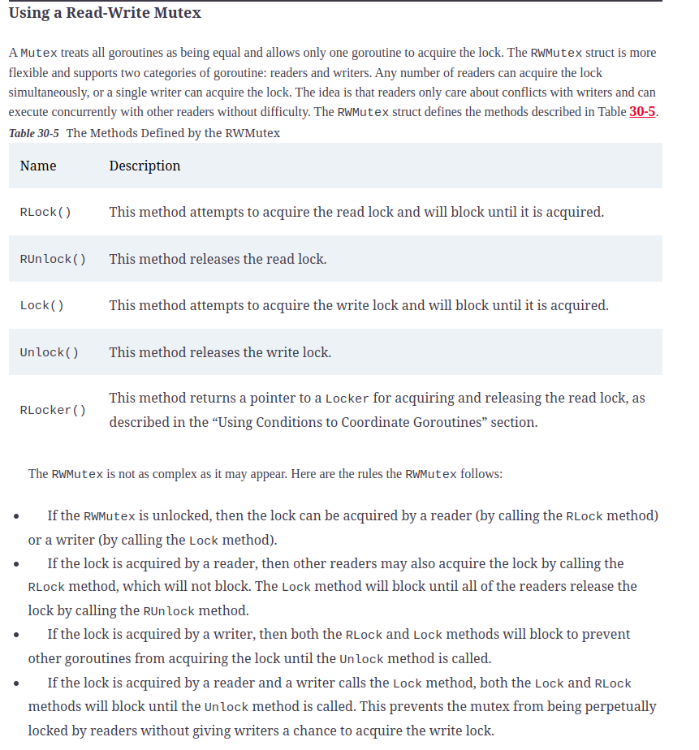

# Coordinating Goroutine

## WaitGroup

## Mutex

### Avoiding The Mutex Pitfalls

* The best approach to using mutual exclusion is to be careful and be conservative. You must ensure that all code that accesses shared data does so using the same Mutex, and every call to a Lock method must be balanced by a call to the Unlock method. It can be tempting to try to create clever enhancements or optimizations, but doing so can lead to poor performance or application deadlocks.

## Read Write Mutex (RW Mutex)

## Using Condition to coordinate goroutine

### Cond Struct

### Ensuring a function is executed once

## Using Context

### Function of context package

