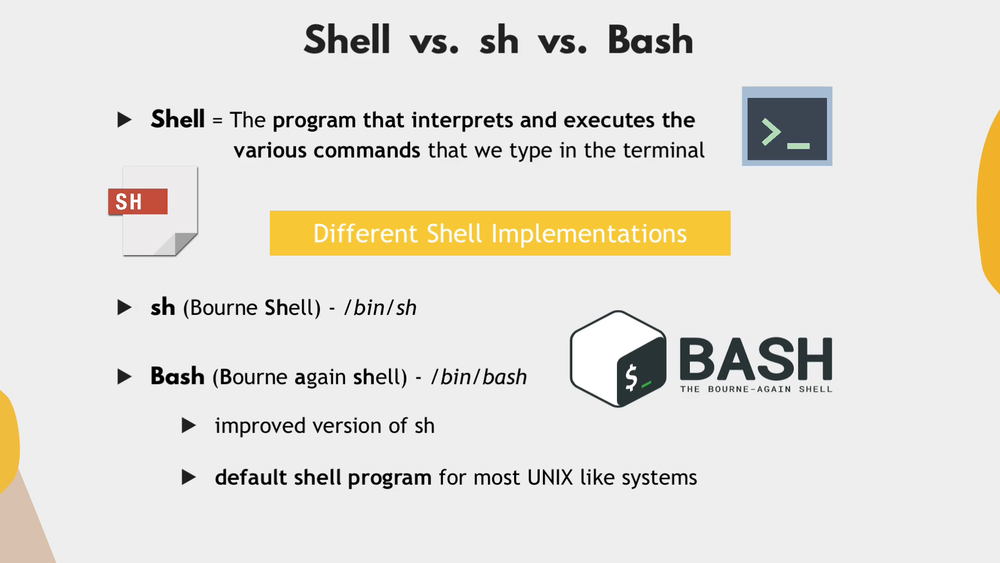
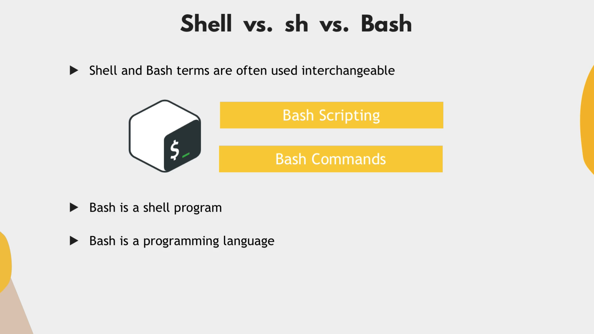
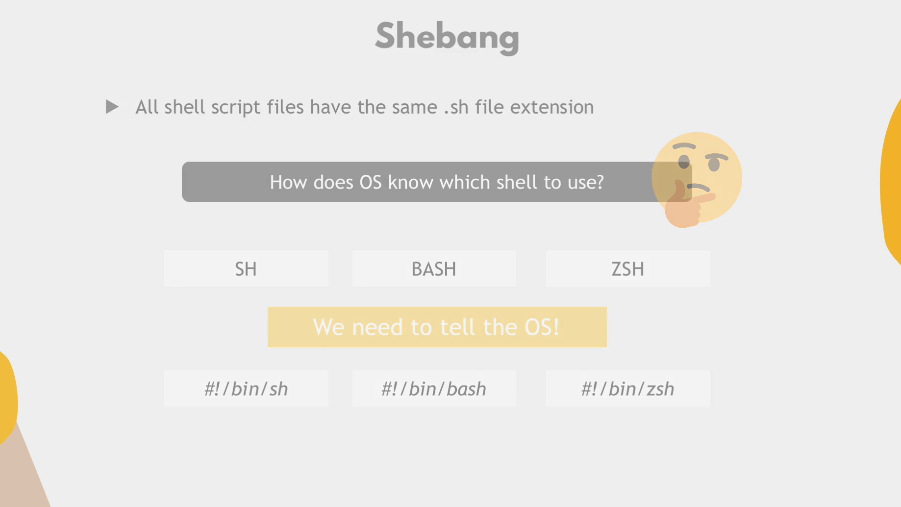
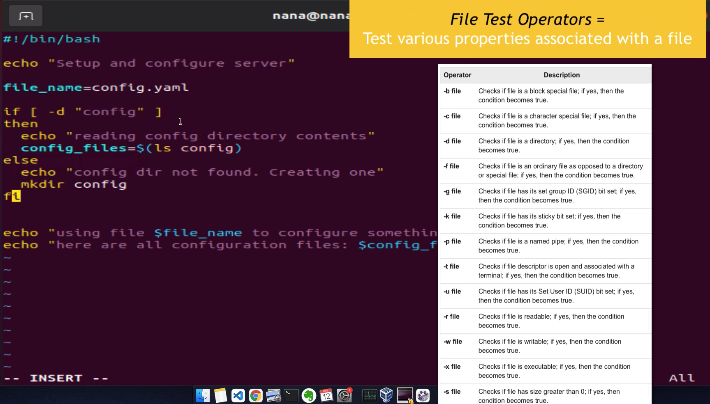
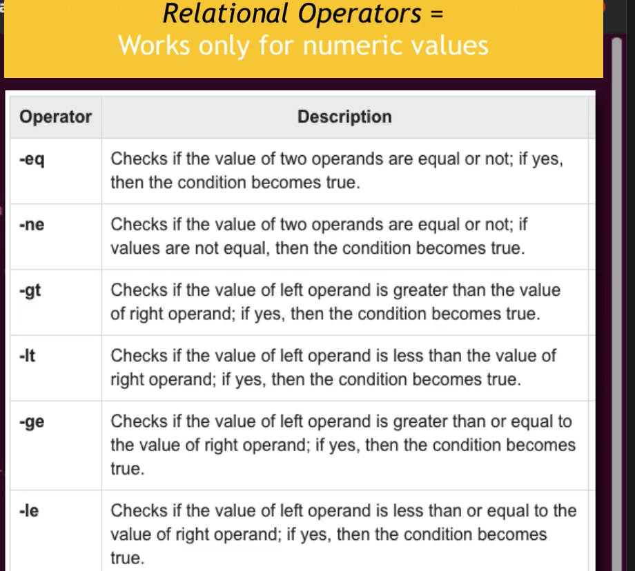
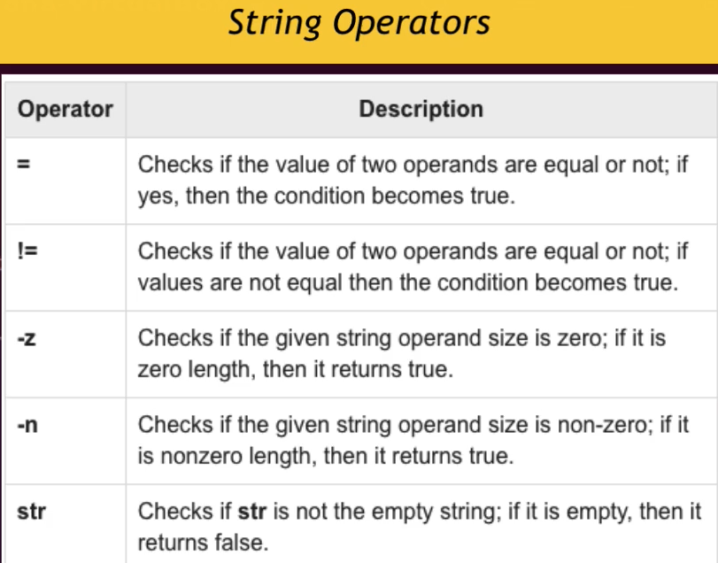

## Intoduction to Shell Scripting

- Avoid repetitive work.
- Keep history of configuration.
- Share the instructions.
- Logic & bulk operations.







- #!/bin/bash - here combo of # and ! is called shebang

### Variables

- Used to store data and can be referenced later.
- similar to variables in general programming languages

```sh
#!/bin/bash

filename=config.yaml
config_files=$(ls config)

echo "using files $filename to configure something"

echo "here are all configuration files : $config_files"
```

- variable_name=value (Assigns the value to the variable)
- Note : There must be no spaces around the "=" sign


### Conditions 

* Allow you ti control flow of the program
* Ex : Execute a command only when a certain condition is true.

```sh
#!/bin/bash

filename=config.yaml

config_dir=$1
if [ -d "config"]
then
    echo "Reading config directory contents"
    config_files=$(ls config)
else
    echo "config dir not found. Creating one"
    mkdir config
fi

user_group=xx
if ["$user_group" == "devops"]
then
    echo "configure the server"
elif [ "$user_group" == "admin"]
then
    echo "administer the server"
else
    echo "No permission to configure server. wrong user group"
fi

echo "using files $filename to configure something"

echo "here are all configuration files : $config_files"
```

* start with "if" and "end" with "fi"

#### Basic Operators

1. File Operator 
2. Relational Operator
    * Works for numeric values
    * Will work to check relation between 10 and 20 as well as
     between "10" and "20"
    * Ex: if [num_files -eq 10] => (check if number of files equal to 10 or not) 
    * 
3. String Operators
    * Ex : if [user_group == "devops"]
    * "==" -> BASH , "=" -> POSIX
    * 


### Passing arguments from outside

* How we can use them 
* Positional Parameter
    * Argument passed to script are processed in the same order in which they're sent.
    * The indexing of argument start from 1.
    * $1 -> which means first argument
    * How to pass them in command line
    * ./script.sh devops
    * Ex: usergroup = $1 (which is devops)
### Reading input from user

* read is used 
* Ex => read -p "Please Enter your password: " user_pwd
* here -p is used for prompt , user_pwd is used for storing this variable.

### How to get all parameter , entered in prompt
* using $* we can access all the params
* $* => represent all the arguments as a single string.
* $# => Total number of arguments provided (number)

### Shell Loops

* There are different types of loops:
    - while loop
    - for loop
    - until loop
    - select loop

#### For loop

```sh

for param in $*
    do 
        echo $param
    done

```


#### while loop

```sh
while condition
 do 
    statement(s) to be executed if command is true
 done
```

* We have double parenthesis for arithmetic operations
    * Ex => $((3 + 6)) 
    * $(($num1 + $num2))

* [ - Posix
* [[ - BASH (more features but you lose portability)


### Functions

```sh

function score_sum() {

}

score_sum #function call

function create_files () {
    file_name=$1
    touch $file_name
}

create_files test.txt
```

### $? => caputes value returned by last command

```sh

function sum(){
    total=$(($1 + $2))
    return total
}

sum 2 10
result=$?
```