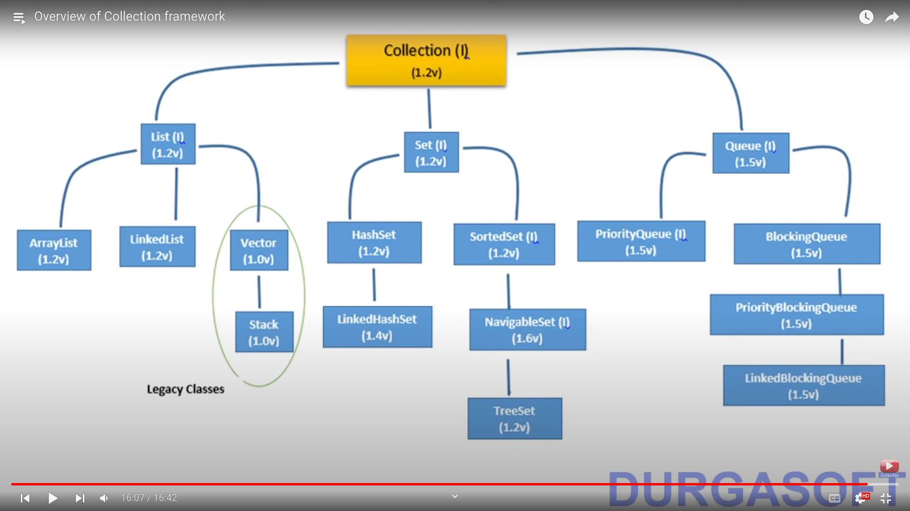
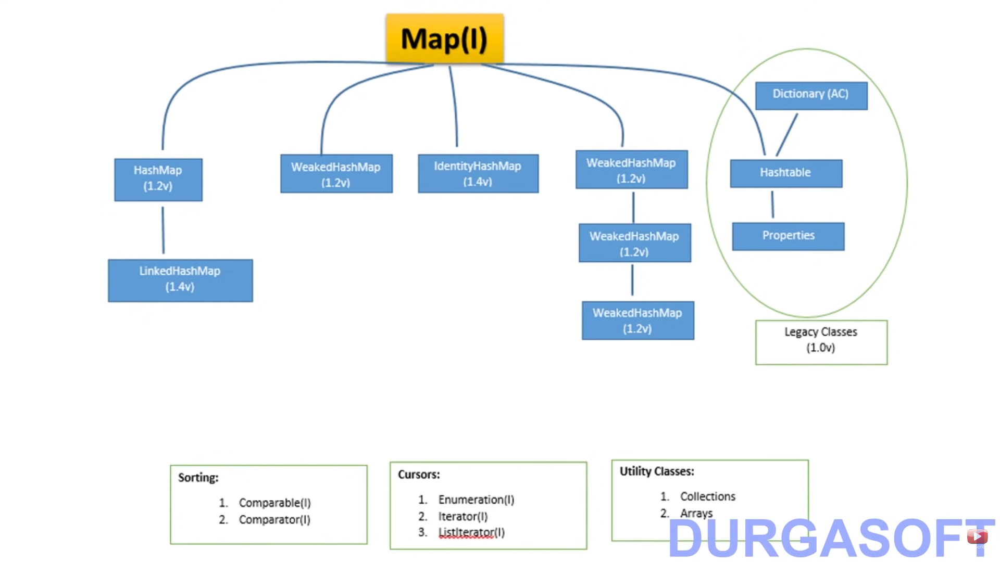

## Collection Framework

### Limitation of Arrays
* Fixed in size
* Homogeneous (store only one type of object , we can resolve this using the Object class)
* No Underlying DS (There is no readymade method support available)

#### To Overcome these problems we have to use collections
* Collection are growable in nature
* Collections can hold both homogenous and hetrogeneous elements.
* Every collection class is implemented based on some standard data structure

|**Arrays**         |**Collections**        |
|:-----------------:|:---------------------:|
| Fixed in size | Growable in nature|
|wrt memory arrays are not used | wrt memory collections are used|
|wrt performance arrays are used| wrt to performance collections are used|
| Only homogenous data | Homogeneous and Hetrogeneous data|
| Readymade method support is not available | Standard DS|
|Primitives and Object can be hold | Only Object can be hold | 

**Collection Framework**

It defines several classes and interfaces which can be used a group of objects as single entity.

### In Collection framework there are 9 key interfaces 

1. **Collection (I):**

    * It defines the most common used method which are applicable for any Collection object.
    * In general collection interface is considered as root interface of Collection Framework.

| **Collection** | **Collections**|
|:----------:|:--------------:|
| Interface | Class| 
| It represent a group of individuls objects as   a single entity | Collections is an utility class present in java.util.package   to define several utility methods (like sorting , searching )   for Collection class|

2. **List (I) :**
    * ArrayList Class
    * LinkedList Class
    * Vector Class
    * Stack Class (Child of Vector Class)

3. **Set (I) :** Child of Collection , insertion order not preserved and duplicates are not allowed.
    * HashSet Class
    * LinkedHashSet Class (Child of HashSet)

4. **SortedSet (I) :** child interface of set
5. **NavigableSet (I) :** child interface of SortedSet
    * TreeSet class implements NavigableSet interface
6. **Queue (I) :** Child of collection interface
    * PriorityQueue Class
    * BlockingQueue Interface
        * LinkedBlockingQueue class
        * PriorityBlockingQueue  class

**NOTE -** All the above interfaces `( Collection , List , Set , SortedSet , NavigableSet and Queue )` meant for representing a group of individual objects. If we want to represent a group of objects as key value pairs then we should go for `Map` interface.

7. **Map (I) :** It is not child interface of Collection
    * HashMap class
        * LinkedHashMap class
    * WeakHashMap class
    * IdentityHashMap class
    * Hashtable class (Child of Dictionary abstract class)
        * Properties class

    Duplicate keys are not allowed but values can be duplicated

8. **SortedMap (I) :** - Child interface of Map  
    If we want to represent a group of key value pairs according to some sorting order of keys then we shoul dgo for SortedMap.

9. **NavigableMap (I) :** - Child of Sorted Map
    * TreeMap is the implementation class

    Sorting
        1. Comparable (I)
        2. Comparator (I)
    

    Cursors
        1. Enumeration (I)
        2. Iterator (I)
        3. ListIterator (I)

    Utility Classes
        1. Collections
        2. Arrays

