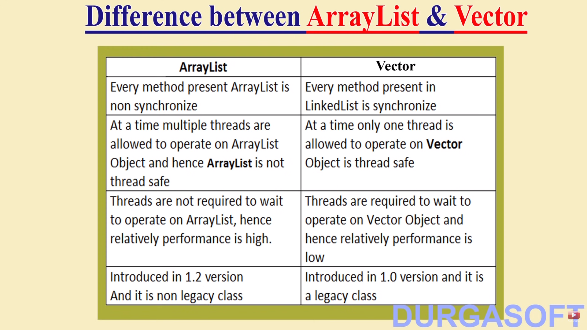

### Methods in collection

1. `add(Object o)` -> add object  o from collection
2. `addAll(Collection C)` -> add a group of object in collection.
3. `remove(Object o)` -> remove a object o from collection.
4. `removeAll(Collection C)` -> remove a group of object from collection.
5. `clear()` -> This will remove all the element from the collection.
6. `retailAll(Collection C)` -> Except a group of object remove all the element from the collection.
7. `isEmpty()` -> return true or false
8. `size()` -> return the size of collection
9. `contains(Object o)` -> check whether a object is present or not.
10. `containsAll(Collection C)` -> check whether a group of collection is available or not.
11. `toArray()` -> convert object to Array
    * Ex -> Object[] a = c.toArray()
    * return type of toArray() method is Object[]
12. `iterator()` -> The iterator() method can be used to get an iterator for any collection .
    * Looping through a collection , use the `hasNext()` and `next()` methods of the iterator.
    * Iterator iterator()

## **List (I) :** 
    All the methods present in Collection Interface are available in List Interface.

Other method specific to List interface

1. `add(int index, Object o)`
2. `addAll(int index, Collection c)`
3. `remove(int index)`
4. `indexOf(Object o)` -> Return the first occurance of Object o
5. `lastIndexOf(Object o)` -> return last occurance of Object o
6. `get(int index)` -> get element at index
7. `set(int index, Object o)` -> set Objet o at index.
8. `listIterator()` -> return ListIterator object for iteration

##

    Everywhere heterogeneous objects are allowed , except TreeSet and TreeMap
    (because these classes use SortedSet and SortedMap respectively , so Object type need to be same)

## ArrayList
1. Resizeable list
2. Duplicate allowed
3. Insertion order preserved
4. Heterogeneous Objects allowed
5. `null` insertion allowed

### Constructor in ArrayList
1. `ArrayList al = new ArrayList()`;
    * This return reference to a empty array with default capacity 10
    * New Capacity = (old * 3/2) + 1
2. `ArrayList al = new ArrayList(int initialCapacity)`
3. `ArrayList al = new ArrayList(Collection C)`

##

    Usually we can use Collections to hold and transfer Objects from one place to another place, to provide support for this requires every Collection already implements Serializable and Clonable Interfaces.

### RandomAccess(I)
1. present in java.util
2. ArrayList and Vector implements this interface
3. It is a Marker Interface -> means it has no method

