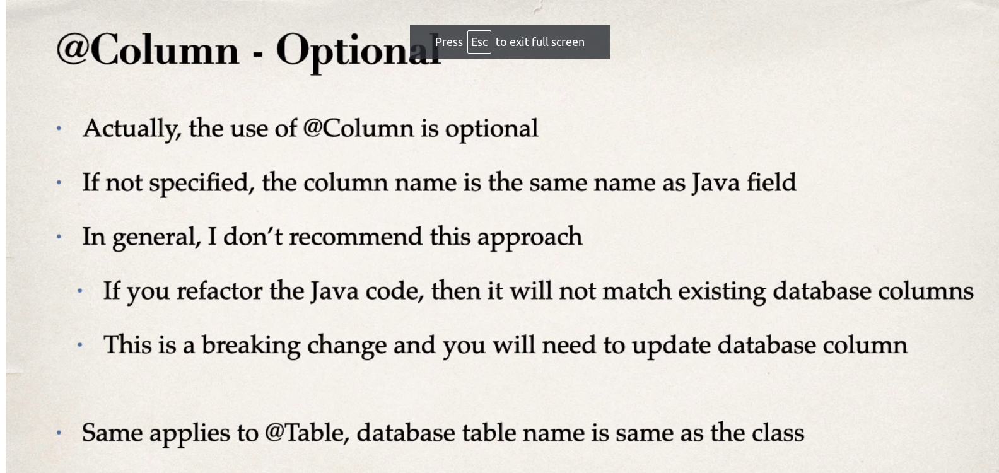
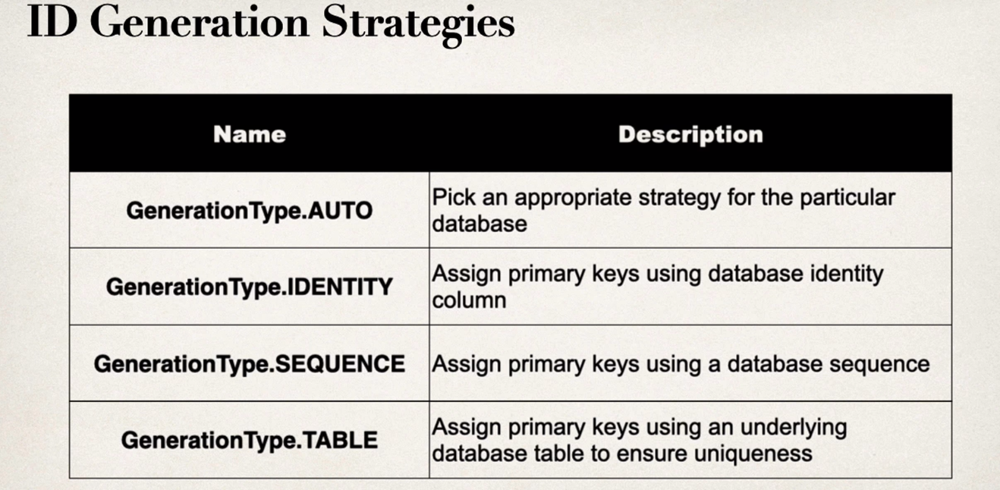

## JPA Annotations

### Entity Class

* Java class that is mapped to a database table.
* At a minimum, the Entity class
    * must be annotated with @Entity
    * must have a public or protected no-argument constructor
        * The class can have other constructors


#### Step 1: Mapping the class to database table

```java
@Entity
@Table(name="Student")
public class Student{
    ...
}
```

#### Step 2: Map fields to database columns

```java
@Entity
@Table(name="Student")
public class Student{
    
    @Id
    @Column(name="id")
    private int id;

    @Column(name="first_name")
    private String firstName;

    ...
}
```



#### JPA Identity - Primary Key

```java
@Entity
@Table(name="Student")
public class Student{
    
    @Id
    @GenerateValue(strategy=GenerationType.IDENTITY)
    @Column(name="id")
    private int id;
}

// @Id denotes the primary key
// @GenerateValue use a strategy which tell that this value is generated by the database.
```

