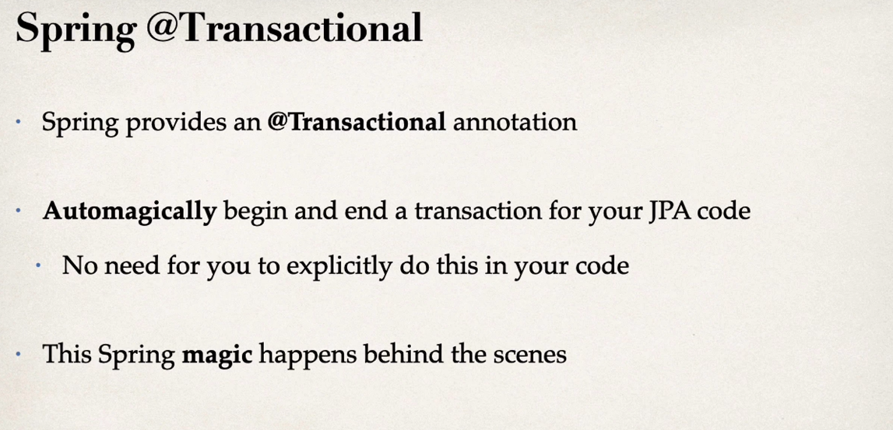

### Step 1: Define DAO interface

```java
import com.nikhil.cruddemo.entity.Student;

public interface StudentDAO{
    void save(Student theStudemt);
}
```

### Step 2: Define DAO implementation

```java
import com.nikhil.cruddemo.entity.Student;
import jakarta.persistence.EntityManager;

@Repository
public class StudentDaoImpl implements StudentDAO{

    private EntityManager entityManager;

    @AutoWired
    public StudentDAOImpl(EntityManager theEntityManager){
        entityManager = theEntityManager;
    }

    @Override
    @Transactional
    public void save(Student theStudent){
        entityManager.persist(theStudent);
    }
}

// @Transactional will handle the transaction management
```



#### @Repository Annotation

* Spring provide this annotation
* It comes under @Component
* Specialized annotation for repositories
* Supports component scanning

```java
public class CruddemoApplication {

	public static void main(String[] args) {
		SpringApplication.run(CruddemoApplication.class, args);
	}

	@Bean
	public CommandLineRunner commandLineRunner(StudentDAO studentDAO){
		return runner -> {
			createStudent(studentDAO);
		};
	}

	private void createStudent(StudentDAO studentDAO){
		// create the student object
		System.out.println("Creating a new student object ... ");
		Student tempStudent = new Student("Nikhil","Singh","code.nikhil20@gmail.com");
		// save the student object

		System.out.println("Saving the student ... ");
		studentDAO.save(tempStudent);

		// display id of the saved student
		System.out.println("Saved Student , Generate ID : " + tempStudent.getId());
	}
}
```
