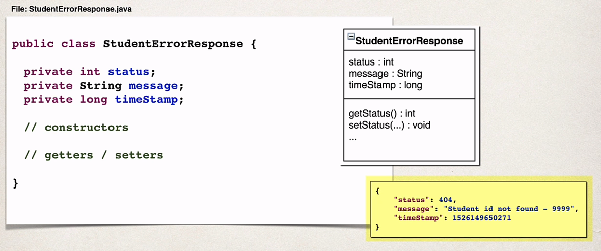
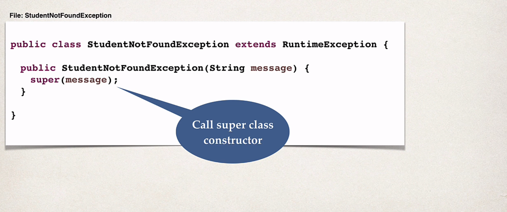
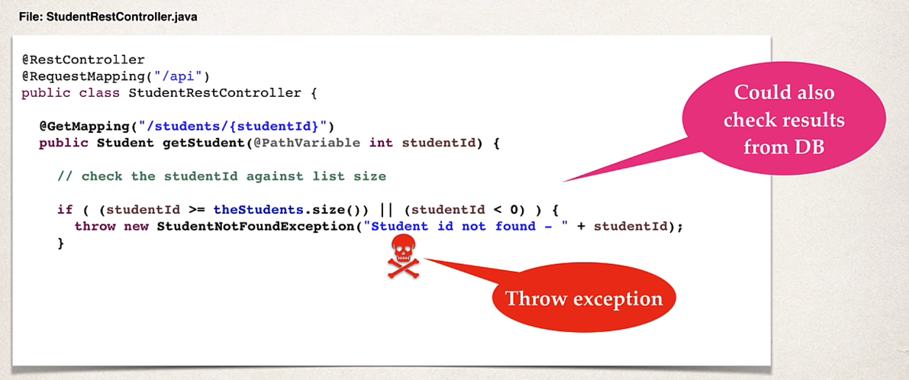
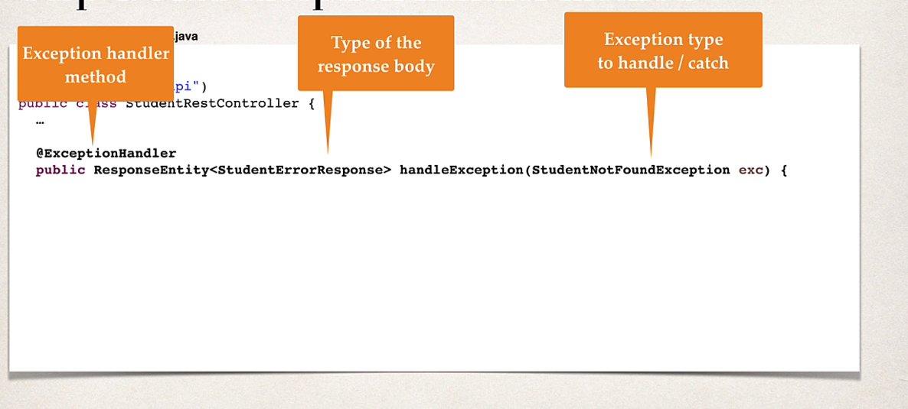
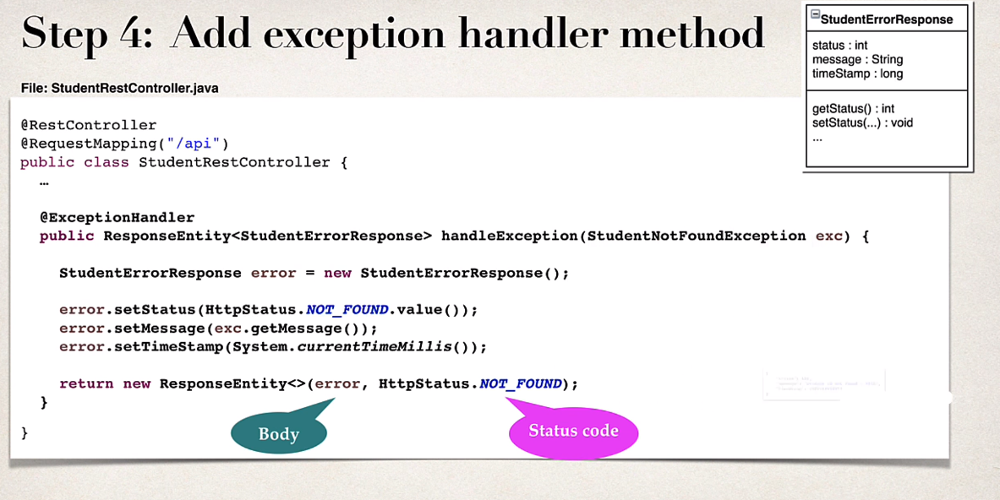
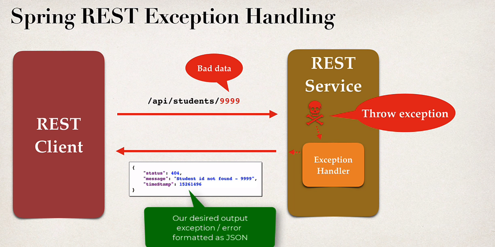

### Development process

1. Create a custom error response class.
2. Create a custom exception class.
3. Update REST service to throw exception if student not found.
4. Add an exception handler method using @ExceptionHandler

#### STEP 1: Create a custom error response class.

* The custom error response class will be sent back to client as JSON.
* We will define as Java class (POJO)
* Jackson will handle converting it to JSON.

#### STEP 2: Create a custom exception class

* The Custom student exception will used by our REST service.
* In our code, if we can't find student, then we'll throw an exception.
* Need to define a custom student exception class.
  * StudentNotFoundException

#### STEP 3: Update rest service to throw exception

#### STEP 4: Add exception handler method

* Define exception handler method(s) with @ExceptionHandler annotation.
* Exception handler will return a ResponseEntity.
* ResponseEntity is a wrapper for HTTP response object.
* ResponseEntity provides fine-grained control to specify:
  * HTTP status code, HTTP headers and Response Body.

