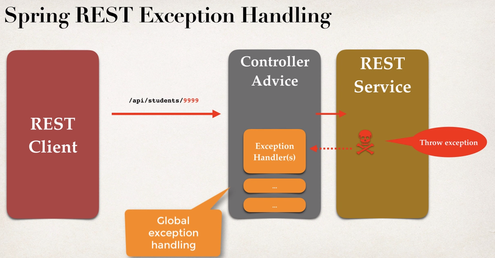

1. Previously we created handler for a specific REST controller.
2. That can't be used by other controllers.

#### We need a global exception handler for

1. Promote reuse.
2. Centralizes exception handling.

### Spring @ControllerAdvice

- @ControllerAdvice is similar to an interceptor / filter.
- Pre process requests to controllers.
- Post process responses to handle exceptions.
- Perfect for global Exception handling.



### Development process

1. Create new @ControllerAdvice
2. Refactor REST service, remove exception handling code.
3. Add exception handling code to @ControllerAdvice

```java

package com.nikhil.restcrud.rest;

import com.nikhil.restcrud.entity.Student;
import jakarta.annotation.PostConstruct;

import org.springframework.web.bind.annotation.GetMapping;
import org.springframework.web.bind.annotation.PathVariable;
import org.springframework.web.bind.annotation.RequestMapping;
import org.springframework.web.bind.annotation.RestController;
import java.util.ArrayList;
import java.util.List;

@RestController
@RequestMapping("/api")
public class StudentRestController {
  // define endpoint for "/students" - return a list of students
  List<Student> theStudents = new ArrayList<>();

  @PostConstruct
  public void loadData() {
    theStudents.add(new Student("Nikhil", "Singh"));
    theStudents.add(new Student("Ritik", "Nandan"));
    theStudents.add(new Student("Yash", "Agarwal"));
  }

  @GetMapping("/students")
  public List<Student> getStudents() {
    return theStudents;
  }

  @GetMapping("/students/{studentId}")
  public Student getStudent(@PathVariable int studentId) {
    // by default variables should match

    // check the student id with list size
    if (studentId >= 0 && studentId < theStudents.size())
      return theStudents.get(studentId);

    throw new StudentNotFoundException("Student id not found : " + studentId);

  }

}
```
