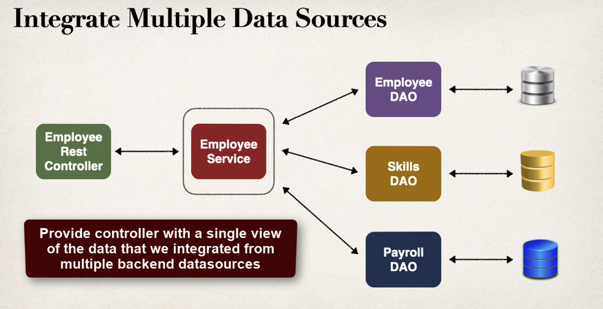
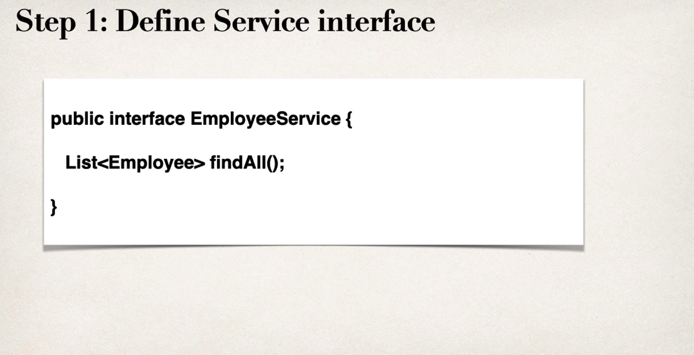
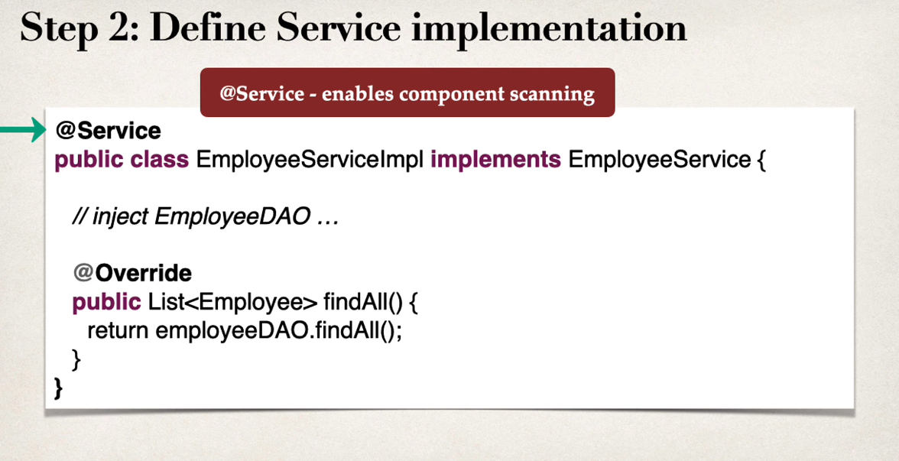
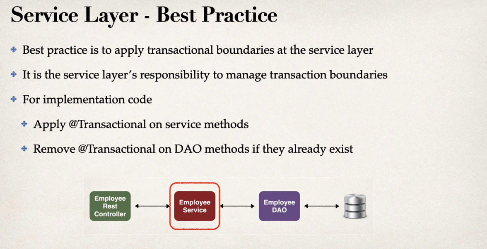

### Purpose for service layer

- Service Facade design pattern.
- Intermediate layer for custom business logic.
- Integrate data from multiple sources (DAO / repositories).

#### Spring provide @Service annotation

### Development process for Employee service layer

1. Define service interface.
2. Define service implementation.

- Inject the EmployeeDAO.

