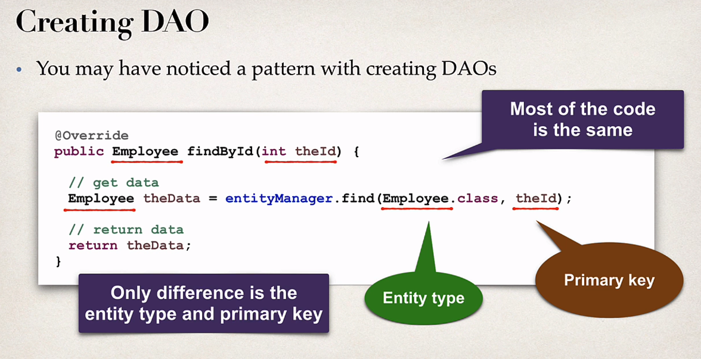
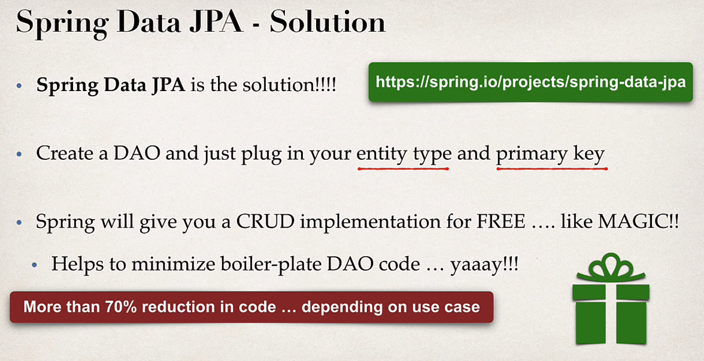
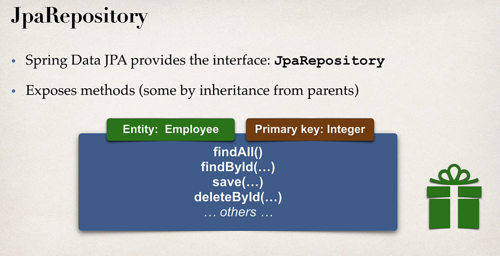
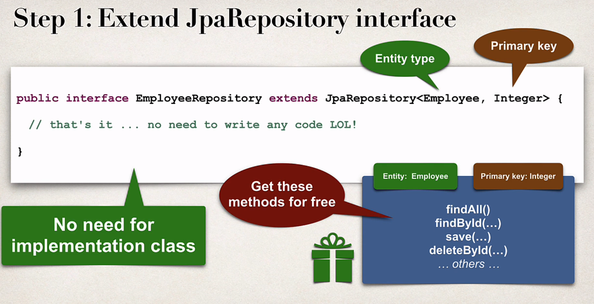
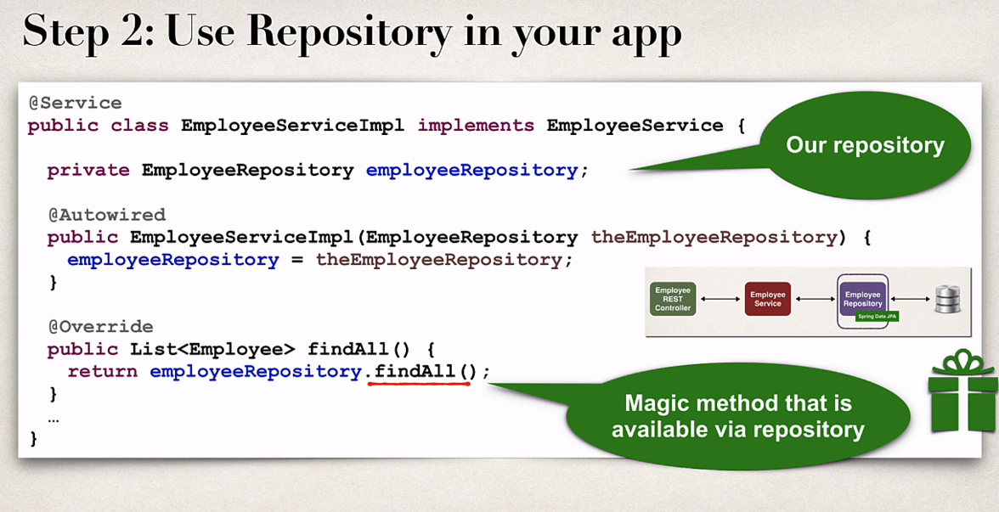
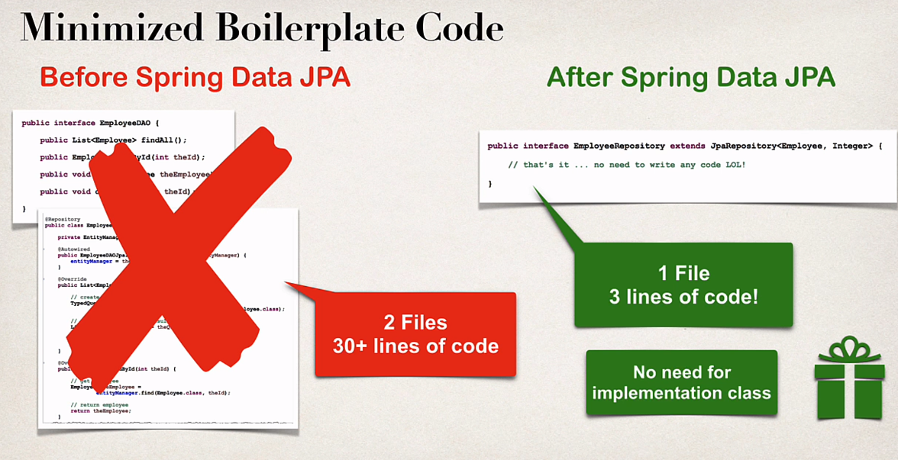

## Spring Data JPA

### Development process

1. Extend JpaRepository Interface.
2. Use your repository in your application. (No need for implementation class)

## Advance features

- Advance features available for
  1. Extending and adding custom queries with JPQL.
  2. Query Domain specific language (Query DSL).
  3. Defining custom methods (low level coding).
