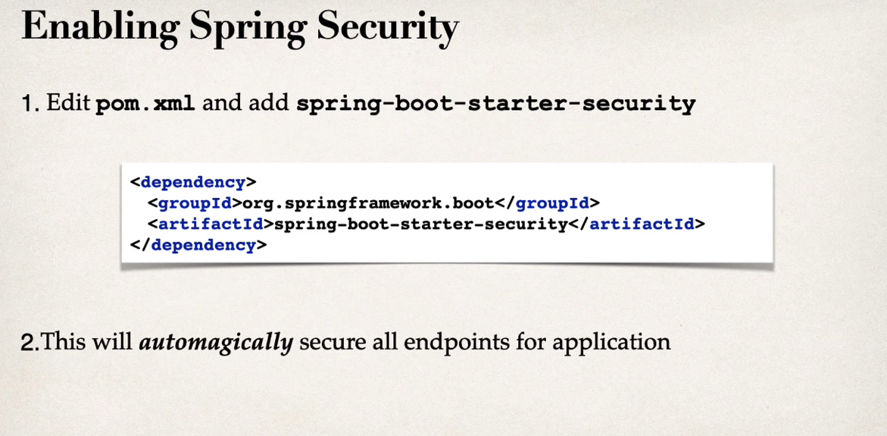

## REST API SECURITY

#### What will we learn

1. Secure Spring Boot REST APIs
2. Define users and roles.
3. Protect URLs based on role
4. Store users , Passwords and roles in DB (plain text -> password)

### Spring security models

- Spring security defines a framework for security.
- Implemented using Servlet filters in the Background.
- Two methods of securing an app : declarative and programmatic

### Spring security with Servlet filters

- Servlet filters are used to pre-process / post process web request.
- Servlet filters can route web requests based on security logic.
- Spring provides a bulk of security functionality with servlet filters.

### Security Concept

1. Authentication

- Check user id and password with credentials stored in app/db

2. Authorization

- Check to see if user has authorized role.

### declarative security

- Define applications security constraints in configuration.
  - All java config: @Configuration
- Provides seperation of concern between applications code and security.

### programmatic security

- Spring security provides an API for custom application coding.
- Provides greater customization for specific app requirement.

