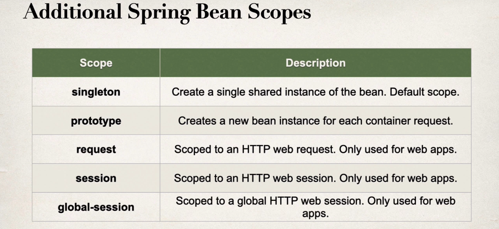

### Bean scopes

* Scope refers to the lifecycle of a bean
* How long does the bean live?
* How many instances are created?
* How is the bean shared?

**Default score** : it is singleton

What is a Singleton?

* Spring Container creates only one instance of the bean, by default
* It is cached in memory
* All dependency injections for the bean
    * will reference the SAME bean

### Explicitly Specify Bean Scope

```java
import org.springframework.beans.factory.config.ConfigurableBeanFactory;
import org.springframework.context.annotation.Scope;
import org.springframework.stereotype.Component;

@Component
@Scope(ConfigurableBeanFactory.SCOPE_SINGLETON)
public class CricketCoach implements Coach {

}
```




## Bean Lifecycle

* Container Start -> 
* Bean initiated -> 
* Dependency injected -> 
* Internal Spring Processing -> 
* Your custom init method -> 
* Bean ready for use , container is shutdown -> 
* Custom Destoy method -> 
* STOP 

### Bean lifecycle methods/ hooks

* You can add custom code during bean initialization.
    * Calling custom business logic methods.
    * Setting up handles to resources (db , sockets, file etc).

* You can add custom code during bean initialization
    * Calling custom business logic method.
    * Clean up handles to resources (db, sockets, file etc).